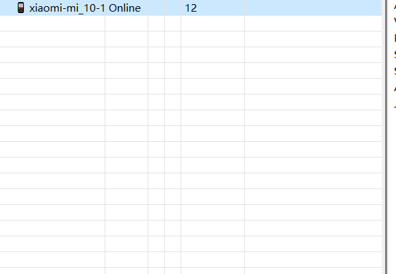

## DDMS不显示对应的进程

### 问题描述

在连接已经root的手机，打开DDMS没有发现对应的进程（LINE）

---

### 问题解决

1. mprop设置
   1. 下载 [mprorp](https://github.com/wpvsyou/mprop)文件 并且 拷贝到/data/目录下；
   2. 第二步：添加权限777
   3. 第二步：./mprop ro.debuggable 1（这个过程大概需要等待一分钟）
   4. 第三步：getprop ro.debuggable;（查看此时ro.debuggable在内存中的值）
   5. 第四步：stop;start(重启adbd进程)；
   
   **这个方法并没有凑效**
   
   [解决办法，还没有整理，方法四凑效](http://blog.wen2go.site/2022/04/02/20220402/)