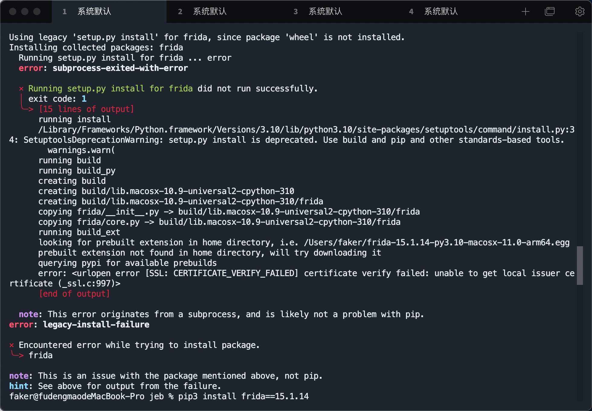

# macOS在安装frida的时候报错

SSL: CERTIFICATE_VERIFY_FAILED] certificate verify failed: unable to get local issuer certificate

---

## 解决办法

`open /Applications/Python\ 3.8/Install\ Certificates.command`

如果你是Python的其他的版本，就更改3.8的版本号

等待他运行完，再执行安装命令