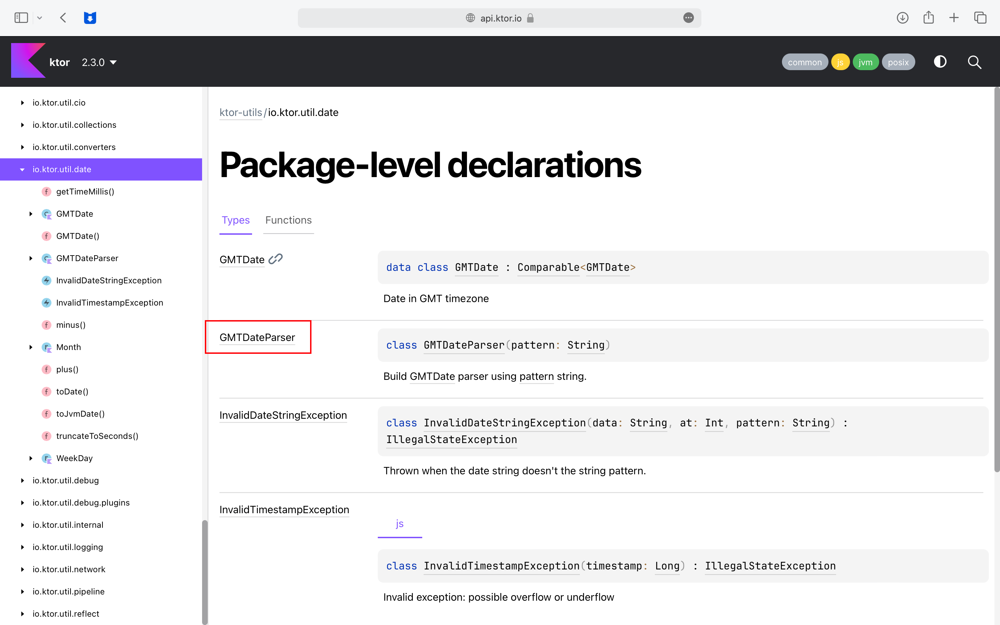
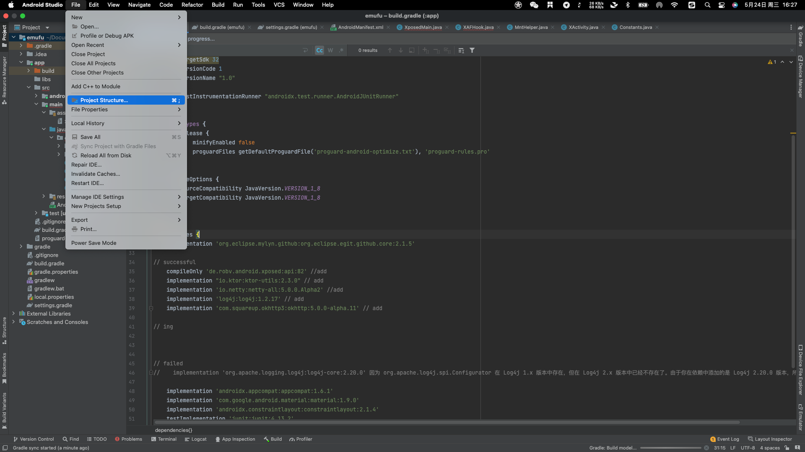
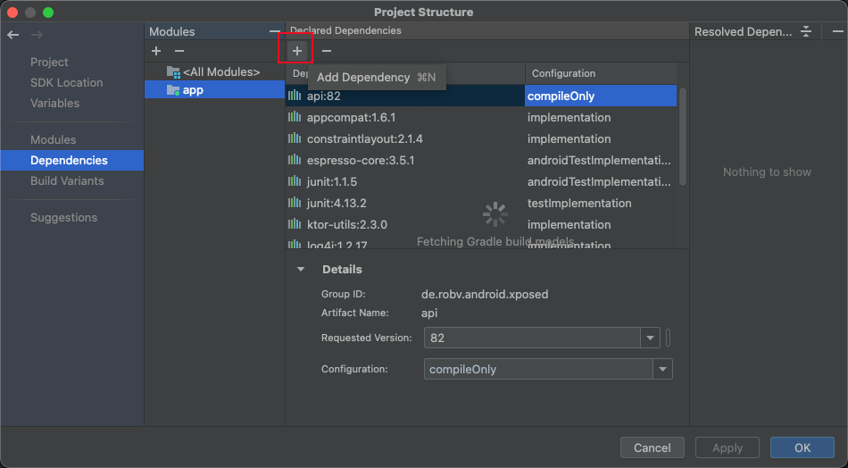

### 找不到一个导入库的依赖代码

#### 方法1

我看到一个代码需要导入				

```java
import io.ktor.util.date.GMTDateParser
```

但是我不知道这个导入，应该怎么写			

直接搜这个，库的相关的信息，信息非常少			

chatGPT给出的答案也是错误的，他一直叫我导入			

```groovy
 implementation "io.ktor:ktor-utils:1.7.2"
```

但是导入了以后也没有看到成功的导入			

追问之下，他说这个库已经被删除，或者是自定义的库			

但是，这个库明显不是自定义的库				

并且我注意到，io.ktor 这个应该就是 API 的名称，chatGPT提供了一个这个 API 的官方网址的链接			

https://api.ktor.io/				

并且我根据这个库的路径找到了这个类



说明这个类是存在的				

并且左上角写的 ktor 2.3.0 说明至少在 2.3.0 是能够找到这个库的				

最后通过			

```groovy
implementation "io.ktor:ktor-utils:2.3.0" 
```

成功的导入想要的类

​				

#### 方法2



​					

在这里为你的每一个模块添加依赖，或者为整个项目添加依赖



​					

在之前的导入当中，我已经知道了导入的大概内容是

```groovy
implementation 'org.eclipse.mylyn.github:org.eclipse.egit.github.core:2.1.5'
```

​					

所以我在库当中搜索  `org.eclipse.mylyn.github` 找到了这个库					

并且同步了以后，这个类就正常的导入了				


比方说，Firebase 库的导入，有官方的教程
[官方教程](https://firebase.google.com/docs/crashlytics/upgrade-sdk?platform=android&hl=zh-cn#gradle)

----

