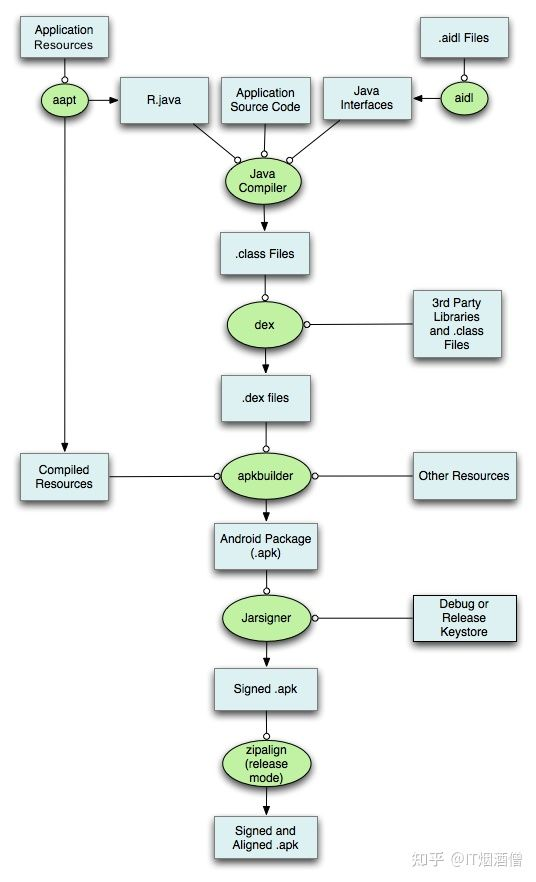

## apk打包的流程

### **1. 打包资源文件，生成R.java文件**

打包资源的工具是aapt（The sAndroid Asset Packaing Tool）

在这个过程中，项目中的 AndroidManifest.xml 文件和布局文件XML 都会编译，然后生成相应的R.java（R.java文件是编译器自动生成的，它无需开发人员对其进行维护。R.java会自动收录当前应用中所有的资源，并根据这些资源建立对应的ID。可以简单的把R.java理解成是当前Android应用的资源字典。）

另外AndroidManifest.xml会被aapt编译成二进制。

存放在APP的res目录下的资源，该类资源在APP打包前大多会被编译，变成二进制文件，并会为每个该类文件赋予一个resource id。**对于该类资源的访问，应用层代码则是通过resource id进行访问的**。Android应用在编译过程中aapt工具会对资源文件进行编译，并生成一个resource.arsc文件，resource.arsc文件相当于一个文件索引表，记录了很多跟资源相关的信息。

### **2. 处理aidl文件，生成相应的.Java文件**

这一过程中使用到的工具是aidl（Android Interface Definition Language），即Android接口描述语言。

aidl工具解析接口定义文件然后生成相应的 .Java 代码接口供程序调用。

如果在项目没有使用到 aidl 文件，则可以跳过这一步。

### **3. 编译项目源代码，生成class文件**

项目中所有的.Java代码，包括*R.java*和*.aidl*文件，都会变Java编译器（javac）编译成*.class*文件，生成的class文件，位于工程中的bin/classes目录下。

### **4. 转换所有的class文件，生成classes.dex文件**

dx工具生成可供Android系统Dalvik虚拟机执行的classes.dex文件。

任何第三方的*libraries*和*.class*文件都会被转换成*.dex*文件。

dx工具的主要工作是将Java字节码转成成Dalvik字节码、压缩常量池、消除冗余信息等。

### **5. 打包生成APK文件**

所有没有编译的资源，如images、assets目录下资源（**该类文件是一些原始文件，APP打包时并不会对其进行编译，而是直接打包到APP中，对于这一类资源文件的访问，应用层代码需要通过文件名对其进行访问**）；

编译过的资源和*.dex*文件都会被apkbuilder工具打包到最终的*.apk*文件中。

打包的工具apkbuilder位于 android-sdk/tools目录下。

### **6. 对APK文件进行签名**

一旦APK文件生成，它必须被签名才能被安装在设备上。

在开发过程中，主要用到的就是两种签名的 keystore

1. 一种是用于调试的debug.keystore，它主要用于调试，在Eclipse或者Android Studio中直接run以后跑在手机上的就是使用的debug.keystore。

另一种就是用于发布正式版本的keystore。

### **7. 对签名后的APK文件进行对齐处理**

如果你发布的apk是正式版的话，就必须对APK进行对齐处理，用到的工具是zipalign。

对齐的主要过程是将APK包中所有的资源文件距离文件起始偏移为4字节整数倍，这样通过内存映射访问apk文件时的速度会更快。对齐的作用就是减少运行时内存的使用。