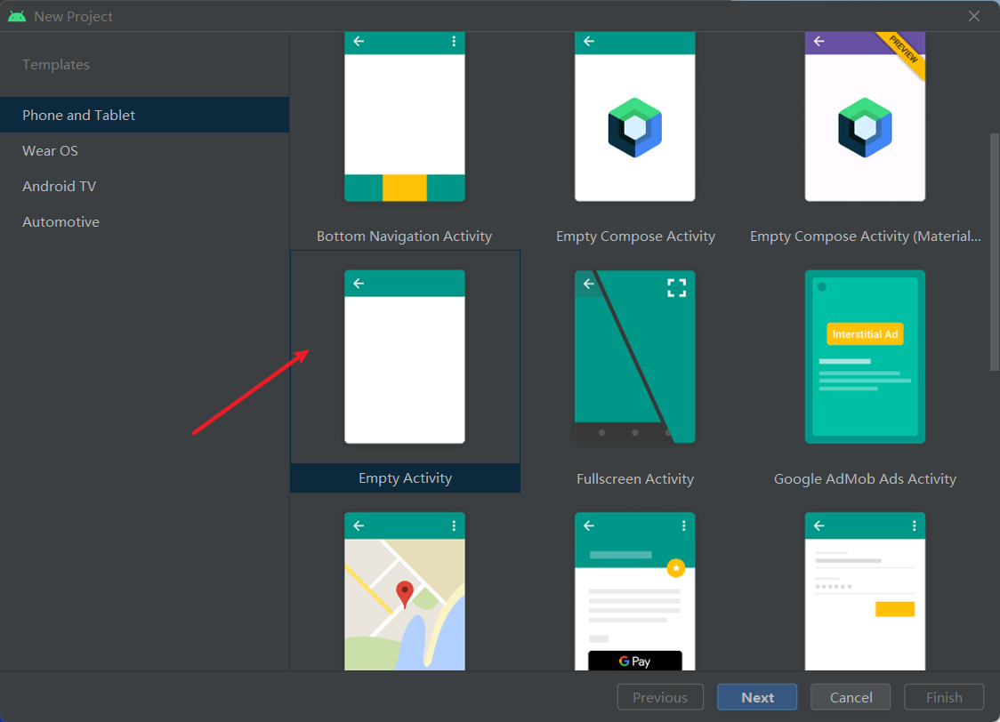
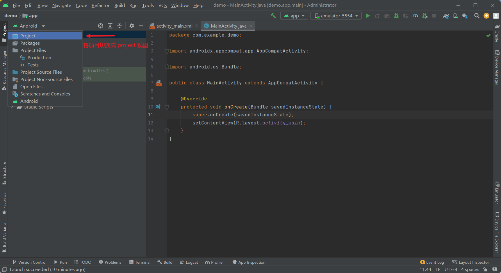
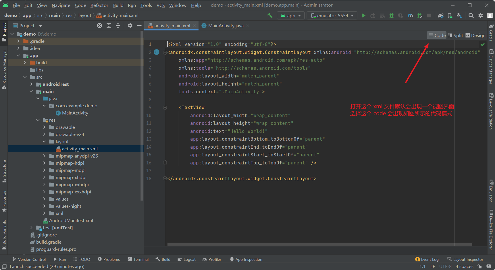

# Android 开发流程
- [Android 开发流程](#android-开发流程)
  - [新建工程](#新建工程)
    - [修改 hello world 项目](#修改-hello-world-项目)
  - [项目结构](#项目结构)
      - [分析各个文件](#分析各个文件)


1. 下载 Android studio ，一路 next 安装
2. 安装 SDK 软件工具包，需要注意的是 SDK 和 Android 版本是有对应关系的，这个对应关系不要错了[Android - SDK对应关系](https://developer.android.com/studio/releases/platforms?hl=zh-cn) 


## 新建工程

1. new project




2. 配置项目信息


3. workplace 简介

在最上方的工具栏当中，选择 Run -> Run App 就能够将这个项目安装在手机或者是虚拟机上面，如果出现了 Hello World 就说明这个项目就新建完成了 


4. 查看 project 视图




5. project 视图介绍


6. 程序介绍

onCreate() 这个函数是在 MainActivity 被调用之后默认加载的生命周期函数

他会先调用父类的 onCreate() 函数    

然后调用 setContentView() [ `setContentView(R.layout.activity_main)`]加载放在，src/main/res/layout 下面的 activity_main.xml 作为 MainActivity 对应的界面，`R.layout.activity_main` 解释了当前的代码和视图的对应关系    




​       

### 修改 hello world 项目

目的是将这个hello world 的项目，改成一个按键，每一次按下一个按键，就能够在日志区，打印一条信息   


在 Logcat 当中查看日志打印信息        

​        

每一次点击都会出现点击的日志信息     


---


因为Mac 当中存在多个版本，并且 Android studio 现在有版本的限制，所以，需要更换版本

---

## 项目结构

项目的文件结构

| 文件名             | 注释                                                         |
| ------------------ | :----------------------------------------------------------- |
| .gradle            | gradle项目产生文件夹（自动编译工具产生的文件）               |
| .idea              | IDEA项目文件夹（开发工具产生的文件）                         |
| app                | module模块（可以多个）                                       |
| gradle文件夹       | gradle环境支持文件夹。`gradle` 文件夹包含 Gradle 构建系统所需的所有配置文件，如 `gradle.properties` 和 `wrapper` 目录 |
| .gitignore         | `.gitignore` 是一个用于指定 Git 版本控制系统忽略哪些文件和目录的文件。 |
| build.gradle       | 是一个 Android 项目中的配置文件，用于定义项目的构建行为。它基于 Groovy 语言编写，通常位于项目的根目录和每个模块的目录下。在 build.gradle 文件中，你可以指定项目的依赖关系、编译选项、打包方式、签名方式、构建类型等等。通过修改 build.gradle 文件，你可以自定义 Android 项目的构建过程，满足项目的特定需求。 |
| gradlew.sh/gradlew | gradlew就是对gradle的包装和配置，gradlew是gradle Wrapper，Wrapper的意思就是包装。<br />因为不是每个人的电脑中都安装了gradle，也不一定安装的版本是要编译项目需要的版本，那么gradlew里面就配置要需要的gradle版本。<br />然后用户只需要运行gradlew就可以按照配置下载对应的gradle到项目的目录中，仅仅给项目本身用，然后就是clean、build等操作。 |
| local.properties   | Android SDK NDK 环境路径配置                                 |
| setting.gradle     | gradle 项目的子项目包含文件                                  |


#### 分析各个文件

##### gradlew

简要概述，就是这是一个 gradle 的管理器，负责，下载合适的版本 gradle 版本，还有就是启动 gradle/wrapper/gradle-wrapper.jar 这个		

这个是一个 shell 脚本，直接分析脚本

```shell
exec "$JAVACMD" "${JVM_OPTS[@]}" -classpath "$CLASSPATH" org.gradle.wrapper.GradleWrapperMain "$@"
```

这个就是指令，Java 虚拟机会启动并运行 GradleWrapperMain 类，该类会解析和执行 Gradle 的构建脚本。


