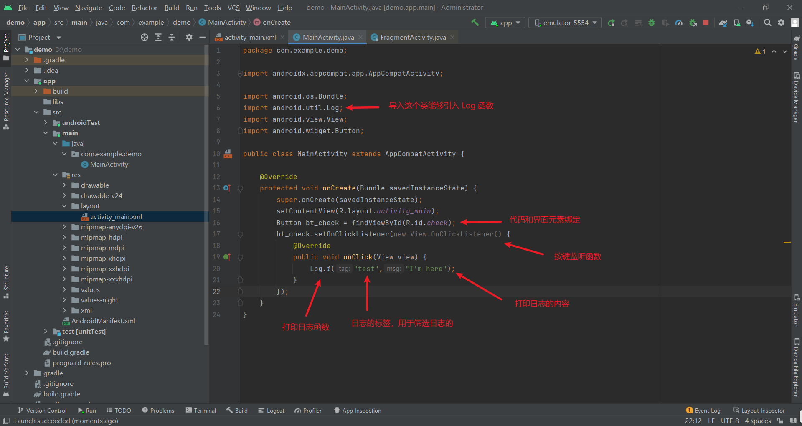

# Android 开发流程简介

1. 下载 Android studio ，一路 next 安装
2. 安装 SDK 软件工具包，需要注意的是 SDK 和 Android 版本是有对应关系的，这个对应关系不要错了[Android - SDK对应关系](https://developer.android.com/studio/releases/platforms?hl=zh-cn) 

## 新建工程

1. new project

2. 配置项目信息

3. workplace 简介

在最上方的工具栏当中，选择 Run -> Run App 就能够将这个项目安装在手机或者是虚拟机上面，如果出现了 Hello World 就说明这个项目就新建完成了 

4. 查看 project 视图

5. project 视图介绍

6. 程序介绍

onCreate() 这个函数是在 MainActivity 被调用之后默认加载的生命周期函数

他会先调用父类的 onCreate() 函数    

然后调用 setContentView() [ `setContentView(R.layout.activity_main)`]加载放在，src/main/res/layout 下面的 activity_main.xml 作为 MainActivity 对应的界面，`R.layout.activity_main` 解释了当前的代码和视图的对应关系    

​       

### 修改 hello world 项目

目的是将这个hello world 的项目，改成一个按键，每一次按下一个按键，就能够在日志区，打印一条信息   

在 Logcat 当中查看日志打印信息        

​        

每一次点击都会出现点击的日志信息     

