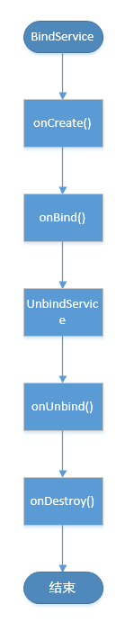
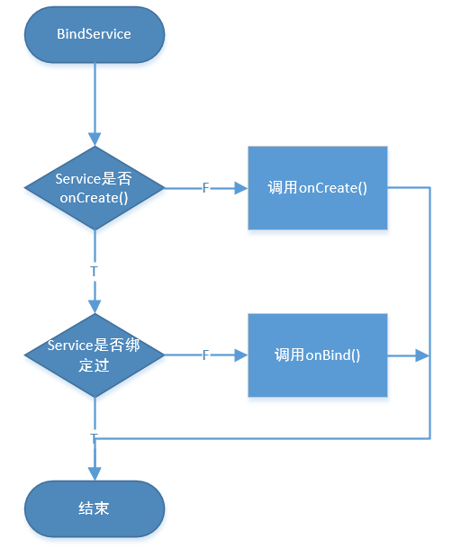

# Android相关的基础知识

- [Android相关的基础知识](#android相关的基础知识)
  - [系统框架](#系统框架)
    - [Linux内核层](#linux内核层)
    - [Android四大组件](#android四大组件)

## 系统框架

### Linux内核层


根据这一张图的描述，一共分为下面的五个部分 

Linux内核、HAL硬件抽象层（是我们最不关心的一个层）、系统Native库和Android运行时环 境（这两个也被称之为系统运行库层）、Java框架层（应用框架层）以及应用层这5层架构

1. Linux内核层，Android在某种程度上就是一个Linux，那么Linux存在的内核漏洞，在Android上面也是存在的，Linux上面的一些命令，理论上也是可以在Android上面执行的，但是，因为缺少硬件环境，所以没有办法实现。
2. 运行库层，一部分是Linux里面的原生库文件，比方说多媒体支持的库文件，libopengl.so 和数据库存储功能的 libsqlite.so 文件，林一部分是 Android 特有的一些库文件，他其实就是一个虚拟机，（Dalvik/Art）
3. 应用框架层，就是给Android开发提供一些API支持
4. 应用层，就是我们的进行Android开发的部分，也是我们最关心的一层，这里面包含了自带应用和下载的应用


## Android四大组件

四大组件就是

1. 活动（Activity）
2. 服务（Service）
3. 广播接收器（Broadcast Receiver）
4. 内容提供者（Content Provider）

activity 就是一个界面，一个界面就可以理解成是一个Activity

Service 就是一个后台

Broadcast Receiver 就是相应其他应用程序（包括系统） 的广播消息

Content Provider 用于进程之间的交互，通常就是从一个应用程序像其他的应用程序提供数据

---

### 广播

想想三体当中叶文杰，罗辑通过太阳向宇宙当中发送的一个安全声明，公布了地球的位置，Android当中的广播与之类似，就是发送一个消息让整个手机都接到消息，比方说，你的屏幕点亮了，比方说你的电量很低了，比方说你的某一个软件卸载了，或者是安装了，这个时候都会有一些软件会突然跳起来（特别是清理类的软件）他是怎么知道的呢，就是通过系统广播知道的，当然，还有一些广播是通过软件自己发送出去的，比方说，你的微信想要拉起某一个浏览器，也是通过广播这样的方式进行的。

广播分为静态注册和动态注册两种

​				

* 动态注册

编写一个继承BroadcastReceiver的广播接收器的类

```java
   class DynamicReceiver extends BroadcastReceiver {

        @Override
        public void onReceive(Context context, Intent intent) {
            Toast.makeText(context,intent.getStringExtra("dynamicInfo"), Toast.LENGTH_SHORT).show();
        }
    }
```

  			

设置广播接收器参数并注册

```java
	@Override
    protected void onCreate(Bundle savedInstanceState) {
        super.onCreate(savedInstanceState);
        setContentView(R.layout.activity_main);
//        实例化动态广播所需IntertFilter
        IntentFilter intentFilter = new IntentFilter();
        intentFilter.addAction("dynamic");
        dynamicReceiver = new DynamicReceiver();
//        动态注册广播
        registerReceiver(dynamicReceiver, intentFilter);
    }

```

​			

发送广播

```java
    Intent intent = new Intent();
    intent.setAction("dynamic");
    intent.putExtra("dynamicInfo", "动态广播");
    sendBroadcast(intent);
```

​					

* 静态注册

通过这样的方式生成一个 MyStaticReceiver.java 


​			

编写接收到广播之后操作

```java
public class MyStaticReceiver extends BroadcastReceiver {
    @Override
    public void onReceive(Context context, Intent intent) {
        Toast.makeText(context,intent.getStringExtra("staticInfo"), Toast.LENGTH_SHORT).show();
    }
}
```

​			

发送广播

```java
	Intent intent = new Intent(this, MyStaticReceiver.class);
//        Android 8.0及以上静态注册广播需要使用显示Intent
//        Intent intent = new Intent();
//        intent.setAction("static");
    intent.putExtra("staticInfo", "静态广播");
    sendBroadcast(intent);
```


**动态注册广播不是常驻型广播**，也就是说广播跟随Activity的生命周期。注意在Activity结束前，移除广播接收器。**静态注册是常驻型**，也就是说当应用程序关闭后，如果有信息广播来，程序也会被系统调用自动运行

​				

* 有序广播和无序广播

1.Normalbroadcasts：默认广播

默认广播即普通广播，发送一个普通广播使用Context.sendBroadcast方法，普通广播对于多个接收者来说是完全异步的，通常每个接收者都无需等待即可以接收到广播，接收者相互之间不会有影响。对于这种广播，接收者无法终止广播，即无法阻止其他接收者的接收动作。

2.orderedbroadcasts：有序广播

发送一个有序广播使用Context.sendorderedBroadcast方法，有序广播比较特殊，它每次只发送到优先级较高的接收者那里，然后由优先级高的接受者再传播到优先级低的接收者那里，优先级高的接收者有能力终止这个广播。
			

1. 当广播为默认广播时：无视优先级，优先接收动态广播。
2. 当广播为有序广播时：优先级高的先接收（不分静态和动态）。同优先级的广播接收器，优先接收动态广播。

---

### Service

#### Service的介绍

Service是一种处于后台长时间运行的组件，它没有UI界面，不需要与用户交互。它被设计用来后台执行耗时任务或者为其他应用程序提供功能调用的服务。

​			

Service是一种应用程序组件，用于两种使用场景：

1. 后台执行长时间的任务，而不需要与用户交互。例如后台播放音乐
2. 将本应用的功能通过接口的形式暴露给其他应用程序调用

​			

#### 两种启动Service的方式：
1、startService，Service会执行onCreate和onStartCommand。多次启动同一个Service不会多次执行onCreate，会多次执行onStartCommand

​		

以调用startService()为例，onCreate方法仅在startSercice()调用后运行一次；然后运行onStartCommand()； onDestory ()仅在stopService()或stopSelf()方法调用后执行一次。
   那么在这期间，如果service被系统kill掉，那么会重新调用onStartCommand()来重新运行。

两种启动service的方式：startService和bindService

bindService启动的服务在调用者和服务之间是典型的client-server的接口，即调用者是客户端，service是服务端，service就一个，但是连接绑定到service上面的客户端client可以是一个或多个。这里特别要说明的是，这里所提到的client指的是组件，比如某个Activity。

​				

bindService启动的服务的生命周期与其绑定的client息息相关。当client销毁的时候，client会自动与Service解除绑定，当然client也可以通过明确调用Context的unbindService方法与Service解除绑定。当没有任何client与Service绑定的时候，Service会自行销毁（通过startService启动的除外）
			

startService和bindService二者执行的回调方法不同：startService启动的服务会涉及Service的的onStartCommand回调方法，而通过bindService启动的服务会涉及Service的onBind、onUnbind等回调方法。

​			

直接开启startService，使用stopService关闭。


​			

绑定开启bindService，使用unbindService解绑关闭



两者区别是：

start和stop只能开启和关闭，无法操作service。bind和unbind可以操作service。

start开启的service，调用者退出后service仍然存在。bind开启的service，调用者退出后，随着调用者销毁。

​					

#### service的生命周期

生命周期过程中的方法一共有五种：

| 方法             | 含义 |
| ---------------- | ---- |
| onCreate()       | 创建 |
| onStartCommand() | 开始 |
| onDestroy()      | 销毁 |
| onBind()         | 绑定 |
| onUnbind()       | 解绑 |

​			

注意以下条件：
1.在整个生命周期内，只有**startCommand()**能被多次调用。其他方法只能被调用**一次**。（即只能绑定和解绑一次。）
2.绑定后没有解绑，**无法**使用stopService()将其停止。
3.如果已经onCreate()，那么startService()将**只**调用startCommand()。
4.如果是以bindService开启，那么使用unbindService时就会**自动调用**onDestroy销毁。


​			


​				



​			


​				

#### bindService 代码演示

使用bindService主要分两种情形: 
1. Service的调用者client与Service在同一个App中； 
2. Service的调用者client是App1中的一个Activity，而Service是App2中的Service，client与service分属两个App，这种情形下主要用于实现跨进程的通信。


