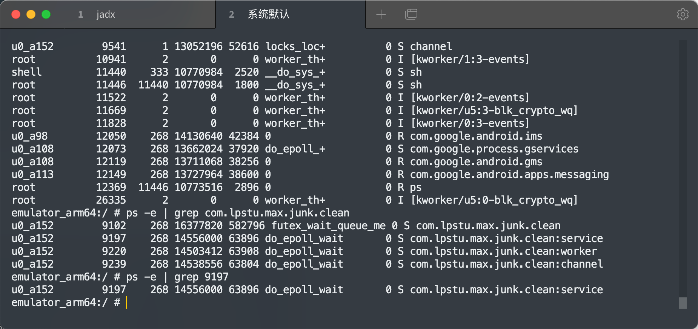
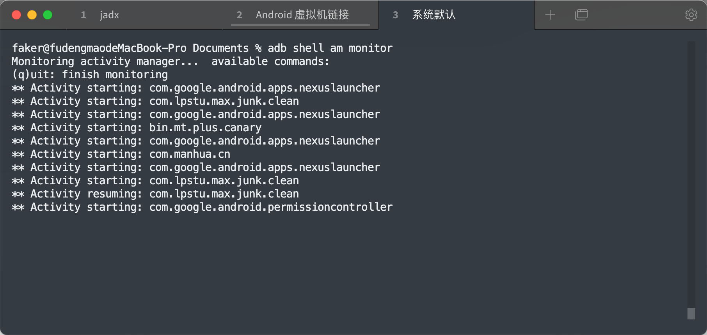

## Android逆向当中的常用的命令

### cat指令

这个指令主要是用来查看文件内容的

---

### touch指令

这个指令是创建一个空文件

---

### echo指令

**>>** 是拓展续写

**>** 是覆盖重写

​      		

---

### grep指令

这个指令主要是用来过滤的

---

### ps指令

在 Android8之前 ps 能够显示所有的进程

在 Android 8 之后 ps 只能够显示当前的进程，想要显示全部的进程需要 ps -e

​			

可以配合 grep 指令进行过滤

---

### netstat指令

通常使用的参数组合为-alpe。netstat -alpe用于查看所有sockets连 接的IP和端口以及相应的进程名和pid

tcp6      32      0 ::ffff:10.0.2.15:57194  ec2-54-160-50-69.:https CLOSE_WAIT  u0_a156    1509043     15290/com.superclean.booster 

可以理解为 com.superclean.booster 正在链接网络，并且他的进程的pid 是 15290			

---

### lsof指令

该命令是用来查看，这个进程正在打开的文件

erclean.booster 15290    u0_a156  187u      REG              253,4     20480      17599 /data/data/com.superclean.booster/databases/npth_log.db

表示的是 15290 这个进程正在打开  /data/data/com.superclean.booster/databases/npth_log.db 这个数据库文件

---

### top指令

这个是用来查看当前的正在进行的进程

---

### adb shell dumpsys activity top | grep ACTIVITY

这个指令就是看当前页面的这个 activity 

---

### adb shell dumpsys package <包名>

这个指令主要是查看包信息，包括四大组件信息以及MIME等相关信息，或者是程序入口，权限的相关信息

---

### adb shell dumpsys dbinfo <包名>

于查看App使用的数据库信息，以及程序对该数据库做出的 相关的 SQL 语句的操作

---

### adb shell pm list packages 

展示，整手机的包名

---

### adb shell am start-activity -D -N <包名>/<类 名>

这个指令主要是，拉起指定的 activity 

---

### logcat指令

这个跟Android studio 上面的 logcat 是一样的，打印你的日志的时候用的。

---

### adb push指令

这个指令是将电脑上面的文件，传到手机/模拟器当中

---

### adb pull 指令展示

这个指令主要是将，手机当中的文件存放在电脑

---

### 查看包名

当我们将 SDK/build-tools.. 这个路径加入到环境变量之后，就可以使用 `aapt dump badging file.apk` 查看包名以及对应的				

​			

或者是通过，`adb shell am monitor` 		

想看哪一个包名就在虚拟机里面点哪一个应用				

