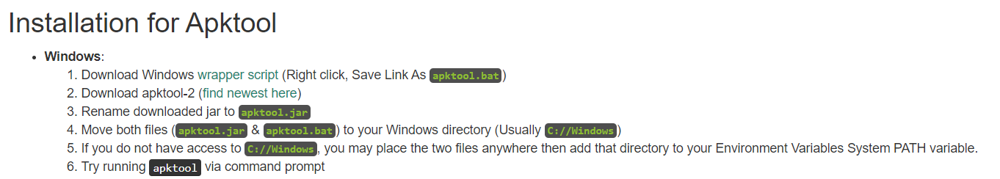

# APKtool工具反编译apk

[官网地址](https://ibotpeaches.github.io/Apktool/install/)

根据官网的介绍

①首先右键保存这个apktool.bat的文件（注意直接点击这个链接是打开一个网页，不会自动的下载，需要将鼠标放在网页的位置，点击鼠标右键，找到 **链接另存为...** 将他保存为 **apktool.bat** ）    
②然后下载 **apktool.jar** 这个文件（直接下载之后可能名字不是这个名字，如果不是，需要改成这个名字，笔者在下载之后就直接就是这个名字）     
③之后找个apktool.bat和apktool.jar文件放到一个方便的目录，我这里放到（D:\apktool）    
④加入环境变量，右键计算机 -> 属性 -> 高级系统设置 -> 环境变量 -> 系统变量Path双击->新建D:\apktool    
⑤将想要反编译apk放入和apktool.bat和apktool.jar相同的文件夹       

​    

在 cmd 当中输入指令

`apktool D C:\\Users\\86480\\Desktop\\LINE_12.11.1_apkcombo.com.apk`

