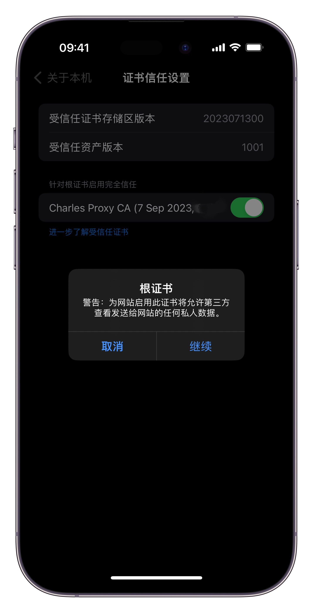

## Charles抓包的配置
- [Charles抓包的配置](#charles抓包的配置)
  - [安装完成](#安装完成)
  - [设置成代理服务器](#设置成代理服务器)
  - [代理设置](#代理设置)
  - [证书安装（电脑端抓包）](#证书安装电脑端抓包)
  - [设置监控的网址【监控所有】](#设置监控的网址监控所有)
  - [抓 iOS 的包](#抓-ios-的包)
    - [首先获取本地的 IP 地址](#首先获取本地的-ip-地址)
    - [设置 iPhone 的代理【你的手机应该和电脑处于同一个 WiFi 环境之下】](#设置-iphone-的代理你的手机应该和电脑处于同一个-wifi-环境之下)
    - [安装 iOS 的证书](#安装-ios-的证书)
  - [抓android的包](#抓android的包)
    - [安装 android 证书](#安装-android-证书)

本来以为是一个简单的过程，网上应该教程一大把，但是没有想到，这个步骤就已经坑的我不行	

记录一下			

设备：Mac，iOS，小米10pro（MIUI13 -> android12）						

​				

[charles 的下载链接](https://www.charlesproxy.com/download/)				

​				

直接下载你需要的版本，因为我这里使用的 Mac 所以用 Mac 演示

注意：因为 Charles 是一个 Java 项目，所以请先事先安装好 JDK			

​			

### 安装完成

安装好了大概就是这样子，下面开始设置

			

### 设置成代理服务器

		

​				

### 代理设置

设置端口 8888				

勾选启动代理			

​				

### 证书安装（电脑端抓包）

通过这样的方式就能够安装证书，并且，一开始的时候，这个证书是不被信任的，你需要双击这个证书，进去，然后点击信任

​			

​	

### 设置监控的网址【监控所有】

				

​						

至此，你已经能够成功的抓取电脑浏览器的包了

​						

### 抓 iOS 的包

#### 首先获取本地的 IP 地址

​					

​				

#### 设置 iPhone 的代理【你的手机应该和电脑处于同一个 WiFi 环境之下】

点击你当前 WIFI 的设置按钮

点击**配置代理**

点击**手动**

将 IP 地址放进服务器的位置

端口就是我们自己设置的端口 8888

​				

​					

#### 安装 iOS 的证书

​			

他会显示这个，注意这个网址，在你 Safari 浏览器当中输入这个东西，可以其他的浏览器吗？？**不可以**

​				

注意：安装了证书之后一定要去，打开这个证书

			

​					

	

​						

​		

证书安装 ok 了以后，就可以直接在手机上打开浏览器或者是 APP 进行抓包了！

​							

### 抓android的包

#### 安装 android 证书

首先也是一样的，需要在手机的浏览器下载证书，但是这里有两个坑

1. 如果你是小米的手机，不能够直接使用自带的浏览器下载的。可以使用第三方的比方说 Chrome ，Edge 浏览器之类的，并且官方会告诉你，在浏览器当中输入 **chls.pro/ssl**  但是亲测下来，我不知道为什么一直没有下载成功，总是报错，于是查到了输入这个，这个地址更好，http://charlesproxy.com/getssl			
2. android 手机也不能直接的将证书放在 **/system/etc/security/cacerts** 因为 android 7.0 之后这个就是被禁止的了，即便是 root 用户也是不允许的。

针对第二个问题，可以使用 Magisk 的模块

模块的链接地址  [Movecert 模块](https://github.com/Magisk-Modules-Repo/movecert)

但是这个 magisk 直接压缩，进行安装，貌似是不可以的有坑（还没有时间研究）

直接使用别人打包好的，在这个 [issue](https://github.com/Magisk-Modules-Repo/movecert/issues/12) 当中有一个老哥已经打包好了，大概在这个位置

​				

这个是 [下载链接](https://github.com/Magisk-Modules-Repo/movecert/files/8473364/movecert-1.9.zip)

​				

为了防止文件不见了，我也备份一份，在我的 **Release** 当中，就是 **movecert.zip** 				

安装好了以后，重启手机，然后

设置 -> 安全 -> 更多安全设置 -> 加密与凭证 -> 安装证书 -> CA 证书 -> 选择你下载的证书

​				

剩下的步骤跟 iOS 的抓包没有任何的区别，都是在同一个 WIFI 下面，进行配置代理，然后就可以抓包了！

