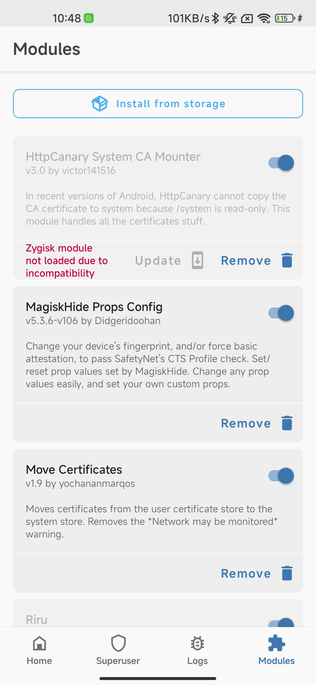
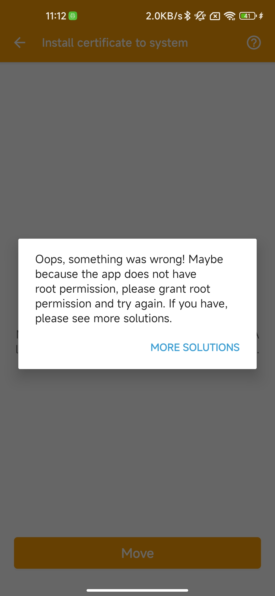

## Httpcanary证书的安装

相信看到这个部分的人，已经知道， httpcanary 是一个什么东西				

并且已经知道自己遇到了一些什么问题			

现在就是要解决，没有办法安装证书的问题			

​				

我们这里主要是用，维克多大佬的 magisk 的模块

维克多大佬的 [Magisk模块的GitHub地址](https://github.com/victor141516/httpcanary-magisk)			

​			

因为 httpcanary 的作者已经公开声明，不再在中国大陆的应用商店上架 httpcanary 的应用。并且，Google play 的商店上面也不容易找到（相传，将账号换成美国的账号，并且切换到美国的节点，能够找到对应的应用）			

在，Release 当中，我备份了一份，文件名 **HttpCanary 3.3.5.apk**				

​				

假设，我们已经安装了软件			

现在我们安装 magisk 的模块，[magisk模块v3.0下载地址](https://github.com/victor141516/httpcanary-magisk/raw/master/install.zip)

我这里也做一个备份，文件名叫做 **httpcanary_module.zip**   

根据这个主页的描述，我们安装了这个模块之后，会显示选择框，选择 **作为 app 和 VPN 的证书**，然后不要做任何改动，一路确定，然后重启手机。

### 一些意外

magisk的模块不兼容

如我们下面的图片所示，我们安装了，magisk 的模块，但是，模块是灰色的，并且告诉我们，没有被兼容。			

但是在我和作者沟通之后，作者起始也不知道这个是什么问题，但是好在这个错误只是一个 bug ，并不影响使用。			

[issue](https://github.com/victor141516/httpcanary-magisk/issues/6)

​			

并且

当我们按照，他的指示，做证书的移动的时候会发现，下面的这个图片，就是告诉我们还是没有办法移动证书因为没有权限						

​			

**但是一切都不要担心，这些都是 bug ，你只要开始抓包，就会发现，其实 httpcanary已经开始正常的工作了**

----

### v1.0

以上的内容都是，v3.0，作者已经帮我们大大的简化了流程。如果我们使用的是 v1.0 的模块，那么

就需要做以下的操作			

​				

1. 菜单->设置->在抓包设置里面找到 Httpcanary根证书
   1. 这个时候看到的 **安装HttpCanary根证书未安装，无法抓取SSL/TLS加密数据包** 这个就是没有安装证书	
2. 在 **/data/data/com guoshi.httpcanary.premium/cache/** 路径下，找到 **87bc3517.0**，和**HtpCanary.pem**，将这两个文件，复制一份，改一个名字，比方说 **httpcanary.jks**（这个很重要，不能忽略），**87bc3517.01**。然后重启Httpcanary。
3. 菜单->设置->在抓包设置里面找到 Httpcanary 根证书，这个路径下就能够看到的到很多选项，选择里面的 **添加根证书至系统（Root）设备需Root，將HttpCanary根证书添加到系统CA列表，用于替代平行空间** 
4. 导出证书，选择导出HttpCanary根证书导出根证书到存储卡，格式为PEM或.0，选择导出类型，如果你是 root 的手机，并且想要更高的权限，就选择System Trusted.0
5. 找到导出的证书，**/storage/emulated/0/HttpCanary/certs/**，这个路径下的，**87bc3517.0**，这个文件
6. 移植证书，将刚刚这个文件放在，**/etc/security/cacerts/**这个文件夹下面，但是你可能发现，这个文件夹在你 root之后还是显示的只读，如何放进去，就是另一故事了，简单来说就是，安装一个面具模块，就要回到我们安装 magisk 模块的部分

