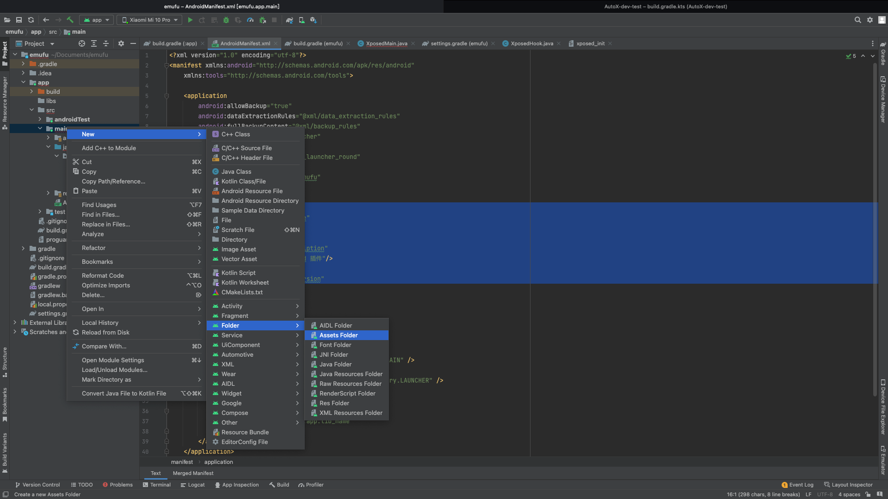
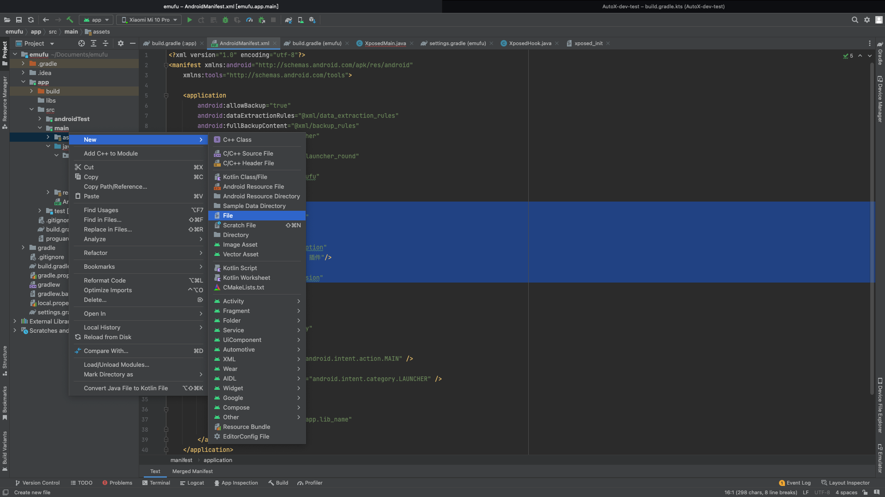
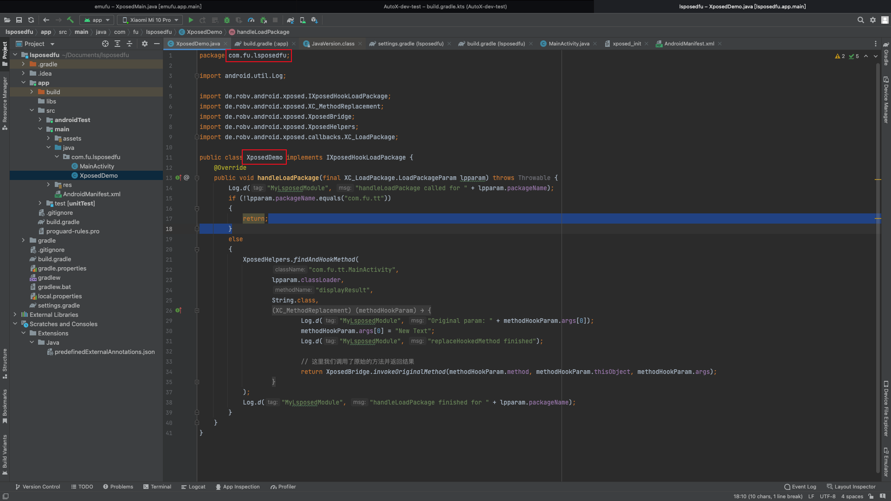
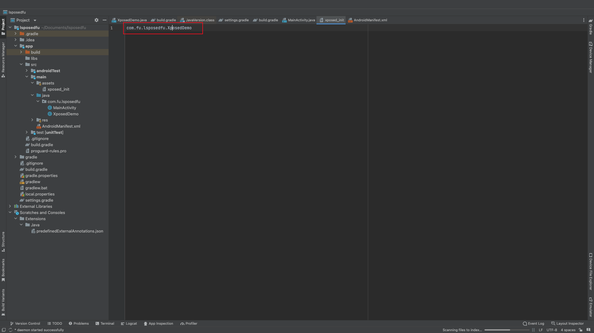

### Lsposed 的环境的搭建

setting.gradle

```setting.gradle
pluginManagement {
    repositories {
        gradlePluginPortal()
        google()
        mavenCentral()
    }
}
dependencyResolutionManagement {
    repositoriesMode.set(RepositoriesMode.FAIL_ON_PROJECT_REPOS)
    repositories {
        google()
        mavenCentral()
        maven { url "https://api.xposed.info/" }
    }
}
rootProject.name = "emufu"
include ':app'
```

​				

项目级别的 build.gradle

```groovy
// Top-level build file where you can add configuration options common to all sub-projects/modules.
plugins {
    id 'com.android.application' version '7.3.0' apply false
    id 'com.android.library' version '7.3.0' apply false
}
```

​					

模块级别的 build.gradle

```groovy
plugins {
    id 'com.android.application'
}

android {
    namespace 'com.fu.emufu'
    compileSdk 33 // replace 32

    defaultConfig {
        applicationId "com.fu.emufu"
        minSdk 21
        targetSdk 32
        versionCode 1
        versionName "1.0"

        testInstrumentationRunner "androidx.test.runner.AndroidJUnitRunner"
    }

    buildTypes {
        release {
            minifyEnabled false
            proguardFiles getDefaultProguardFile('proguard-android-optimize.txt'), 'proguard-rules.pro'
        }
    }
    compileOptions {
        sourceCompatibility JavaVersion.VERSION_1_8
        targetCompatibility JavaVersion.VERSION_1_8
    }
}

dependencies {
    compileOnly 'de.robv.android.xposed:api:82' // 注意这里的 compileOnly 很重要，否则可能会出现什么都是正确的，但是没有办法加载模块

    implementation 'androidx.appcompat:appcompat:1.6.1'
    implementation 'com.google.android.material:material:1.9.0'
    implementation 'androidx.constraintlayout:constraintlayout:2.1.4'
    testImplementation 'junit:junit:4.13.2'
    androidTestImplementation 'androidx.test.ext:junit:1.1.5'
    androidTestImplementation 'androidx.test.espresso:espresso-core:3.5.1'
}
```

​					

AndroidManifest.xml

```xml
<?xml version="1.0" encoding="utf-8"?>
<manifest xmlns:android="http://schemas.android.com/apk/res/android"
    xmlns:tools="http://schemas.android.com/tools">

    <application
        android:allowBackup="true"
        android:dataExtractionRules="@xml/data_extraction_rules"
        android:fullBackupContent="@xml/backup_rules"
        android:icon="@mipmap/ic_launcher"
        android:label="@string/app_name"
        android:roundIcon="@mipmap/ic_launcher_round"
        android:supportsRtl="true"
        android:theme="@style/Theme.Emufu"
        tools:targetApi="31">

        <meta-data
            android:name="xposedmodule"
            android:value="true"/>
        <meta-data
            android:name="xposeddescription"
            android:value="EMU Lsposed 插件"/>
        <meta-data
            android:name="xposedminversion"
            android:value="53"/>


        <activity
            android:name=".MainActivity"
            android:exported="true">
            <intent-filter>
                <action android:name="android.intent.action.MAIN" />

                <category android:name="android.intent.category.LAUNCHER" />
            </intent-filter>

            <meta-data
                android:name="android.app.lib_name"
                android:value="" />
        </activity>
    </application>

</manifest>
```

​						

设置入口：创建 assets 文件夹



​				

设置入口：创建文件 并且命名为 xposed_init



​						

并且在里面写上你的入口类的路径，注意不要有多余的空格和回车				

比方说我的是入口类的位置在这个位置				



文件里面的路径就应该写为




