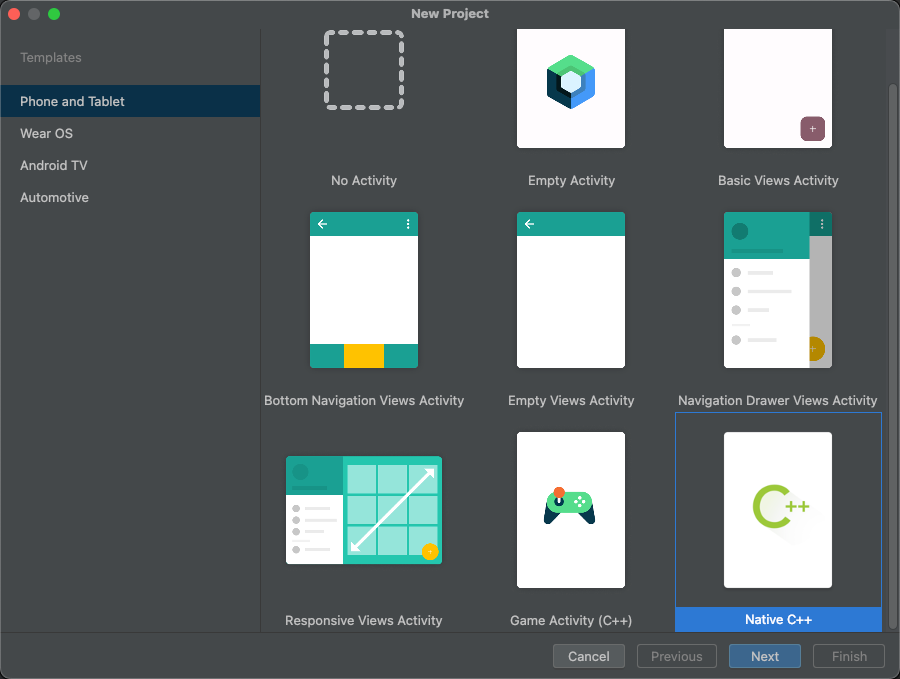
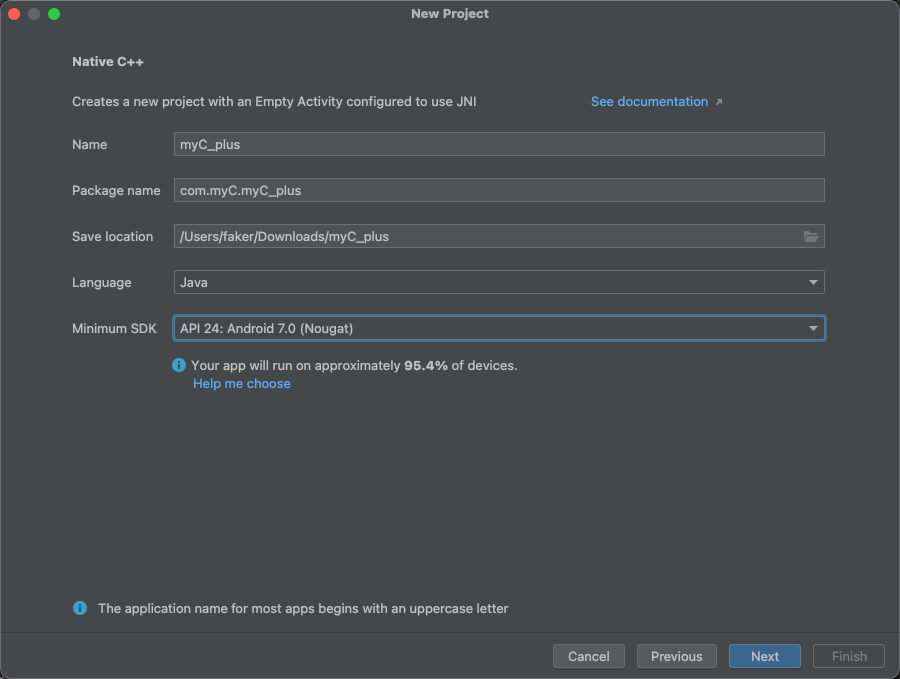
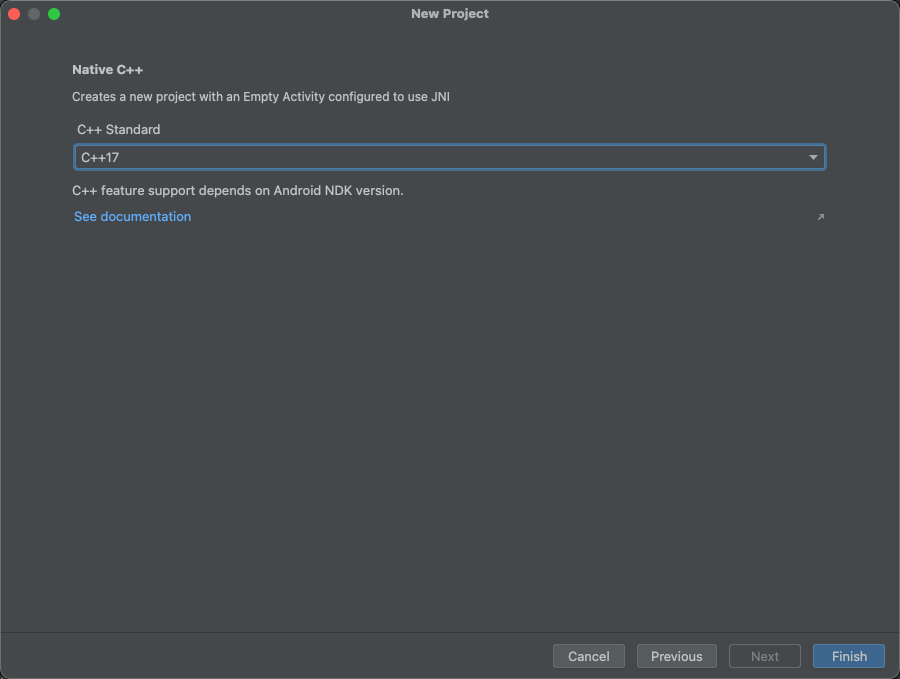
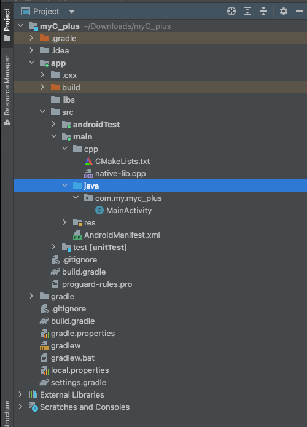

###  NDK 开发简介

1. 为了安全（C++ 反编译出来的代码狗都不想看，加了混淆，狗看了都摇头）
2. 为了运行速度
3. 他能够获取 Java 层的返回值，或者能够给 Java 层递返回值

### 创建项目

1. 首先是我们要选择，我们的项目，注意不是任何的项目都可以，只能是 Native C++ 的项目



​					

2. 设置你的项目的名称

   

​			

3. 最后是选择 C++ 



​				

### 认识你的项目文件结构



你会看到相较于以前的新建的项目，我们的项目多了 CPP 的这个文件夹				

这个目录下存放的是你的 C++ 源代码文件和 `CMakeLists.txt` 文件，用于编译你的 C++ 代码				


我们来看看 MainActivity.java 这个文件有什么不同

```java
package com.my.myc_plus;

import androidx.appcompat.app.AppCompatActivity;

import android.os.Bundle;
import android.widget.TextView;

import com.my.myc_plus.databinding.ActivityMainBinding;

public class MainActivity extends AppCompatActivity {

    static {
        System.loadLibrary("myc_plus");
    }

    private ActivityMainBinding binding;

    @Override
    protected void onCreate(Bundle savedInstanceState) {
        super.onCreate(savedInstanceState);

        binding = ActivityMainBinding.inflate(getLayoutInflater());
        setContentView(binding.getRoot());

        TextView tv = binding.sampleText;
        tv.setText(stringFromJNI());
    }

    public native String stringFromJNI();
}
```

​			

这里我们发现他导入了 libmyc_plus.so 的这个文件（但是我们没有 myc_plus.cpp 的这个文件啊，这个我们后面解释）

```java
    static {
        System.loadLibrary("myc_plus");
    }
```

​			

这是一个被 native 修饰的一个函数，说明这个函数的实现在 so 文件当中，也就是上面我们看到的那个 so 文件，看这个函数的类型就知道返回的是一个字符串，并且这个字符串在后面的展示当中被当做展示的文本

```java
public native String stringFromJNI();
```

​			

注意：如果你的一个 项目或者说一个类当中被加入了多个 so 文件，那么你应该要确保，每一个 so 层的函数的函数名没有重复，因为你重复以后，他不会报错，但是他的执行是按照，谁先加载执行谁的函数，所以可能会出现执行的函数和你想象当中不一样的情况

​			

**对应的 C++ 的代码**

```C++
#include <jni.h>
#include <string>

extern "C" JNIEXPORT jstring JNICALL
Java_com_my_myc_1plus_MainActivity_stringFromJNI(
        JNIEnv* env,
        jobject /* this */) {
    std::string hello = "Hello from C++";
    return env->NewStringUTF(hello.c_str());
}
```

注意：通过观察这个 ，Java_com_my_myc_1plus_MainActivity_stringFromJNI 这个路径，我们会发现，为什么多了一个 1 			

为什么不是 ： Java_com_my_myc_plus_MainActivity_stringFromJNI，那是因为在原来的路径当中 com.my.myc_plus.MainActivity.stringFromJNI()，有一个下划线，这个下划线没有办法直接转，不然就成了两个下划线，看起来很怪，而且下划线一多，也不知道连在一起到底多少个下划线。所以下划线就转换成了 1 

​				

**加载 so 文件的方式有两种(一般都是 System.loadLibrary )**

1. `System.loadLibrary(String libName)`: 这个函数接受一个库名（不包括 "lib" 前缀和 ".so" 后缀）作为参数。它会搜索系统的库路径（例如，在 Android 设备上的 `/lib` 目录）和应用的私有库路径（例如，你的 APK 包里的 `lib` 目录）来查找并加载这个库。
2. `System.load(String absolutePath)`: 这个函数接受一个 `.so` 文件的绝对路径作为参数。它不会搜索任何路径，而是直接加载这个路径下的 `.so` 文件。

​				

**为什么 C++ 的文件名和 .so 的文件名不一样**

原因是编译文件决定的

```tex
# For more information about using CMake with Android Studio, read the
# documentation: https://d.android.com/studio/projects/add-native-code.html

# Sets the minimum version of CMake required to build the native library.

cmake_minimum_required(VERSION 3.22.1)

# Declares and names the project.

project("myc_plus")

# Creates and names a library, sets it as either STATIC
# or SHARED, and provides the relative paths to its source code.
# You can define multiple libraries, and CMake builds them for you.
# Gradle automatically packages shared libraries with your APK.

add_library( # Sets the name of the library.
        myc_plus

        # Sets the library as a shared library.
        SHARED

        # Provides a relative path to your source file(s).
        native-lib.cpp)

# Searches for a specified prebuilt library and stores the path as a
# variable. Because CMake includes system libraries in the search path by
# default, you only need to specify the name of the public NDK library
# you want to add. CMake verifies that the library exists before
# completing its build.

find_library( # Sets the name of the path variable.
        log-lib

        # Specifies the name of the NDK library that
        # you want CMake to locate.
        log)

# Specifies libraries CMake should link to your target library. You
# can link multiple libraries, such as libraries you define in this
# build script, prebuilt third-party libraries, or system libraries.

target_link_libraries( # Specifies the target library.
        myc_plus

        # Links the target library to the log library
        # included in the NDK.
        ${log-lib})
```

​			

```tex
add_library( # Sets the name of the library.
        myc_plus

        # Sets the library as a shared library.
        SHARED

        # Provides a relative path to your source file(s).
        native-lib.cpp)
```

这个部分决定了生成的 so 文件的名字

​			

### C++ 代码

```C++
extern "C"
JNIEXPORT jstring JNICALL
Java_com_example_myapp_MyActivity_stringFromJNI(
    JNIEnv* env,
    jobject /* this */) {
  std::string hello = "Hello from C++";
  return env->NewStringUTF(hello.c_str());
}
```


