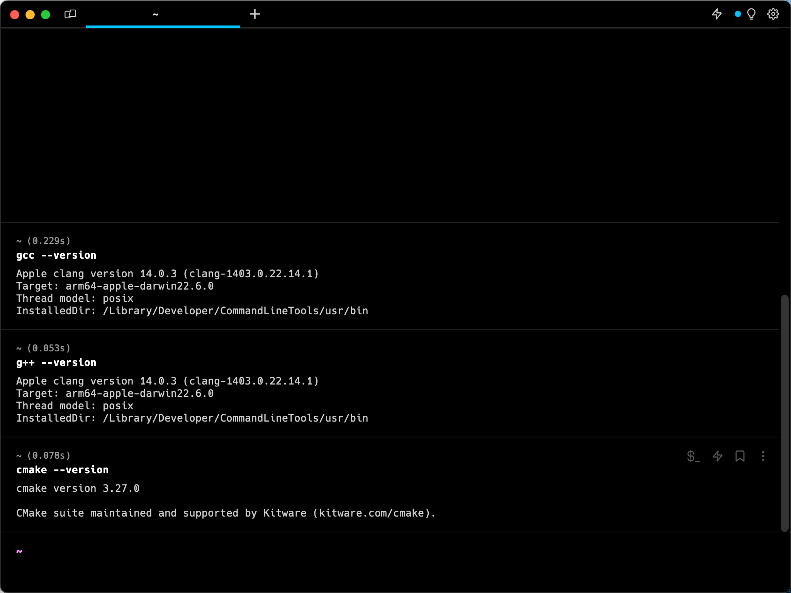
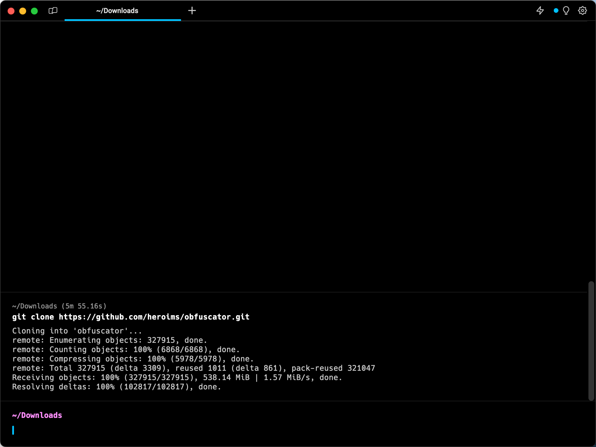
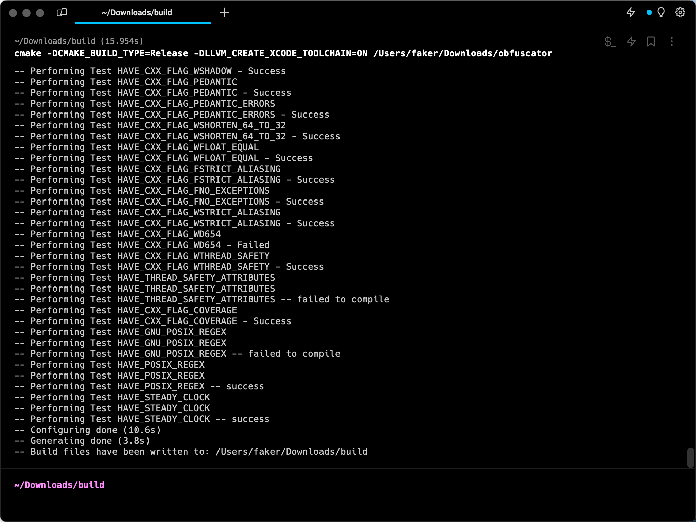
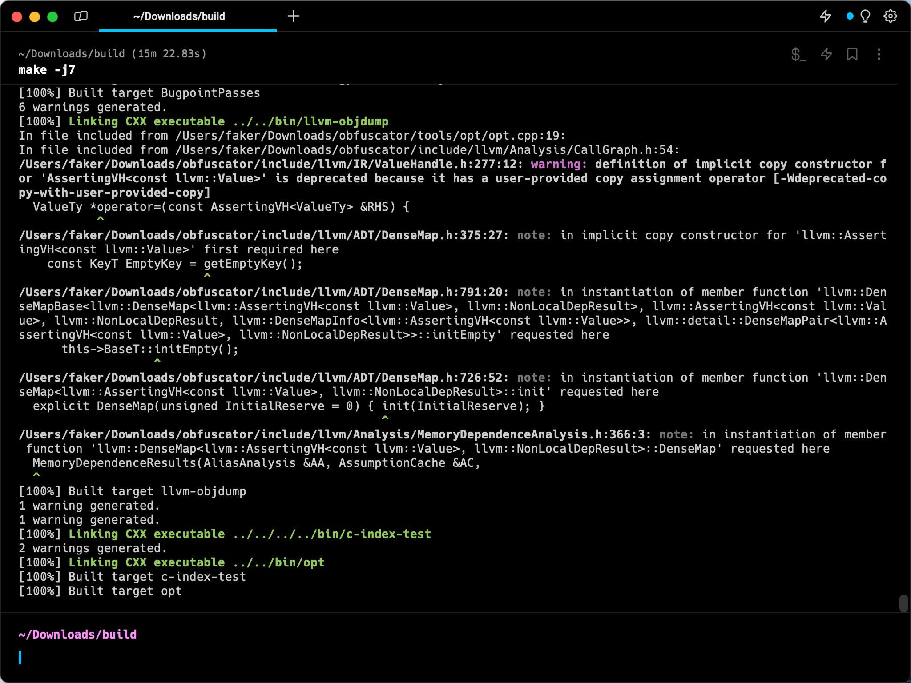
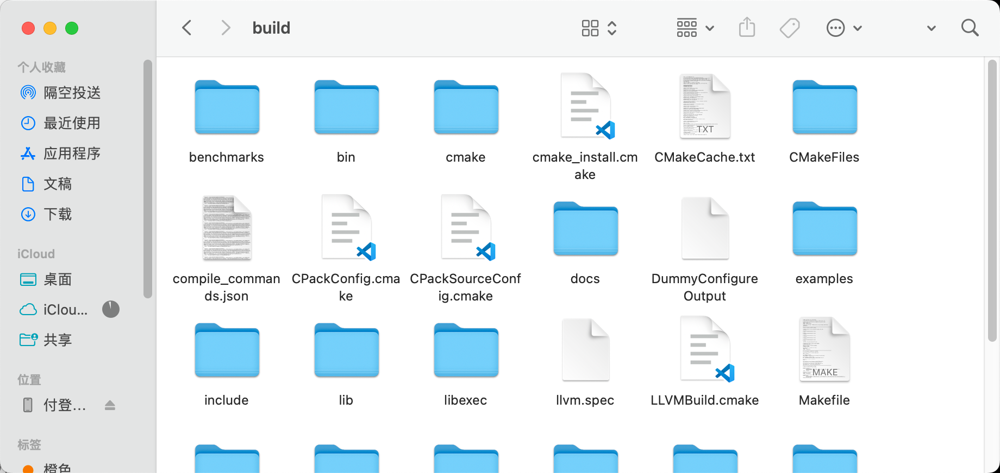
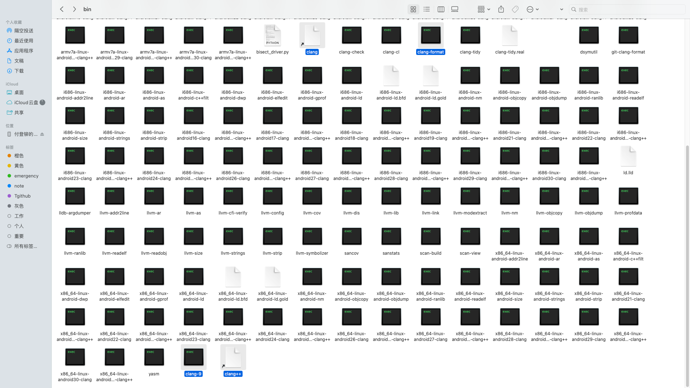
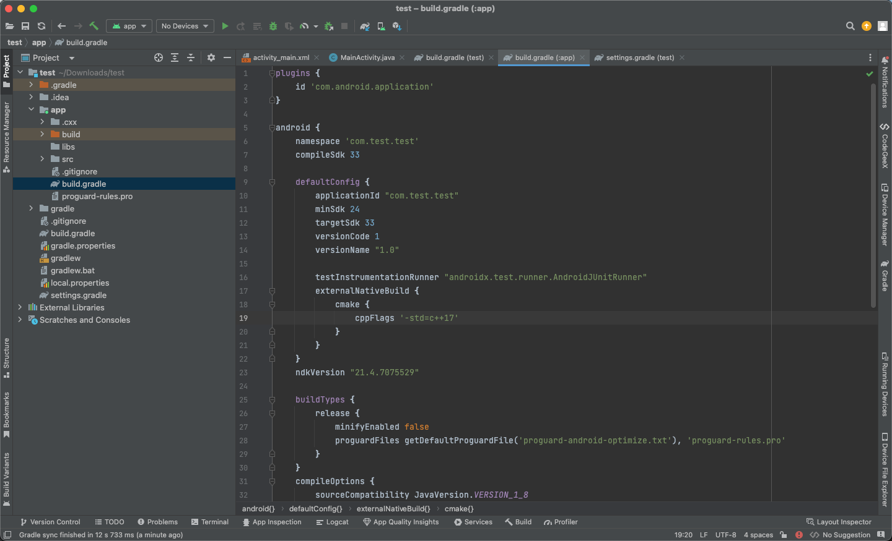
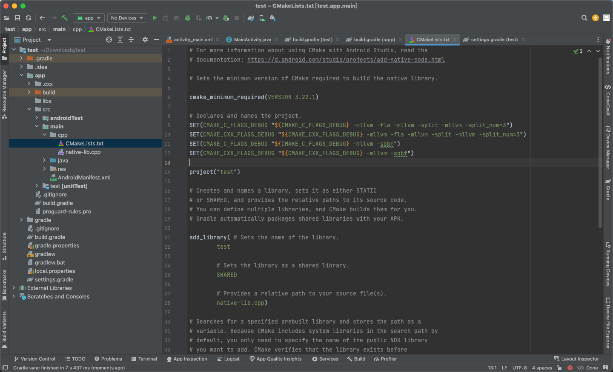
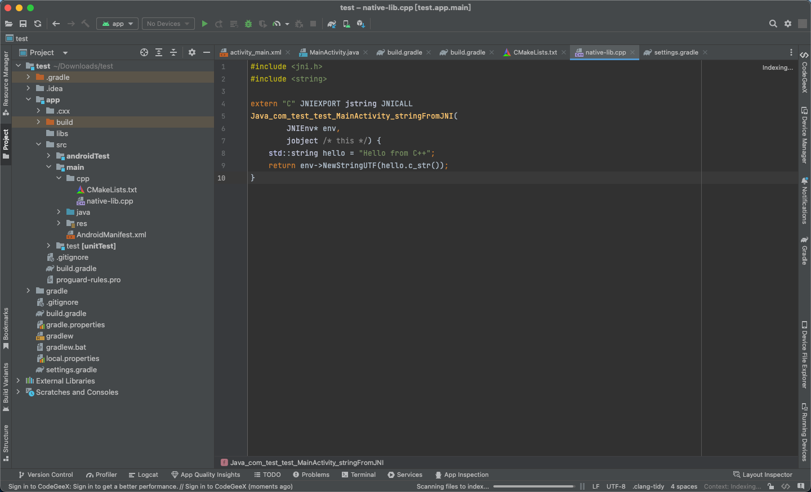
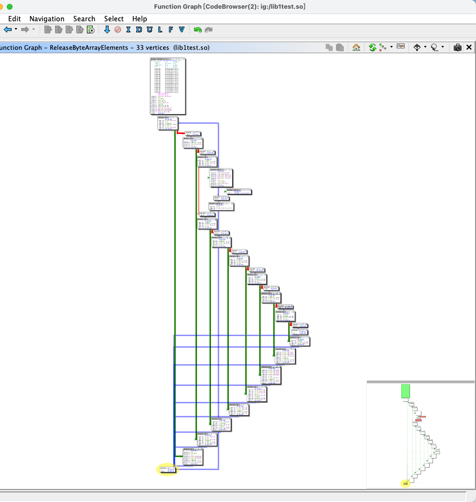

## 编译OLLVM并且混淆SO实例

### 前言

- mllvm -fla：控制流扁平化
- mllvm -sub：指令替换
- mllvm -bcf：虚假控制流程
- mllvm -sobf： 字符串加密


### 环境准备

1. 笔者当前的环境是 MacOS Ventura
2. 编译需要安装
   1. gcc
   2. g++
   3. cmake（安装最新的，低版本会报错）
   4. ndk版本（21,22）


先检查自己的环境是不是已经具备了这些环境




**NDK 的位置**

如果你是 MacOS ，并且使用的是 Android studio 进行安装的 NDK ，一般都是在：**/Users/你的电脑的用户名/Library/Android/sdk**


### 下载并编译ollvm9.0.1

github上地址是https://github.com/obfuscator-llvm/obfuscator 只不过仅更新到llvm的4.0（已经被抛弃）

​					

**下载别人的 9.0.1**

```git
git clone <https://github.com/heroims/obfuscator.git>
```

				

​			

**编译**

```Git
cd obfuscator
git checkout llvm-9.0.1  #切换分支至9.0.1
mkdir build  #新建目录
cd build
# 执行编译
cmake -DCMAKE_BUILD_TYPE=Release -DLLVM_CREATE_XCODE_TOOLCHAIN=ON ../obfuscator/
make -j7
```

**make -j7** 表示的是用七个核心进行编译，少了的话，很费时间


**CMAKE 成功**



​						

**编译成功**



​					

现在看看我们的 build 的这个目录，关注 bin，lib 这两个文件夹



​					

### 替换文件

把 build/bin 下面的 				

clang、clang++、clang-9、clang-format				

替换到

/Users/你的电脑的用户名/Library/Android/sdk/ndk/21.4.7075529/toolchains/llvm/prebuilt/darwin-x86_64/bin 当中




把 /build/lib/clang/9.0.1/include 下面的 				

stdarg.h，stddef.h，__stddef_max_align_t.h，float.h			

替换到

/Users/你的电脑的用户名/Library/Android/sdk/ndk/21.4.7075529/toolchains/llvm/prebuilt/darwin-x86_64/bin 当中

ndk/21.0.6113669/toolchains/llvm/prebuilt/linux-x86_64/sysroot/usr/include

​						

还有将编译生成的头部文件替换到ndk中，不然Android Studio 编译时会提示找不到stddef.h文件

将编译目录/build/lib/clang/9.0.1/include文件夹中的下列这些文件

stdarg.h
stddef.h
__stddef_max_align_t.h
float.h

复制到 /Users/你的电脑的用户名/Library/Android/sdk/ndk/21.4.7075529/toolchains/llvm/prebuilt/darwin-x86_64/sysroot/usr/include 文件夹中


# 新建项目开始混淆

在模块级别的 build.gradle 当中指定 ndk 的版本，也就是你修改过的版本



​				

Android Studio 中新建一个带有c++的项目，在CmakeList.txt文件中添加指令

```jsx
SET(CMAKE_C_FLAGS_DEBUG "${CMAKE_C_FLAGS_DEBUG} -mllvm -fla -mllvm -split -mllvm -split_num=3")
SET(CMAKE_CXX_FLAGS_DEBUG "${CMAKE_CXX_FLAGS_DEBUG} -mllvm -fla -mllvm -split -mllvm -split_num=3")
SET(CMAKE_C_FLAGS_DEBUG "${CMAKE_C_FLAGS_DEBUG} -mllvm -sobf")
SET(CMAKE_CXX_FLAGS_DEBUG "${CMAKE_CXX_FLAGS_DEBUG} -mllvm -sobf")
```




其中，ollvm9.0.1支持

- mllvm -fla：控制流扁平化，最直观的感受就是简单的if-else语句，被嵌套成了while-switch语句，出现了很多干扰无用的分支，增加阅读难度。
- mllvm -sub：指令替换，主要是将正常的运算操作（+，-，&，|等）替换成功能相等但表述更复杂的形式。
- mllvm -bcf：虚假控制流程，表示使用控制流伪造模式，也是对程序的控制流做操作。BCF模式会在原代码块的前后随机插入新的代码块，新插入的代码块不是确定的，然后新代码块再通过条件判断跳转到原代码块中
- mllvm -sobf： 字符串加密，就是代码中出现的字符串进行替换，

另外还可以设置 这些指令出现的频率、次数等等。


最后看看我们的没有编译过的 cpp 文件




### 效果样图



---

