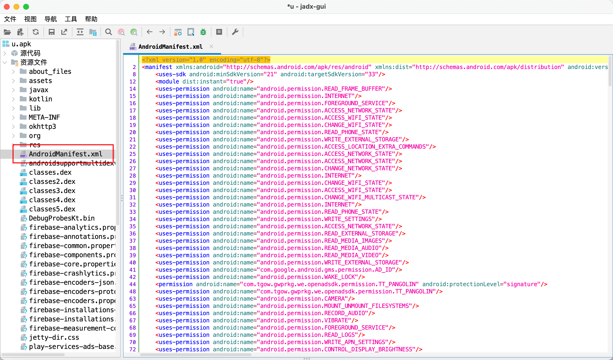

## androidmanifest.xml

当我我们用 jadx-gui 的时候就能够看得到，一个 app 的文件结构，在资源文件下面就是我们现在关心的

Androidmanifest.xml 的文件



​			

他是一个清单文件，在这个文件当中我们能够大致的看到这个 app 的大部分的内容，其中包括

1. **声明权限**：这个权限包括，系统的权限，还有就是自定义的权限。应用可能需要访问设备的功能或信息（如相机、联系人、网络等）。这些权限必须在 `AndroidManifest.xml` 中声明。
2. **定义组件**：应用的四大组件（活动（Activities）、服务（Services）、广播接收器（Broadcast Receivers）、内容提供器（Content Providers））都需要在这里注册。例如，每个活动都需要有一个 `<activity>` 元素。同时，我们还会在这个，每一个组件当中指定，相应的属性，比方说入口或者是他的属性
3. **设置应用级别属性**：例如，可以在此文件中定义应用的最小、最大 SDK 版本，是否支持平板设备，主题样式等。
4. **添加元数据**：可以在这里为应用或其组件添加元数据，例如 Google Play 服务配置。
5. **配置硬件和软件特性**：声明应用需要的硬件和软件特性，如是否需要触摸屏、是否需要电话功能等。

​			

### 手撕 Androidmanifest.xml

下面我们看一个完整的 xml 文件，逐行解释里面的内容

```xml
<?xml version="1.0" encoding="utf-8"?>
<manifest xmlns:android="http://schemas.android.com/apk/res/android" xmlns:dist="http://schemas.android.com/apk/distribution" android:versionCode="20204" android:versionName="V2.2.4" android:compileSdkVersion="33" android:compileSdkVersionCodename="13" package="com.tgow.gwprkg.we" platformBuildVersionCode="33" platformBuildVersionName="13">
    <uses-sdk android:minSdkVersion="21" android:targetSdkVersion="33"/>
    <module dist:instant="true"/>
    <uses-permission android:name="android.permission.READ_FRAME_BUFFER"/>
    <uses-permission android:name="android.permission.INTERNET"/>
    <uses-permission android:name="android.permission.FOREGROUND_SERVICE"/>
    <uses-permission android:name="android.permission.ACCESS_NETWORK_STATE"/>
    <uses-permission android:name="android.permission.ACCESS_WIFI_STATE"/>
    <uses-permission android:name="android.permission.CHANGE_WIFI_STATE"/>
    <uses-permission android:name="android.permission.READ_PHONE_STATE"/>
    <uses-permission android:name="android.permission.WRITE_EXTERNAL_STORAGE"/>
    <uses-permission android:name="android.permission.ACCESS_LOCATION_EXTRA_COMMANDS"/>
    <uses-permission android:name="android.permission.ACCESS_NETWORK_STATE"/>
    <uses-permission android:name="android.permission.ACCESS_NETWORK_STATE"/>
    <uses-permission android:name="android.permission.CHANGE_NETWORK_STATE"/>
    <uses-permission android:name="android.permission.INTERNET"/>
    <uses-permission android:name="android.permission.CHANGE_WIFI_STATE"/>
    <uses-permission android:name="android.permission.ACCESS_WIFI_STATE"/>
    <uses-permission android:name="android.permission.CHANGE_WIFI_MULTICAST_STATE"/>
    <uses-permission android:name="android.permission.INTERNET"/>
    <uses-permission android:name="android.permission.READ_PHONE_STATE"/>
    <uses-permission android:name="android.permission.WRITE_SETTINGS"/>
    <uses-permission android:name="android.permission.ACCESS_NETWORK_STATE"/>
    <uses-permission android:name="android.permission.READ_EXTERNAL_STORAGE"/>
    <uses-permission android:name="android.permission.READ_MEDIA_IMAGES"/>
    <uses-permission android:name="android.permission.READ_MEDIA_AUDIO"/>
    <uses-permission android:name="android.permission.READ_MEDIA_VIDEO"/>
    <uses-permission android:name="android.permission.WRITE_EXTERNAL_STORAGE"/>
    <uses-permission android:name="com.google.android.gms.permission.AD_ID"/>
    <uses-permission android:name="android.permission.WAKE_LOCK"/>
    <permission android:name="com.tgow.gwprkg.we.openadsdk.permission.TT_PANGOLIN" android:protectionLevel="signature"/>
    <uses-permission android:name="com.tgow.gwprkg.we.openadsdk.permission.TT_PANGOLIN"/>
    <uses-permission android:name="android.permission.CAMERA"/>
    <uses-permission android:name="android.permission.MOUNT_UNMOUNT_FILESYSTEMS"/>
    <uses-permission android:name="android.permission.RECORD_AUDIO"/>
    <uses-permission android:name="android.permission.VIBRATE"/>
    <uses-permission android:name="android.permission.FOREGROUND_SERVICE"/>
    <uses-permission android:name="android.permission.READ_LOGS"/>
    <uses-permission android:name="android.permission.WRITE_APN_SETTINGS"/>
    <uses-permission android:name="android.permission.CONTROL_DISPLAY_BRIGHTNESS"/>
    <uses-permission android:name="android.permission.WAKE_LOCK"/>
    <uses-permission android:name="android.permission.SYSTEM_ALERT_WINDOW"/>
    <uses-permission android:name="android.permission.GET_TASKS"/>
    <uses-permission android:name="android.permission.SYSTEM_OVERLAY_WINDOW"/>
    <queries package="com.tgow.gwprkg.we">
        <intent>
            <action android:name="android.media.action.IMAGE_CAPTURE"/>
        </intent>
        <intent>
            <action android:name="android.media.action.ACTION_VIDEO_CAPTURE"/>
        </intent>
        <intent>
            <action android:name="android.intent.action.VIEW"/>
            <category android:name="android.intent.category.BROWSABLE"/>
            <data android:scheme="https"/>
        </intent>
        <intent>
            <action android:name="com.applovin.am.intent.action.APPHUB_SERVICE"/>
        </intent>
        <package android:name="com.facebook.katana"/>
        <package android:name="com.sec.android.app.samsungapps"/>
        <package android:name="com.google.android.gms"/>
        <package android:name="com.android.vending"/>
        <package android:name="com.android.creator"/>
        <package android:name="com.mdid.msa"/>
        <package android:name="com.samsung.android.deviceidservice"/>
        <package android:name="com.coolpad.deviceidsupport"/>
        <package android:name="com.heytap.openid"/>
        <package android:name="com.huawei.hwid"/>
        <package android:name="com.huawei.hwid.tv"/>
        <package android:name="com.huawei.hms"/>
        <package android:name="com.asus.msa.SupplementaryDID"/>
        <package android:name="com.zui.deviceidservice"/>
        <intent>
            <action android:name="android.support.customtabs.action.CustomTabsService"/>
        </intent>
    </queries>
    <uses-permission android:name="com.applovin.array.apphub.permission.BIND_APPHUB_SERVICE"/>
    <uses-permission android:name="android.permission.FLASHLIGHT"/>
    <uses-feature android:name="android.hardware.camera"/>
    <uses-feature android:name="android.hardware.camera.autofocus"/>
    <uses-permission android:name="com.google.android.finsky.permission.BIND_GET_INSTALL_REFERRER_SERVICE"/>
    <uses-permission android:name="com.asus.msa.SupplementaryDID.ACCESS"/>
    <uses-permission android:name="freemme.permission.msa"/>
    <permission android:name="com.tgow.gwprkg.we.DYNAMIC_RECEIVER_NOT_EXPORTED_PERMISSION" android:protectionLevel="signature"/>
    <uses-permission android:name="com.tgow.gwprkg.we.DYNAMIC_RECEIVER_NOT_EXPORTED_PERMISSION"/>
    <application android:theme="@style/ft" android:label="@string/app_name" android:icon="@mipmap/ic_launcher" android:name="bk.CV" android:testOnly="false" android:allowBackup="true" android:hardwareAccelerated="true" android:largeHeap="true" android:supportsRtl="true" android:usesCleartextTraffic="true" android:networkSecurityConfig="@xml/network_security_config" android:roundIcon="@mipmap/ic_launcher_round" android:appComponentFactory="androidx.core.app.CoreComponentFactory" android:requestLegacyExternalStorage="true" android:localeConfig="@xml/locales_config">
        <meta-data android:name="UMENG_CHANNEL" android:value="uniquegg"/>
        <meta-data android:name="com.google.android.gms.ads.APPLICATION_ID" android:value="ca-app-pub-2073519642421697~1051875217"/>
        <meta-data android:name="com.facebook.sdk.ApplicationId" android:value="@string/facebook_app_id"/>
        <meta-data android:name="com.facebook.sdk.ClientToken" android:value="@string/facebook_client_token"/>
        <meta-data android:name="com.amap.api.v2.apikey" android:value="49e7da570e2080509b0062fa2f3a46a6"/>
        <service android:name="bl.CW" android:exported="false"/>
        <provider android:name="ba.CX" android:exported="false" android:authorities="com.tgow.gwprkg.we.fileProvider" android:grantUriPermissions="true">
            <meta-data android:name="android.support.FILE_PROVIDER_PATHS" android:resource="@xml/file_paths"/>
        </provider>
        <uses-library android:name="org.apache.http.legacy" android:required="false"/>
        <service android:name="bm.CY" android:exported="false"/>
        <service android:name="bn.CZ" android:exported="false"/>
        <service android:name="bn.DA" android:exported="false"/>
        <activity android:theme="@style/m" android:name="bo.DB" android:exported="true" android:alwaysRetainTaskState="true">
            <intent-filter>
                <action android:name="android.intent.action.MAIN"/>
                <category android:name="android.intent.category.LAUNCHER"/>
            </intent-filter>
            <intent-filter>
                <action android:name="android.intent.action.MAIN"/>
                <category android:name="android.intent.category.DEFAULT"/>
                <category android:name="android.intent.category.BROWSABLE"/>
            </intent-filter>
            <intent-filter>
                <action android:name="android.intent.action.VIEW"/>
                <category android:name="android.intent.category.DEFAULT"/>
                <category android:name="android.intent.category.BROWSABLE"/>
                <data android:scheme="videoapp" android:host="fbsplash"/>
            </intent-filter>
        </activity>
        <activity android:name="bp.DC" android:exported="true" android:launchMode="singleTask" android:screenOrientation="portrait">
            <intent-filter>
                <action android:name="android.intent.action.VIEW"/>
                <action android:name="android.intent.action.LOOKPLUS_PAGE"/>
                <category android:name="android.intent.category.DEFAULT"/>
                <category android:name="android.intent.category.BROWSABLE"/>
                <data android:scheme="videoapp" android:host="mainaction"/>
            </intent-filter>
        </activity>
        <activity android:name="bp.DD"/>
        <activity android:name="bq.DE" android:screenOrientation="portrait" android:configChanges="smallestScreenSize|screenSize|screenLayout|orientation|keyboardHidden"/>
        <activity android:name="br.DF" android:screenOrientation="portrait" android:windowSoftInputMode="adjustNothing"/>
        <activity android:name="bs.DG" android:screenOrientation="portrait"/>
        <activity android:name="bs.DH" android:configChanges="screenSize|orientation|keyboardHidden"/>
        <activity android:name="bs.DI" android:screenOrientation="portrait"/>
        <activity android:name="bt.DJ" android:screenOrientation="portrait" android:windowSoftInputMode="adjustResize|stateHidden"/>
        <activity android:name="bt.DK" android:screenOrientation="portrait"/>
        <activity android:name="bu.DL" android:screenOrientation="portrait"/>
        <activity android:name="bv.DM" android:screenOrientation="portrait"/>
        <activity android:name="bs.DN" android:screenOrientation="portrait"/>
        <activity android:name="bs.DO" android:screenOrientation="portrait"/>
        <activity android:name="bw.DP" android:screenOrientation="portrait"/>
        <activity android:name="bs.DQ" android:screenOrientation="portrait"/>
        <activity android:name="bw.DR" android:screenOrientation="portrait"/>
        <activity android:name="bs.DS" android:screenOrientation="portrait"/>
        <activity android:name="bs.DT" android:screenOrientation="portrait"/>
        <activity android:name="bu.DU" android:screenOrientation="portrait"/>
        <activity android:name="bo.DV" android:screenOrientation="portrait"/>
        <activity android:name="bo.DW" android:screenOrientation="portrait"/>
        <activity android:name="bo.DX" android:screenOrientation="portrait"/>
        <activity android:name="bo.DY" android:screenOrientation="portrait"/>
        <activity android:name="bx.DZ" android:screenOrientation="portrait"/>
        <activity android:name="bx.EA" android:screenOrientation="portrait"/>
        <activity android:name="bo.EB" android:screenOrientation="portrait"/>
        <activity android:name="bw.EC" android:screenOrientation="portrait"/>
        <activity android:name="bw.ED" android:exported="true" android:screenOrientation="portrait">
            <intent-filter>
                <action android:name="android.intent.action.VIEW"/>
                <action android:name="android.intent.action.LOOKPLUS_PAGE"/>
                <category android:name="android.intent.category.DEFAULT"/>
                <category android:name="android.intent.category.BROWSABLE"/>
                <data android:scheme="videoapp" android:host="selectorsexaction"/>
            </intent-filter>
        </activity>
        <activity android:name="bz.EE" android:screenOrientation="portrait"/>
        <activity android:name="com.facebook.CustomTabActivity" android:exported="true">
            <intent-filter>
                <action android:name="android.intent.action.VIEW"/>
                <category android:name="android.intent.category.DEFAULT"/>
                <category android:name="android.intent.category.BROWSABLE"/>
                <data android:scheme="@string/fb_login_protocol_scheme"/>
            </intent-filter>
            <intent-filter>
                <action android:name="android.intent.action.VIEW"/>
                <category android:name="android.intent.category.DEFAULT"/>
                <category android:name="android.intent.category.BROWSABLE"/>
                <data android:scheme="fbconnect" android:host="cct.com.tgow.gwprkg.we"/>
            </intent-filter>
        </activity>
        <activity android:name="ca.EF" android:launchMode="singleTop" android:screenOrientation="fullSensor"/>
        <activity android:name="cb.EG" android:launchMode="singleTop" android:screenOrientation="fullSensor"/>
        <activity android:name="cb.EH" android:launchMode="singleTop" android:screenOrientation="fullSensor"/>
        <activity android:name="cb.EI" android:launchMode="singleTop" android:screenOrientation="fullSensor"/>
        <activity android:name="cb.EJ" android:launchMode="singleTop" android:screenOrientation="fullSensor"/>
        <activity android:name="cb.EK" android:launchMode="singleTop" android:screenOrientation="fullSensor"/>
        <activity android:name="cb.EL" android:launchMode="singleTop" android:screenOrientation="fullSensor"/>
        <activity android:theme="@style/nf" android:name="cc.EM" android:exported="true">
            <intent-filter>
                <action android:name="android.intent.action.VIEW"/>
                <action android:name="android.intent.action.LOOKPLUS_PAGE"/>
                <category android:name="android.intent.category.DEFAULT"/>
                <category android:name="android.intent.category.BROWSABLE"/>
                <data android:scheme="videoapp" android:host="uniqueaction"/>
            </intent-filter>
        </activity>
        <activity android:theme="@style/nf" android:name="cc.EN" android:exported="true"/>
        <activity android:theme="@style/nf" android:name="cc.EO" android:exported="true"/>
        <activity android:theme="@style/nf" android:name="cc.EP" android:exported="true"/>
        <activity android:theme="@style/nf" android:name="cc.EQ" android:exported="true"/>
        <activity android:theme="@style/nf" android:name="cc.ER" android:exported="true"/>
        <activity android:name="cd.ES" android:configChanges="orientation|keyboardHidden"/>
        <activity android:name="ce.ET" android:process=":error_activity"/>
        <provider android:name="ce.EU" android:exported="false" android:authorities="com.tgow.gwprkg.we.customactivityoncrashinitprovider" android:initOrder="101"/>
        <activity android:theme="@style/main_commom_theme" android:name="com.yk.e.activity.RewardVideoActivity" android:launchMode="singleTask" android:configChanges="screenSize|orientation|keyboardHidden" android:hardwareAccelerated="true"/>
        <activity android:theme="@style/main_commom_theme" android:name="com.yk.e.activity.WebActivity" android:launchMode="singleTask" android:screenOrientation="portrait" android:configChanges="screenSize|orientation|keyboardHidden"/>
        <activity android:theme="@style/main_commom_theme" android:name="com.yk.e.activity.GameActivity" android:launchMode="singleTask" android:screenOrientation="portrait" android:configChanges="screenSize|orientation|keyboardHidden"/>
        <activity android:theme="@style/main_commom_theme" android:name="com.yk.e.activity.RewardWebActivity" android:launchMode="singleTask" android:configChanges="screenSize|orientation|keyboardHidden" android:hardwareAccelerated="true"/>
        <receiver android:name="com.yk.e.receiver.InstallReceiver" android:exported="true">
            <intent-filter>
                <action android:name="android.intent.action.PACKAGE_ADDED"/>
            </intent-filter>
        </receiver>
        <provider android:name="com.yk.e.provider.MainProvider" android:exported="false" android:authorities="com.tgow.gwprkg.we.MainProvider" android:grantUriPermissions="true">
            <meta-data android:name="android.support.FILE_PROVIDER_PATHS" android:resource="@xml/main_file_path"/>
        </provider>
        <meta-data android:name="OKT_SDK_VERSION" android:value="2.10.6"/>
        <meta-data android:name="applovin.sdk.key" android:value="mDldykZT8VavsvNyix46brOLNusOEaSOQmP5nOaCIAuJTRVCQCutpUzMRU39tzFGlZLbi5vlA37uS_1A0qSTuB"/>
        <activity android:theme="@android:style/Theme.NoTitleBar.Fullscreen" android:name="com.unity3d.services.ads.adunit.AdUnitActivity" android:exported="false" android:configChanges="fontScale|smallestScreenSize|screenSize|uiMode|screenLayout|orientation|navigation|keyboardHidden|keyboard|touchscreen|locale|mnc|mcc" android:hardwareAccelerated="true"/>
        <activity android:theme="@android:style/Theme.Translucent.NoTitleBar.Fullscreen" android:name="com.unity3d.services.ads.adunit.AdUnitTransparentActivity" android:exported="false" android:configChanges="fontScale|smallestScreenSize|screenSize|uiMode|screenLayout|orientation|navigation|keyboardHidden|keyboard|touchscreen|locale|mnc|mcc" android:hardwareAccelerated="true"/>
        <activity android:theme="@android:style/Theme.Translucent.NoTitleBar.Fullscreen" android:name="com.unity3d.services.ads.adunit.AdUnitTransparentSoftwareActivity" android:exported="false" android:configChanges="fontScale|smallestScreenSize|screenSize|uiMode|screenLayout|orientation|navigation|keyboardHidden|keyboard|touchscreen|locale|mnc|mcc" android:hardwareAccelerated="false"/>
        <activity android:theme="@android:style/Theme.NoTitleBar.Fullscreen" android:name="com.unity3d.services.ads.adunit.AdUnitSoftwareActivity" android:exported="false" android:configChanges="fontScale|smallestScreenSize|screenSize|uiMode|screenLayout|orientation|navigation|keyboardHidden|keyboard|touchscreen|locale|mnc|mcc" android:hardwareAccelerated="false"/>
        <provider android:name="androidx.startup.InitializationProvider" android:exported="false" android:authorities="com.tgow.gwprkg.we.androidx-startup">
            <meta-data android:name="androidx.lifecycle.ProcessLifecycleInitializer" android:value="androidx.startup"/>
            <meta-data android:name="com.unity3d.services.core.configuration.AdsSdkInitializer" android:value="androidx.startup"/>
            <meta-data android:name="androidx.emoji2.text.EmojiCompatInitializer" android:value="androidx.startup"/>
            <meta-data android:name="androidx.work.WorkManagerInitializer" android:value="androidx.startup"/>
        </provider>
        <activity android:theme="@style/tt_landing_page" android:name="com.bytedance.sdk.openadsdk.activity.TTLandingPageActivity" android:launchMode="standard" android:configChanges="screenSize|orientation|keyboardHidden"/>
        <activity android:theme="@style/tt_landing_page" android:name="com.bytedance.sdk.openadsdk.activity.TTPlayableLandingPageActivity" android:launchMode="standard" android:configChanges="screenSize|orientation|keyboardHidden"/>
        <activity android:theme="@style/tt_landing_page" android:name="com.bytedance.sdk.openadsdk.activity.TTVideoLandingPageLink2Activity" android:launchMode="standard" android:configChanges="screenSize|orientation|keyboardHidden"/>
        <activity android:theme="@android:style/Theme.Translucent.NoTitleBar" android:name="com.bytedance.sdk.openadsdk.activity.TTDelegateActivity" android:launchMode="standard"/>
        <activity android:theme="@style/tt_privacy_landing_page" android:name="com.bytedance.sdk.openadsdk.activity.TTWebsiteActivity" android:launchMode="standard" android:screenOrientation="portrait"/>
        <service android:name="com.bytedance.sdk.openadsdk.multipro.aidl.BinderPoolService"/>
        <activity android:theme="@style/tt_app_open_ad_no_animation" android:name="com.bytedance.sdk.openadsdk.activity.TTAppOpenAdActivity" android:launchMode="standard" android:configChanges="screenSize|orientation|keyboardHidden"/>
        <activity android:theme="@style/tt_full_screen_new" android:name="com.bytedance.sdk.openadsdk.activity.TTRewardVideoActivity" android:launchMode="standard" android:configChanges="screenSize|orientation|keyboardHidden"/>
        <activity android:theme="@style/tt_full_screen_new" android:name="com.bytedance.sdk.openadsdk.activity.TTRewardExpressVideoActivity" android:launchMode="standard" android:configChanges="screenSize|orientation|keyboardHidden"/>
        <activity android:theme="@style/tt_full_screen_new" android:name="com.bytedance.sdk.openadsdk.activity.TTFullScreenVideoActivity" android:launchMode="standard" android:configChanges="screenSize|orientation|keyboardHidden"/>
        <activity android:theme="@style/tt_full_screen_new" android:name="com.bytedance.sdk.openadsdk.activity.TTFullScreenExpressVideoActivity" android:launchMode="standard" android:configChanges="screenSize|orientation|keyboardHidden"/>
        <activity android:theme="@style/tt_full_screen_interaction" android:name="com.bytedance.sdk.openadsdk.activity.TTInterstitialActivity" android:launchMode="standard" android:configChanges="screenSize|orientation|keyboardHidden"/>
        <activity android:theme="@style/tt_full_screen_interaction" android:name="com.bytedance.sdk.openadsdk.activity.TTInterstitialExpressActivity" android:launchMode="standard" android:configChanges="screenSize|orientation|keyboardHidden"/>
        <activity android:name="com.vungle.warren.ui.VungleActivity" android:launchMode="singleTop" android:configChanges="smallestScreenSize|screenSize|uiMode|screenLayout|orientation|keyboardHidden"/>
        <provider android:name="com.vungle.warren.utility.VungleProvider" android:exported="false" android:authorities="com.tgow.gwprkg.we.vungle-provider"/>
        <provider android:name="com.applovin.sdk.AppLovinInitProvider" android:exported="false" android:authorities="com.tgow.gwprkg.we.applovininitprovider" android:initOrder="101"/>
        <activity android:name="com.applovin.adview.AppLovinFullscreenActivity" android:exported="false" android:launchMode="singleTop" android:screenOrientation="behind" android:configChanges="fontScale|smallestScreenSize|screenSize|uiMode|screenLayout|orientation|keyboardHidden|keyboard|locale" android:hardwareAccelerated="true"/>
        <activity android:theme="@android:style/Theme.NoTitleBar.Fullscreen" android:name="com.applovin.adview.AppLovinFullscreenThemedActivity" android:exported="false" android:launchMode="singleTop" android:screenOrientation="behind" android:configChanges="fontScale|smallestScreenSize|screenSize|uiMode|screenLayout|orientation|keyboardHidden|keyboard|locale" android:hardwareAccelerated="true"/>
        <activity android:name="com.applovin.sdk.AppLovinWebViewActivity" android:configChanges="fontScale|smallestScreenSize|screenSize|uiMode|screenLayout|orientation|keyboardHidden|keyboard|locale"/>
        <activity android:theme="@android:style/Theme.NoTitleBar.Fullscreen" android:name="com.applovin.mediation.hybridAds.MaxHybridMRecAdActivity" android:configChanges="fontScale|smallestScreenSize|screenSize|uiMode|screenLayout|orientation|keyboardHidden|keyboard|locale"/>
        <activity android:theme="@android:style/Theme.NoTitleBar.Fullscreen" android:name="com.applovin.mediation.hybridAds.MaxHybridNativeAdActivity" android:configChanges="fontScale|smallestScreenSize|screenSize|uiMode|screenLayout|orientation|keyboardHidden|keyboard|locale"/>
        <activity android:theme="@style/com.applovin.mediation.MaxDebuggerActivity.Theme" android:name="com.applovin.mediation.MaxDebuggerActivity" android:configChanges="fontScale|smallestScreenSize|screenSize|uiMode|screenLayout|orientation|keyboardHidden|keyboard|locale"/>
        <activity android:theme="@style/com.applovin.mediation.MaxDebuggerActivity.Theme" android:name="com.applovin.mediation.MaxDebuggerDetailActivity" android:configChanges="fontScale|smallestScreenSize|screenSize|uiMode|screenLayout|orientation|keyboardHidden|keyboard|locale"/>
        <activity android:theme="@style/com.applovin.mediation.MaxDebuggerActivity.Theme" android:name="com.applovin.mediation.MaxDebuggerMultiAdActivity" android:configChanges="fontScale|smallestScreenSize|screenSize|uiMode|screenLayout|orientation|keyboardHidden|keyboard|locale"/>
        <activity android:theme="@style/com.applovin.mediation.MaxDebuggerActivity.Theme" android:name="com.applovin.mediation.MaxDebuggerAdUnitsListActivity" android:configChanges="fontScale|smallestScreenSize|screenSize|uiMode|screenLayout|orientation|keyboardHidden|keyboard|locale"/>
        <activity android:theme="@style/com.applovin.mediation.MaxDebuggerActivity.Theme" android:name="com.applovin.mediation.MaxDebuggerAdUnitWaterfallsListActivity" android:configChanges="fontScale|smallestScreenSize|screenSize|uiMode|screenLayout|orientation|keyboardHidden|keyboard|locale"/>
        <activity android:theme="@style/com.applovin.mediation.MaxDebuggerActivity.Theme" android:name="com.applovin.mediation.MaxDebuggerAdUnitDetailActivity" android:configChanges="fontScale|smallestScreenSize|screenSize|uiMode|screenLayout|orientation|keyboardHidden|keyboard|locale"/>
        <activity android:theme="@style/com.applovin.mediation.MaxDebuggerActivity.Theme" android:name="com.applovin.mediation.MaxDebuggerTcfInfoListActivity" android:configChanges="fontScale|smallestScreenSize|screenSize|uiMode|screenLayout|orientation|keyboardHidden|keyboard|locale"/>
        <activity android:theme="@style/com.applovin.mediation.MaxDebuggerActivity.Theme" android:name="com.applovin.mediation.MaxDebuggerTcfStringActivity" android:configChanges="fontScale|smallestScreenSize|screenSize|uiMode|screenLayout|orientation|keyboardHidden|keyboard|locale"/>
        <activity android:theme="@style/com.applovin.mediation.MaxDebuggerActivity.Theme" android:name="com.applovin.mediation.MaxDebuggerTcfVendorDetailListActivity" android:configChanges="fontScale|smallestScreenSize|screenSize|uiMode|screenLayout|orientation|keyboardHidden|keyboard|locale"/>
        <activity android:theme="@style/com.applovin.mediation.MaxDebuggerActivity.Theme" android:name="com.applovin.mediation.MaxDebuggerTestLiveNetworkActivity" android:configChanges="fontScale|smallestScreenSize|screenSize|uiMode|screenLayout|orientation|keyboardHidden|keyboard|locale"/>
        <activity android:theme="@style/com.applovin.mediation.MaxDebuggerActivity.Theme" android:name="com.applovin.mediation.MaxDebuggerTestModeNetworkActivity" android:configChanges="fontScale|smallestScreenSize|screenSize|uiMode|screenLayout|orientation|keyboardHidden|keyboard|locale"/>
        <activity android:theme="@style/com.applovin.mediation.MaxDebuggerActivity.Theme" android:name="com.applovin.mediation.MaxDebuggerWaterfallKeywordsActivity" android:configChanges="fontScale|smallestScreenSize|screenSize|uiMode|screenLayout|orientation|keyboardHidden|keyboard|locale"/>
        <activity android:theme="@style/com.applovin.creative.CreativeDebuggerActivity.Theme" android:name="com.applovin.creative.MaxCreativeDebuggerActivity" android:configChanges="fontScale|smallestScreenSize|screenSize|uiMode|screenLayout|orientation|keyboardHidden|keyboard|locale"/>
        <activity android:theme="@style/com.applovin.creative.CreativeDebuggerActivity.Theme" android:name="com.applovin.creative.MaxCreativeDebuggerDisplayedAdActivity" android:configChanges="fontScale|smallestScreenSize|screenSize|uiMode|screenLayout|orientation|keyboardHidden|keyboard|locale"/>
        <service android:name="com.applovin.impl.adview.activity.FullscreenAdService" android:exported="false" android:stopWithTask="false"/>
        <provider android:name="com.luck.picture.lib.basic.PictureFileProvider" android:exported="false" android:authorities="com.tgow.gwprkg.we.luckProvider" android:grantUriPermissions="true">
            <meta-data android:name="android.support.FILE_PROVIDER_PATHS" android:resource="@xml/c"/>
        </provider>
        <service android:name="com.luck.picture.lib.service.ForegroundService" android:enabled="true" android:foregroundServiceType="location"/>
        <activity android:theme="@style/c_" android:name="com.luck.picture.lib.basic.PictureSelectorSupporterActivity" android:configChanges="screenSize|orientation|keyboardHidden"/>
        <activity android:theme="@style/h4" android:name="com.luck.picture.lib.basic.PictureSelectorTransparentActivity" android:configChanges="screenSize|orientation|keyboardHidden"/>
        <activity android:theme="@style/un" android:name="com.facebook.FacebookActivity" android:configChanges="screenSize|screenLayout|orientation|keyboardHidden|keyboard"/>
        <activity android:name="com.facebook.CustomTabMainActivity"/>
        <activity android:theme="@style/lw" android:name="ci.FE" android:screenOrientation="portrait" android:configChanges="screenSize|orientation|keyboardHidden"/>
        <activity android:theme="@style/lw" android:name="ci.FF" android:screenOrientation="portrait" android:configChanges="screenSize|orientation|keyboardHidden"/>
        <activity android:theme="@style/lx" android:name="com.yzq.zxinglibrary.android.CaptureActivity" android:screenOrientation="portrait" android:configChanges="screenSize|orientation" android:windowSoftInputMode="adjustPan|stateHidden"/>
        <provider android:name="com.facebook.internal.FacebookInitProvider" android:exported="false" android:authorities="com.tgow.gwprkg.we.FacebookInitProvider"/>
        <receiver android:name="com.facebook.CurrentAccessTokenExpirationBroadcastReceiver" android:exported="false">
            <intent-filter>
                <action android:name="com.facebook.sdk.ACTION_CURRENT_ACCESS_TOKEN_CHANGED"/>
            </intent-filter>
        </receiver>
        <receiver android:name="com.facebook.AuthenticationTokenManager.CurrentAuthenticationTokenChangedBroadcastReceiver" android:exported="false">
            <intent-filter>
                <action android:name="com.facebook.sdk.ACTION_CURRENT_AUTHENTICATION_TOKEN_CHANGED"/>
            </intent-filter>
        </receiver>
        <meta-data android:name="com.huawei.hms.client.service.name:ads-identifier" android:value="ads-identifier:3.4.39.302"/>
        <meta-data android:name="com.huawei.hms.client.service.name:ads-installreferrer" android:value="ads-installreferrer:3.4.39.302"/>
        <service android:name="com.google.firebase.components.ComponentDiscoveryService" android:exported="false" android:directBootAware="true">
            <meta-data android:name="com.google.firebase.components:com.google.firebase.crashlytics.CrashlyticsRegistrar" android:value="com.google.firebase.components.ComponentRegistrar"/>
            <meta-data android:name="com.google.firebase.components:com.google.firebase.analytics.connector.internal.AnalyticsConnectorRegistrar" android:value="com.google.firebase.components.ComponentRegistrar"/>
            <meta-data android:name="com.google.firebase.components:com.google.firebase.installations.FirebaseInstallationsRegistrar" android:value="com.google.firebase.components.ComponentRegistrar"/>
        </service>
        <service android:name="com.google.android.datatransport.runtime.backends.TransportBackendDiscovery" android:exported="false">
            <meta-data android:name="backend:com.google.android.datatransport.cct.CctBackendFactory" android:value="cct"/>
        </service>
        <service android:name="com.google.android.datatransport.runtime.scheduling.jobscheduling.JobInfoSchedulerService" android:permission="android.permission.BIND_JOB_SERVICE" android:exported="false"/>
        <receiver android:name="com.google.android.datatransport.runtime.scheduling.jobscheduling.AlarmManagerSchedulerBroadcastReceiver" android:exported="false"/>
        <provider android:name="com.google.firebase.provider.FirebaseInitProvider" android:exported="false" android:authorities="com.tgow.gwprkg.we.firebaseinitprovider" android:initOrder="100" android:directBootAware="true"/>
        <receiver android:name="com.google.android.gms.measurement.AppMeasurementReceiver" android:enabled="true" android:exported="false"/>
        <service android:name="com.google.android.gms.measurement.AppMeasurementService" android:enabled="true" android:exported="false"/>
        <service android:name="com.google.android.gms.measurement.AppMeasurementJobService" android:permission="android.permission.BIND_JOB_SERVICE" android:enabled="true" android:exported="false"/>
        <activity android:theme="@android:style/Theme.Translucent" android:name="com.google.android.gms.ads.AdActivity" android:exported="false" android:configChanges="smallestScreenSize|screenSize|uiMode|screenLayout|orientation|keyboardHidden|keyboard"/>
        <provider android:name="com.google.android.gms.ads.MobileAdsInitProvider" android:exported="false" android:authorities="com.tgow.gwprkg.we.mobileadsinitprovider" android:initOrder="100"/>
        <service android:name="com.google.android.gms.ads.AdService" android:enabled="true" android:exported="false"/>
        <activity android:name="com.google.android.gms.ads.OutOfContextTestingActivity" android:exported="false" android:configChanges="smallestScreenSize|screenSize|uiMode|screenLayout|orientation|keyboardHidden|keyboard"/>
        <activity android:theme="@android:style/Theme.Translucent.NoTitleBar" android:name="com.google.android.gms.common.api.GoogleApiActivity" android:exported="false"/>
        <meta-data android:name="com.google.android.gms.version" android:value="@integer/google_play_services_version"/>
        <service android:name="androidx.work.impl.background.systemalarm.SystemAlarmService" android:enabled="@bool/enable_system_alarm_service_default" android:exported="false" android:directBootAware="false"/>
        <service android:name="androidx.work.impl.background.systemjob.SystemJobService" android:permission="android.permission.BIND_JOB_SERVICE" android:enabled="@bool/enable_system_job_service_default" android:exported="true" android:directBootAware="false"/>
        <service android:name="androidx.work.impl.foreground.SystemForegroundService" android:enabled="@bool/enable_system_foreground_service_default" android:exported="false" android:directBootAware="false"/>
        <receiver android:name="androidx.work.impl.utils.ForceStopRunnable.BroadcastReceiver" android:enabled="true" android:exported="false" android:directBootAware="false"/>
        <receiver android:name="androidx.work.impl.background.systemalarm.ConstraintProxy.BatteryChargingProxy" android:enabled="false" android:exported="false" android:directBootAware="false">
            <intent-filter>
                <action android:name="android.intent.action.ACTION_POWER_CONNECTED"/>
                <action android:name="android.intent.action.ACTION_POWER_DISCONNECTED"/>
            </intent-filter>
        </receiver>
        <receiver android:name="androidx.work.impl.background.systemalarm.ConstraintProxy.BatteryNotLowProxy" android:enabled="false" android:exported="false" android:directBootAware="false">
            <intent-filter>
                <action android:name="android.intent.action.BATTERY_OKAY"/>
                <action android:name="android.intent.action.BATTERY_LOW"/>
            </intent-filter>
        </receiver>
        <receiver android:name="androidx.work.impl.background.systemalarm.ConstraintProxy.StorageNotLowProxy" android:enabled="false" android:exported="false" android:directBootAware="false">
            <intent-filter>
                <action android:name="android.intent.action.DEVICE_STORAGE_LOW"/>
                <action android:name="android.intent.action.DEVICE_STORAGE_OK"/>
            </intent-filter>
        </receiver>
        <receiver android:name="androidx.work.impl.background.systemalarm.ConstraintProxy.NetworkStateProxy" android:enabled="false" android:exported="false" android:directBootAware="false">
            <intent-filter>
                <action android:name="android.net.conn.CONNECTIVITY_CHANGE"/>
            </intent-filter>
        </receiver>
        <receiver android:name="androidx.work.impl.background.systemalarm.RescheduleReceiver" android:enabled="false" android:exported="false" android:directBootAware="false">
            <intent-filter>
                <action android:name="android.intent.action.BOOT_COMPLETED"/>
                <action android:name="android.intent.action.TIME_SET"/>
                <action android:name="android.intent.action.TIMEZONE_CHANGED"/>
            </intent-filter>
        </receiver>
        <receiver android:name="androidx.work.impl.background.systemalarm.ConstraintProxyUpdateReceiver" android:enabled="@bool/enable_system_alarm_service_default" android:exported="false" android:directBootAware="false">
            <intent-filter>
                <action android:name="androidx.work.impl.background.systemalarm.UpdateProxies"/>
            </intent-filter>
        </receiver>
        <receiver android:name="androidx.work.impl.diagnostics.DiagnosticsReceiver" android:permission="android.permission.DUMP" android:enabled="true" android:exported="true" android:directBootAware="false">
            <intent-filter>
                <action android:name="androidx.work.diagnostics.REQUEST_DIAGNOSTICS"/>
            </intent-filter>
        </receiver>
        <uses-library android:name="androidx.window.extensions" android:required="false"/>
        <uses-library android:name="androidx.window.sidecar" android:required="false"/>
        <service android:name="androidx.room.MultiInstanceInvalidationService" android:exported="false" android:directBootAware="true"/>
        <activity android:theme="@style/a" android:name="com.blankj.utilcode.util.UtilsTransActivity4MainProcess" android:configChanges="screenSize|orientation|keyboardHidden" android:windowSoftInputMode="stateAlwaysHidden"/>
        <activity android:theme="@style/a" android:name="com.blankj.utilcode.util.UtilsTransActivity" android:multiprocess="true" android:configChanges="screenSize|orientation|keyboardHidden" android:windowSoftInputMode="stateAlwaysHidden"/>
        <provider android:name="com.blankj.utilcode.util.UtilsFileProvider" android:exported="false" android:authorities="com.tgow.gwprkg.we.utilcode.provider" android:grantUriPermissions="true">
            <meta-data android:name="android.support.FILE_PROVIDER_PATHS" android:resource="@xml/i"/>
        </provider>
        <service android:name="com.blankj.utilcode.util.MessengerUtils.ServerService" android:exported="false">
            <intent-filter>
                <action android:name="com.tgow.gwprkg.we.messenger"/>
            </intent-filter>
        </service>
        <activity android:name="com.mbridge.msdk.interstitial.view.MBInterstitialActivity" android:excludeFromRecents="true" android:configChanges="screenSize|orientation"/>
        <activity android:theme="@android:style/Theme.Translucent.NoTitleBar" android:name="com.mbridge.msdk.reward.player.MBRewardVideoActivity" android:excludeFromRecents="true" android:configChanges="screenSize|orientation|keyboardHidden"/>
        <activity android:theme="@style/v0" android:name="com.mbridge.msdk.activity.MBCommonActivity" android:exported="false" android:excludeFromRecents="true" android:screenOrientation="portrait" android:configChanges="orientation|keyboard"/>
        <activity android:name="com.mbridge.msdk.out.LoadingActivity"/>
        <meta-data android:name="com.android.dynamic.apk.fused.modules" android:value="base"/>
        <meta-data android:name="com.android.stamp.source" android:value="https://play.google.com/store"/>
        <meta-data android:name="com.android.stamp.type" android:value="STAMP_TYPE_STANDALONE_APK"/>
        <meta-data android:name="com.android.vending.splits" android:resource="@xml/splits0"/>
        <meta-data android:name="com.android.vending.derived.apk.id" android:value="3"/>
    </application>
</manifest>
```

​			

```xml
<?xml version="1.0" encoding="utf-8"?>
```

**XML 声明**

这是标准的 XML 声明，指定了文件使用的 XML 版本和字符编码

​			

```xml
<manifest xmlns:android="http://schemas.android.com/apk/res/android" xmlns:dist="http://schemas.android.com/apk/distribution" android:versionCode="20204" android:versionName="V2.2.4" android:compileSdkVersion="33" android:compileSdkVersionCodename="13" package="com.open.openandroid" platformBuildVersionCode="33" platformBuildVersionName="13">
```

 `manifest` 标签

```xml
<manifest xmlns:android="http://schemas.android.com/apk/res/android"
          xmlns:dist="http://schemas.android.com/apk/distribution">
    <!-- 其他元素和属性 -->
</manifest>
```

 `xmlns` 是 XML 命名空间的声明前缀，表明这一条是一个命名空间

`android` 是命名空间的别名，他会将下面的，`android:xxxx` 相关的属性，他会按照，Android 的方式进行解析，比方说：

1. `<uses-permission android:name="android.permission.READ_FRAME_BUFFER"/>`
2. `android:versionCode="20204"`
3.  `android:versionName="V2.2.4"`

`"http://schemas.android.com/apk/res/android"` 就是


**xmLns: tools="http://schemas.android.com/tools"**
