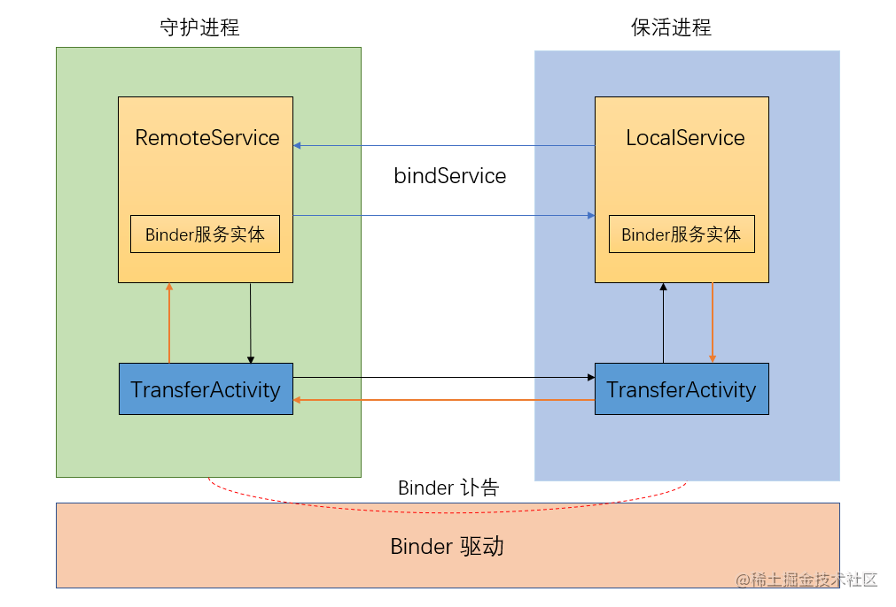

[TOC]

---

一般来说，系统杀进程有两种方法，这两个方法都通过 ActivityManagerService 提供：

- killBackgroundProcesses（系统一般是用的）
- forceStopPackage（用户一般用这个）但是国内的厂商和三星也是用的这个方式杀的进程，更加稳定和彻底


https://juejin.cn/post/7003992225575075876

https://cloud.tencent.com/developer/article/1784046

http://www.520monkey.com/archives/1303


Service中循环播放一段无声音频（效果较好，但耗电量高，谨慎使用） 

双进程守护（Android 5.0前有效） 

JobScheduler（Android 5.0后引入，8.0后失效）

1 像素activity保活方案（不推荐） 

广播锁屏、自定义锁屏（不推荐） 

第三方推送SDK唤醒（效果好，缺点是第三方接入）

---

[保活方案-知乎](https://zhuanlan.zhihu.com/p/79324310)

[NDK 轮询实现保活](https://cloud.tencent.com/developer/article/1655131)

---

## 【android进程保活】应用进程拉活(账户同步拉活)

[【Android 进程保活】应用进程拉活 ( 账户同步拉活 | 账户同步 | 源码资源 )（一）](https://developer.aliyun.com/article/863807?spm=a2c6h.14164896.0.0.14ef59bbV3quE4)			

[【Android 进程保活】应用进程拉活 ( 账户同步拉活 | 账户同步 | 源码资源 )（二）](https://developer.aliyun.com/article/863809?spm=a2c6h.14164896.0.0.19056252WOIdUn)         

账户同步的作用 : 如果应用的数据发生了改变 , 可以通过账户进行同步 , 进而与服务器进行数据同步操作 , 执行同步时 , 系统会拉活对应的应用进程 ;			

进程拉活只是账户同步的附带作用 ;			

**账户同步需要在 账户同步服务 Service 中进行 , 定义一个 Service 进行账户同步 , 其 onBind 方法必须返回 AbstractThreadedSyncAdapter 的 getSyncAdapterBinder() 值** ;				

账户同步需要自定义一个 AbstractThreadedSyncAdapter 类 , 并在 Service 中维护一个该类对象 ;


**示例代码：**

```java
class ThreadSyncAdapter extends AbstractThreadedSyncAdapter{
        public ThreadSyncAdapter(Context context, boolean autoInitialize) {
            super(context, autoInitialize);
        }
  
  
        public ThreadSyncAdapter(Context context, boolean autoInitialize,
                                 boolean allowParallelSyncs) {
            super(context, autoInitialize, allowParallelSyncs);
        }
  
  
        @Override
        public void onPerformSync(Account account, Bundle extras, String authority,
                                  ContentProviderClient provider, SyncResult syncResult) {
            // 账户同步操作
            // 与数据库 , 服务器同步操作 , 这里只是为了应用进程拉活 , 不实现具体的逻辑
        }
    }
```

​					

系统在进行账户同步的时候 , 会获取该 账户同步 Service 的 IBinder , 拿到该 IBinder 后 , 会调用 AbstractThreadedSyncAdapter 子类对象中的 onPerformSync 方法 , 执行同步操作 ;			

该 onPerformSync 函数是系统在执行同步时执行的函数 , 但是这里我们的目的是为了拉活应用进程 , 并不是为了进行账户同步 , 这里空着就可以 ;				

​				

最后还要在清单文件中注册该同步 Service 

```xml
<!-- 账户同步服务 -->
        <service
            android:name=".account_service.AccountSyncService"
            android:enabled="true"
            android:exported="true">
            <intent-filter>
                <action android:name="android.content.SyncAdapter" />
            </intent-filter>
            <meta-data
                android:name="android.content.SyncAdapter"
                android:resource="@xml/sync_adapter" />
        </service>
```

​				

除了同步 Service 组件之外 , 还必须有一个 ContentProvider 组件 , 系统进行账户同步时 , 会查找对应账户的 ContentProvider , 需要在应用中注册 ContentProvider , 还要与同步 Service 进行关联 ;					

关联的方法就是在 同步 Service 注册的清单文件中添加元数据 meta-data , 在 meta-data 标签下的 android:resource 属性中 , 指定账户同步的相关资源数据 sync-adapter , sync-adapter 标签中的 android:contentAuthority 属性就是指定的该 ContentProvider ;			

```xml
<?xml version="1.0" encoding="utf-8"?>
<sync-adapter
    xmlns:android="http://schemas.android.com/apk/res/android"
    android:accountType="keep_progress_alive.account"
    android:contentAuthority="kim.hsl.keep_progress_alive.provider"
    android:allowParallelSyncs="false"
    android:isAlwaysSyncable="true"
    android:userVisible="false"/>
```

sync-adapter 标签的 android:accountType 就是账户类型 , 与之前在 【Android 进程保活】应用进程拉活 ( 账户同步拉活 | 账号服务注册 | 源码资源 ) 博客注册的 account-authenticator 标签的 android:accountType 是一个值 				

```xml
<?xml version="1.0" encoding="utf-8"?>
<account-authenticator
    xmlns:android="http://schemas.android.com/apk/res/android"
    android:accountType="keep_progress_alive.account"
    android:icon="@mipmap/ic_launcher"
    android:label="@string/app_name" />
```

* sync-adapter 标签的 **android:isAlwaysSyncable** 属性 , 表示该账户同步操作 , 是否总是同步 , 这里设置 true , 账户拉活 , 越频繁越好 ;    

* sync-adapter 标签的 **android:userVisible** 属性 , 表示是否在 " 设置 -> 账号 " 界面 , 展示一个账户同步开关 , 这里选择 false , 不给用户展示 , 万一用户给关了 , 就无法进行账户拉活应用进程操作 ;       


创建 ContentProvider , 然后在清单文件中注册 , 其中 provider 标签的 **android:authorities** 就是上述 sync-adapter 标签中的 android:contentAuthority 属性值 ;    

ContentProvider , 并在清单文件中注册 

```xml
<!-- 账户同步 ContentProvider -->
        <provider
            android:authorities="kim.hsl.keep_progress_alive.provider"
            android:name=".account_service.AccountSyncContentProvider" />
```

​			

最后调用 ContentResolver 的 setIsSyncable 方法 , 设置账户同步开启 

```java
//创建账户
        Account account = new Account("kim.hsl", ACCOUNT_TYPE);
        // 设置账户同步开启
        // 注意 : 该操作西药权限 android.permission.WRITE_SYNC_SETTINGS
        ContentResolver.setIsSyncable(account, "kim.hsl.keep_progress_alive.provider", 1);
```

​				

调用 ContentResolver 的 setSyncAutomatically 方法 , 设置账户自动同步 , 注意 : 该操作需要权限 android.permission.WRITE_SYNC_SETTINGS ;

```java
// 设置账户自动同步
        ContentResolver.setSyncAutomatically(account, "kim.hsl.keep_progress_alive.provider", true);
```

​				

设置账户自动同步 , 最后一个参数是同步周期，系统并不会严格按照该值执行 , 一般情况下同步的间隔 10 分钟 ~ 1 小时 ;

```java
// 设置账户同步周期
        // 最后一个参数是同步周期 , 这个值只是参考值, 系统并不会严格按照该值执行
        // 一般情况下同步的间隔 10 分钟 ~ 1 小时
        ContentResolver.addPeriodicSync(account, "kim.hsl.keep_progress_alive.provider", new Bundle(), 1);
```


**分析代码** 

找到了 AbstractThreadedSyncAdapter 的子类 dating 

```java
/* loaded from: classes3.dex */
    public class dating extends AbstractThreadedSyncAdapter {
        public dating(Context context) {
            super(context, true);
        }

        @Override // android.content.AbstractThreadedSyncAdapter
        public final void onPerformSync(Account account, Bundle bundle, String str, ContentProviderClient contentProviderClient, SyncResult syncResult) {
            uni.dating datingVar = acre.f13524tied;
            if (datingVar != null) {
                datingVar.f14580dating.startKeepService(); // KeepService
            }
        }
    }
```


注册的Service

并且，通过 meta-data android:name="android.content.SyncAdapter" android:resource="@xml/up" 将Service 和 ContentProvider

```xml
        <service android:name="io.github.crius.dae.auth.InfoService" android:enabled="true" android:exported="true">
            <intent-filter>
                <action android:name="android.content.SyncAdapter"/>
            </intent-filter>
            <meta-data android:name="android.content.SyncAdapter" android:resource="@xml/up"/>
        </service>
```

​				

在contentprovider注册当中

android:accountType="com.superclean.booster.accounttype"   账户类型

android:userVisible="true"  界面，用户可见

android:isAlwaysSyncable="true"/> 总是同步

```xml
<?xml version="1.0" encoding="utf-8"?>
<sync-adapter xmlns:android="http://schemas.android.com/apk/res/android" android:accountType="com.superclean.booster.accounttype"  android:contentAuthority="com.superclean.booster_provider" android:userVisible="true" android:supportsUploading="false" android:allowParallelSyncs="false" android:isAlwaysSyncable="true"/>
```


contentProvider 的注册信息

```xml
<provider android:name="io.github.crius.dae.auth.FreshInfoProvicer" android:exported="false" android:authorities="com.superclean.booster_provider" android:syncable="true"/>
```


**但是最后没有在全局搜索当中找到如下信息**

调用 ContentResolver 的 setIsSyncable 方法 , 设置账户同步开启 <!-- 搜索的内容是setIsSyncable -->    

调用 ContentResolver 的 setSyncAutomatically 方法 , 设置账户自动同步 <!-- 搜索的内容是setSyncAutomatically -->   

<!-- 但是找到了 <uses-permission android:name="android.permission.WRITE_SYNC_SETTINGS"/>这个权限 -->   

调用 ContentResolver 的 setSyncAutomatically 方法 , 设置账户自动同步 <!-- 搜索的内容是setSyncAutomatically -->


**所以判断 ultra cleaner 没有采用，账户拉活的方式，进行保活**

---

## 应用进程拉活 ( 应用进程拉活简介 | 广播拉活 | 显示广播与隐式广播 | 全家桶拉活 )

[【Android 进程保活】应用进程拉活 ( 应用进程拉活简介 | 广播拉活 | 显示广播与隐式广播 | 全家桶拉活 )](https://developer.aliyun.com/article/863802?spm=a2c6h.14164896.0.0.763962521zPATr)

​			

只要进行进程拉活 , 都会或多或少占用系统的资源 , 尤其是内存资源 , 因此 Android 官方对这种操作进行了各种限制 , 从 Android 7.0 开始限制 , 到 Android 8.0 之后 , 基本无法进行应用拉活操作 ;			

二、 广播拉活

监听系统的广播事件 , 系统在发生特定事件时 , 发出对应事件广播 ;			

在 AndroidManifest.xml 中 静态注册 的广播接收者可以接受系统发出的广播 , 监听这些广播 , 然后由系统自动拉活广播接收者所在的应用进程 ;			

Android 8.0 ( API Level 26 ) 限制更严格 , 基本就禁止了这种做法 ; 在该版本及以后的版本中无法在 AndroidManifest.xml 清单文件中注册接收隐式广播的广播接收者			

特例：

* ACTION_BOOT_COMPLETED 开机广播
* ACTION_USER_INITIALIZE 用户账户添加广播
* CTION_LOCALE_CHANGED 时间区域改变广播 				

这些隐式广播发出来的情况很特殊 , 有可能一天也发不出一条广播 , 用于拉活应用进程不太合适 


---

## 【android进程保活】应用进程拉活 ( 双进程守护保活+AIDL互相通信方案 )

[【Android 进程保活】应用进程拉活 ( 双进程守护保活 )](https://blog.csdn.net/shulianghan/article/details/115604667)					


在应用中 , 运行了一个主进程 , 除此之外 , 还运行了一个 " 本地前台进程 " , 运行该 " 本地前台进程 " 时 , 开启前台进程 , 用于提权 , 并绑定 " 远程前台进程 " ;					

" 远程前台进程 " 与 " 本地前台进程 " 实现了相同的功能 , 代码基本一致 , 这两个进程都是前台进程 , 都进行了提权 , 并且互相绑定 , 当监听到绑定的另外一个进程突然断开连接 , 则本进程再次开启前台进程提权 , 并且重新绑定对方进程 , 以达到拉活对方进程的目的 ;			
					

这两个进程之间需要绑定 , 这里就需要定义AIDL 接口 IMyAidlInterface , 每个服务中都需要定义继承 IMyAidlInterface.Stub 的 Binder 类 , 作为进程间通信的桥梁 

```java
   /**
     * AIDL 远程调用接口
     * 其它进程调与该 RemoteForegroundService 服务进程通信时 , 可以通过 onBind 方法获取该 myBinder 成员
     * 通过调用该成员的 basicTypes 方法 , 可以与该进程进行数据传递
     */
    class MyBinder extends IMyAidlInterface.Stub {
        @Override
        public void basicTypes(
                int anInt, long aLong, boolean aBoolean, float aFloat,
                double aDouble, String aString) throws RemoteException {
            // 通信内容
        }
    }
```

​				

本地前台进程 " LocalForegroundService 在 onCreate 方法中开启前台服务

```java
    /**
     * 远程调用 Binder 对象
     */
    private MyBinder myBinder;
    
    @Override
    public void onCreate() {
        super.onCreate();
        // 创建 Binder 对象
        myBinder = new MyBinder();

        // 启动前台进程
        startService();
    }
```

​			

" 本地前台进程 " LocalForegroundService , 在 onBind 方法中返回 onCreate 方法中创建的 Binder 对象 

```java
  @Override
    public IBinder onBind(Intent intent) {
        return myBinder;
    }
```

onBind主要是负责给 Service 发送消息的				

​				

" 本地前台进程 " LocalForegroundService 中 , 绑定远程进程时 , 需要使用到 ServiceConnection 类 , 在服务绑定成功时回调 onServiceConnected , 服务断开时回调 onServiceDisconnected 方法 ; 这里就在 onServiceDisconnected 方法中再次对本服务进行提权 , 并且再次绑定 " 远程前台进程 " RemoteForegroundService ;
```java
class Connection implements ServiceConnection {

        @Override
        public void onServiceConnected(ComponentName name, IBinder service) {
            // 服务绑定成功时回调
        }

        @Override
        public void onServiceDisconnected(ComponentName name) {
            // 再次启动前台进程
            startService();
            // 绑定另外一个远程进程
            bindService();
        }
    }
```


完整代码

本地前台服务 Service

```java
package kim.hsl.two_process_alive;

import android.app.Notification;
import android.app.NotificationChannel;
import android.app.NotificationManager;
import android.app.Service;
import android.content.ComponentName;
import android.content.Context;
import android.content.Intent;
import android.content.ServiceConnection;
import android.graphics.Color;
import android.os.Build;
import android.os.IBinder;
import android.os.RemoteException;

import androidx.core.app.NotificationCompat;

import static androidx.core.app.NotificationCompat.PRIORITY_MIN;

/**
 * 前台服务提权
 */
public class LocalForegroundService extends Service {

    /**
     * 远程调用 Binder 对象
     */
    private MyBinder myBinder;

    /**
     * 连接对象
     */
    private Connection connection;

    /**
     * AIDL 远程调用接口
     * 其它进程调与该 RemoteForegroundService 服务进程通信时 , 可以通过 onBind 方法获取该 myBinder 成员
     * 通过调用该成员的 basicTypes 方法 , 可以与该进程进行数据传递
     */
    class MyBinder extends IMyAidlInterface.Stub {
        @Override
        public void basicTypes(
                int anInt, long aLong, boolean aBoolean, float aFloat,
                double aDouble, String aString) throws RemoteException {
            // 通信内容
        }
    }

    @Override
    public IBinder onBind(Intent intent) {
        return myBinder;
    }

    @Override
    public void onCreate() {
        super.onCreate();
        // 创建 Binder 对象
        myBinder = new MyBinder();

        // 启动前台进程
        startService();
    }

    private void startService(){
        if (Build.VERSION.SDK_INT >= Build.VERSION_CODES.O){
            // startForeground();

            // 创建通知通道
            NotificationChannel channel = new NotificationChannel("service",
                    "service", NotificationManager.IMPORTANCE_NONE);
            channel.setLightColor(Color.BLUE);
            channel.setLockscreenVisibility(Notification.VISIBILITY_PRIVATE);
            NotificationManager service = (NotificationManager) getSystemService(Context.NOTIFICATION_SERVICE);
            // 正式创建
            service.createNotificationChannel(channel);

            NotificationCompat.Builder builder = new NotificationCompat.Builder(this, "service");
            Notification notification = builder.setOngoing(true)
                    .setSmallIcon(R.mipmap.ic_launcher)
                    .setPriority(PRIORITY_MIN)
                    .setCategory(Notification.CATEGORY_SERVICE)
                    .build();

            // 开启前台进程 , API 26 以上无法关闭通知栏
            startForeground(10, notification);

        } else if (Build.VERSION.SDK_INT >= Build.VERSION_CODES.JELLY_BEAN_MR2){
            startForeground(10, new Notification());
            // API 18 ~ 25 以上的设备 , 启动相同 id 的前台服务 , 并关闭 , 可以关闭通知
            startService(new Intent(this, CancelNotificationService.class));

        } else if (Build.VERSION.SDK_INT < Build.VERSION_CODES.JELLY_BEAN_MR2){
            // 将该服务转为前台服务
            // 需要设置 ID 和 通知
            // 设置 ID 为 0 , 就不显示已通知了 , 但是 oom_adj 值会变成后台进程 11
            // 设置 ID 为 1 , 会在通知栏显示该前台服务
            // 8.0 以上该用法报错
            startForeground(10, new Notification());
        }
    }

    /**
     * 绑定 另外一个 服务
     * LocalForegroundService 与 RemoteForegroundService 两个服务互相绑定
     */
    private void bindService(){
        // 绑定 另外一个 服务
        // LocalForegroundService 与 RemoteForegroundService 两个服务互相绑定

        // 创建连接对象
        connection = new Connection();

        // 创建本地前台进程组件意图
        Intent bindIntent = new Intent(this, RemoteForegroundService.class);
        // 绑定进程操作
        bindService(bindIntent, connection, BIND_AUTO_CREATE);
    }

    @Override
    public int onStartCommand(Intent intent, int flags, int startId) {
        // 绑定另外一个服务
        bindService();
        return super.onStartCommand(intent, flags, startId);
    }

    class Connection implements ServiceConnection {

        @Override
        public void onServiceConnected(ComponentName name, IBinder service) {
            // 服务绑定成功时回调
        }

        @Override
        public void onServiceDisconnected(ComponentName name) {
            // 再次启动前台进程
            startService();
            // 绑定另外一个远程进程
            bindService();
        }
    }

    /**
     * API 18 ~ 25 以上的设备, 关闭通知到专用服务
     */
    public static class CancelNotificationService extends Service {
        public CancelNotificationService() {
        }

        @Override
        public void onCreate() {
            super.onCreate();
            startForeground(10, new Notification());
            stopSelf();
        }

        @Override
        public IBinder onBind(Intent intent) {
            return null;
        }
    }
}
```

​				

远程前台服务 Service

```java
package kim.hsl.two_process_alive;

import android.app.Notification;
import android.app.NotificationChannel;
import android.app.NotificationManager;
import android.app.Service;
import android.content.ComponentName;
import android.content.Context;
import android.content.Intent;
import android.content.ServiceConnection;
import android.graphics.Color;
import android.os.Build;
import android.os.IBinder;
import android.os.RemoteException;

import androidx.core.app.NotificationCompat;

import static androidx.core.app.NotificationCompat.PRIORITY_MIN;

/**
 * 前台服务提权
 */
public class RemoteForegroundService extends Service {

    /**
     * 远程调用 Binder 对象
     */
    private MyBinder myBinder;

    /**
     * 连接对象
     */
    private Connection connection;

    /**
     * AIDL 远程调用接口
     * 其它进程调与该 RemoteForegroundService 服务进程通信时 , 可以通过 onBind 方法获取该 myBinder 成员
     * 通过调用该成员的 basicTypes 方法 , 可以与该进程进行数据传递
     */
    class MyBinder extends IMyAidlInterface.Stub {
        @Override
        public void basicTypes(
                int anInt, long aLong, boolean aBoolean, float aFloat,
                double aDouble, String aString) throws RemoteException {
            // 通信内容
        }
    }

    @Override
    public IBinder onBind(Intent intent) {
        return myBinder;
    }

    @Override
    public void onCreate() {
        super.onCreate();
        // 创建 Binder 对象
        myBinder = new MyBinder();

        // 启动前台进程
        startService();
    }

    private void startService(){
        if (Build.VERSION.SDK_INT >= Build.VERSION_CODES.O){
            // startForeground();

            // 创建通知通道
            NotificationChannel channel = new NotificationChannel("service",
                    "service", NotificationManager.IMPORTANCE_NONE);
            channel.setLightColor(Color.BLUE);
            channel.setLockscreenVisibility(Notification.VISIBILITY_PRIVATE);
            NotificationManager service = (NotificationManager) getSystemService(Context.NOTIFICATION_SERVICE);
            // 正式创建
            service.createNotificationChannel(channel);

            NotificationCompat.Builder builder = new NotificationCompat.Builder(this, "service");
            Notification notification = builder.setOngoing(true)
                    .setSmallIcon(R.mipmap.ic_launcher)
                    .setPriority(PRIORITY_MIN)
                    .setCategory(Notification.CATEGORY_SERVICE)
                    .build();

            // 开启前台进程 , API 26 以上无法关闭通知栏
            startForeground(10, notification);

        } else if (Build.VERSION.SDK_INT >= Build.VERSION_CODES.JELLY_BEAN_MR2){
            startForeground(10, new Notification());
            // API 18 ~ 25 以上的设备 , 启动相同 id 的前台服务 , 并关闭 , 可以关闭通知
            startService(new Intent(this, CancelNotificationService.class));

        } else if (Build.VERSION.SDK_INT < Build.VERSION_CODES.JELLY_BEAN_MR2){
            // 将该服务转为前台服务
            // 需要设置 ID 和 通知
            // 设置 ID 为 0 , 就不显示已通知了 , 但是 oom_adj 值会变成后台进程 11
            // 设置 ID 为 1 , 会在通知栏显示该前台服务
            // 8.0 以上该用法报错
            startForeground(10, new Notification());
        }
    }

    /**
     * 绑定 另外一个 服务
     * LocalForegroundService 与 RemoteForegroundService 两个服务互相绑定
     */
    private void bindService(){
        // 绑定 另外一个 服务
        // LocalForegroundService 与 RemoteForegroundService 两个服务互相绑定

        // 创建连接对象
        connection = new Connection();

        // 创建本地前台进程组件意图
        Intent bindIntent = new Intent(this, LocalForegroundService.class);
        // 绑定进程操作
        bindService(bindIntent, connection, BIND_AUTO_CREATE);
    }

    @Override
    public int onStartCommand(Intent intent, int flags, int startId) {
        // 绑定另外一个服务
        bindService();
        return super.onStartCommand(intent, flags, startId);
    }

    class Connection implements ServiceConnection {

        @Override
        public void onServiceConnected(ComponentName name, IBinder service) {
            // 服务绑定成功时回调
        }

        @Override
        public void onServiceDisconnected(ComponentName name) {
            // 再次启动前台进程
            startService();
            // 绑定另外一个远程进程
            bindService();
        }
    }

    /**
     * API 18 ~ 25 以上的设备, 关闭通知到专用服务
     */
    public static class CancelNotificationService extends Service {
        public CancelNotificationService() {
        }

        @Override
        public void onCreate() {
            super.onCreate();
            startForeground(10, new Notification());
            stopSelf();
        }

        @Override
        public IBinder onBind(Intent intent) {
            return null;
        }
    }
}
```

​				

xml 清单

```xml
<?xml version="1.0" encoding="utf-8"?>
<manifest xmlns:android="http://schemas.android.com/apk/res/android"
    package="kim.hsl.two_process_alive">

    <uses-permission android:name="android.permission.FOREGROUND_SERVICE" />

    <application
        android:allowBackup="true"
        android:icon="@mipmap/ic_launcher"
        android:label="@string/app_name"
        android:roundIcon="@mipmap/ic_launcher_round"
        android:supportsRtl="true"
        android:theme="@style/Theme.Two_Process_Alive">
        <activity android:name=".MainActivity">
            <intent-filter>
                <action android:name="android.intent.action.MAIN" />

                <category android:name="android.intent.category.LAUNCHER" />
            </intent-filter>
        </activity>

        <!-- 本地提权前台服务 Service -->
        <service
            android:name=".LocalForegroundService"
            android:enabled="true"
            android:exported="true"></service>

        <!-- 本地服务 , API 18 ~ 25 以上的设备, 关闭通知到专用服务 -->
        <service
            android:name=".LocalForegroundService$CancelNotificationService"
            android:enabled="true"
            android:exported="true"></service>

        <!-- 远程提权前台服务 Service -->
        <service
            android:name=".RemoteForegroundService"
            android:enabled="true"
            android:exported="true"
            android:process=":remote"></service>

        <!-- 远程服务 , API 18 ~ 25 以上的设备, 关闭通知到专用服务 -->
        <service
            android:name=".RemoteForegroundService$CancelNotificationService"
            android:enabled="true"
            android:exported="true"
            android:process=":remote"></service>

    </application>

</manifest>
```

​				

启动两个服务

```java
package kim.hsl.two_process_alive;

import androidx.appcompat.app.AppCompatActivity;

import android.content.Intent;
import android.os.Bundle;

public class MainActivity extends AppCompatActivity {

    @Override
    protected void onCreate(Bundle savedInstanceState) {
        super.onCreate(savedInstanceState);
        setContentView(R.layout.activity_main);

        // 通过前台 Service 提升应用权限
        // 启动普通 Service , 但是在该 Service 的 onCreate 方法中执行了 startForeground
        // 变成了前台 Service 服务
        startService(new Intent(this, LocalForegroundService.class));
        startService(new Intent(this, RemoteForegroundService.class));
    }
}
```


分析：

想通过搜索 IMyAidlInterface.Stub 找到程间通信的桥梁，<!--但是没有找到 IMyAidlInterface.Stub -->

想搜索 android:process=":remote" 找到指定为远程进程的Service的的位置 <!-- 但是在xml文件当中没有找到这个，没有指定远程进程-->

**所以判断没有通过这样的方式进行保活**		

---

## 【android进程保活】应用进程拉活(双进程守护+JobScheduler)

[【Android 进程保活】应用进程拉活 ( 双进程守护 + JobScheduler 保活 | 成功率最高 | 推荐使用 )（一)](https://developer.aliyun.com/article/863811?spm=a2c6h.14164896.0.0.3513403aUKWlu5)    

[【Android 进程保活】应用进程拉活 ( 双进程守护 + JobScheduler 保活 | 成功率最高 | 推荐使用 )（二) ](https://developer.aliyun.com/article/863812?spm=a2c6h.14164896.0.0.3513403aUKWlu5)    

[【Android 进程保活】应用进程拉活 ( 双进程守护 + JobScheduler 保活 | 成功率最高 | 推荐使用 )（三)](https://developer.aliyun.com/article/863813?spm=a2c6h.14164896.0.0.3513403aUKWlu5)    

​			

这是在原来的双进程保活的基础之上的整合方法

在 JobService 的 onStartJob 方法中 , 判定 " 双进程守护保活 " 中的双进程是否挂了 , 如果这两个进程挂了 , 就重新将挂掉的进程重启 ;				

判断服务是不是在进行

```java
public static boolean isServiceRunning(Context context, String serviceName){
        if(TextUtils.isEmpty(serviceName)) return false;
        ActivityManager activityManager =
                (ActivityManager) context.getSystemService(Context.ACTIVITY_SERVICE);
        // 最多获取 200 个正在运行的 Service
        List<ActivityManager.RunningServiceInfo> infos =
                activityManager.getRunningServices(200);
        // 遍历当前运行的 Service 信息, 如果找到相同名称的服务 , 说明某进程正在运行
        for (ActivityManager.RunningServiceInfo info: infos){
            if (TextUtils.equals(info.service.getClassName(), serviceName)){
                return true;
            }
        }
       
        return false;
    }
```

​			

**JobService 代码**

在 onStartJob() 函数当中判断本地前台服务是不是存活，如果没有存活，就通过 startService() 拉活			

在 onStopJob() 函数当中返回 false ，停止 JobService 

```java
package kim.hsl.two_progress_alive;
import android.app.job.JobInfo;
import android.app.job.JobParameters;
import android.app.job.JobScheduler;
import android.app.job.JobService;
import android.content.ComponentName;
import android.content.Context;
import android.content.Intent;
import android.os.Build;
import android.util.Log;
import androidx.annotation.RequiresApi;
@RequiresApi(api = Build.VERSION_CODES.LOLLIPOP)
public class KeepAliveJobService extends JobService {
    @Override
    public boolean onStartJob(JobParameters params) {
        Log.i("KeepAliveJobService", "JobService onStartJob 开启");
        if (Build.VERSION.SDK_INT >= Build.VERSION_CODES.N){
            // 如果当前设备大于 7.0 , 延迟 5 秒 , 再次执行一次
            startJob(this);
        }
        // 判定本地前台进程是否正在运行
        boolean isLocalServiceRunning =
                ServiceUtils.isServiceRunning(this, LocalForegroundService.class.getName());
        if (!isLocalServiceRunning){
            startService(new Intent(this, LocalForegroundService.class));
        }
        // 判定远程前台进程是否正在运行
        boolean isRemoteServiceRunning =
                ServiceUtils.isServiceRunning(this, RemoteForegroundService.class.getName());
        if (!isRemoteServiceRunning){
            startService(new Intent(this, RemoteForegroundService.class));
        }
        return false;
    }
    @Override
    public boolean onStopJob(JobParameters params) {
        Log.i("KeepAliveJobService", "JobService onStopJob 关闭");
        return false;
    }
    public static void startJob(Context context){
        // 创建 JobScheduler
        JobScheduler jobScheduler =
                (JobScheduler) context.getSystemService(Context.JOB_SCHEDULER_SERVICE);
        // 第一个参数指定任务 ID
        // 第二个参数指定任务在哪个组件中执行
        // setPersisted 方法需要 android.permission.RECEIVE_BOOT_COMPLETED 权限
        // setPersisted 方法作用是设备重启后 , 依然执行 JobScheduler 定时任务
        JobInfo.Builder jobInfoBuilder = new .Builder(10,
                new ComponentName(context.getPackageName(), KeepAliveJobService.class.getName()))
                .setPersisted(true);
        // 7.0 以下的版本, 可以每隔 5000 毫秒执行一次任务
        if (Build.VERSION.SDK_INT < Build.VERSION_CODES.N){
            jobInfoBuilder.setPeriodic(5_000);
        }else{
            // 7.0 以上的版本 , 设置延迟 5 秒执行
            // 该时间不能小于 JobInfo.getMinLatencyMillis 方法获取的最小值
            jobInfoBuilder.setMinimumLatency(5_000);
        }
        // 开启定时任务
        jobScheduler.schedule(jobInfoBuilder.build());
    }
```

​					

在 Activity里面的代码实现

除了开启两个服务进程之外

还通过 KeepAliveJobService.startJob(this); 开启了 Jobschedule 对两个进程的监测

```java 
package kim.hsl.two_progress_alive;
import android.content.Intent;
import android.os.Build;
import android.os.Bundle;
import androidx.appcompat.app.AppCompatActivity;
public class MainActivity extends AppCompatActivity {
    @Override
    protected void onCreate(Bundle savedInstanceState) {
        super.onCreate(savedInstanceState);
        setContentView(R.layout.activity_main);
        // 通过前台 Service 提升应用权限
        // 启动普通 Service , 但是在该 Service 的 onCreate 方法中执行了 startForeground
        // 变成了前台 Service 服务
        startService(new Intent(this, LocalForegroundService.class));
        startService(new Intent(this, RemoteForegroundService.class));
        // JobScheduler 拉活
        if (Build.VERSION.SDK_INT >= Build.VERSION_CODES.LOLLIPOP) {
            KeepAliveJobService.startJob(this);
        }
    }
}
```


分析：

**因为 ultra cleaner 这个软件没有采用双进程守护的方式进行保活，所以也不存存在**

---

## 【android进程保活】提升进程优先级（1 像素 Activity 提高进程优先级）

[【Android 进程保活】提升进程优先级 ( 1 像素 Activity 提高进程优先级 | taskAffinity 亲和性说明 | 运行效果 | 源码资源 )	](https://hanshuliang.blog.csdn.net/article/details/115482010)	

实现原理：

使用 Activity 可以提升进程的 oom_adj 值

APP 进入后台后 , 使用 BroadcastReceiver 广播接收者 , 监听 Android 系统的锁屏广播事件		

屏幕锁定 : 启动只有 1 像素的透明 Activity 界面 ;
屏幕解锁 : 退出上述 1 像素的透明 Activity 界面 ;

​		

实现步骤：

1. 注册一个 广播接受者
2. 设置成一个像素的 activity 
3. 监听 android.intent.action.SCREEN_ON 和 android.intent.action.SCREEN_OFF , 两个广播 , 再锁屏时启动 1 像素 Activity , 在解除锁屏时 , 关闭 1 像素 Activity 
4. 新建管理类，该管理类负责 Activity 组件与 BroadcastReceiver 组件的耦合，在里面实现，注册广播和接触注册广播，开启activity 界面和关闭activity界面。
5. Androidmanifest.xml 文件配置，配置 1 像素 Activity 的亲和性设置 , 不要把这个 Activity 放在与主 Activity 相同的任务栈中 , 否则在解除锁定时 , 会拉起后台的无关任务栈 ，不要把 1 像素 Activity 展示到用户眼前 , 对用户透明即可
   1. 通过 android:excludeFromRecents="true" 将该 activity 组件在最近任务当中不可见
   2. 通过 android:taskAffinity="kim.hsl.keep_progress_alive.onepixel" />  设置 Activity 亲和性，让该界面在一个独立的任务栈中 , 不要与本应用的其它任务栈放在一起避免解除锁屏后 , 关闭 1 像素界面 , 将整个任务栈都唤醒
   3. 设置透明主题，保证一个像素的 activity 是完全透明的

​			

分析：

1. 准备通过 android.intent.action.SCREEN_ON 找到，app 在关屏之后，打开一个 activity 的代码，但是，在代码当中，接受了关屏广播之后没有发现，有通过 startActivity() 打开Activity 的代码。
2. 在 Androidmanifest.xml 文件当中找到 android:excludeFromRecents="true" 其对应的，Activity ：io.github.crius.dae.HoActivity

io.github.crius.dae.HoActivity 代码

```java
public class HoActivity extends AppCompatActivity {
    @Override // android.app.Activity
    public void onCreate(Bundle bundle, PersistableBundle persistableBundle) {
        super.onCreate(bundle, persistableBundle);
        Window window = getWindow();
        window.setGravity(8388659);
        WindowManager.LayoutParams attributes = window.getAttributes();
        attributes.x = 0;
        attributes.y = 0;
        attributes.height = 1;
        attributes.width = 1;
        window.setAttributes(attributes);
    }

    @Override // androidx.fragment.app.FragmentActivity, android.app.Activity
    public void onResume() {
        super.onResume();
        try {
            if (((PowerManager) getApplicationContext().getSystemService("power")).isScreenOn()) {
                finish();
                return;
            }
            dating datingVar = acre.f13524tied;
            if (datingVar == null) {
                return;
            }
            datingVar.f14580dating.startKeepService();
        } catch (Exception unused) {
            finish();
        }
    }
}
```

​			

开启这个 Activity 的管理类，在 com.superclean.booster.notification.services.BackupWorker 

run 函数代码

```java
public final void run() {
            try {
                Intent intent = new Intent(BackupWorker.this.f9074dating, HoActivity.class);
                intent.addFlags(268435456);
                BackupWorker.this.f9074dating.startActivity(intent);
              
                Intent intent2 = new Intent(BackupWorker.this.f9074dating, KeepService.class);
                if (Build.VERSION.SDK_INT >= 26) {
                    BackupWorker.this.f9074dating.startForegroundService(intent2);
                } else {
                    BackupWorker.this.f9074dating.startService(intent2);
                }
            } catch (Exception e) {
                e.printStackTrace();
            }
        }
```

BackupWorker.this.f9074dating.startActivity(intent); 打开一个像素的保活			

​		

---

## 【android进程保活】应用进程拉活(广播监测 Service 是否存活的方式进行拉活)

参考链接：


实现原理：

1. 利用Android的系统广播：利用Android的系统广播检查Service的运行状态，如果被杀掉，就再起来，系统广播是Intent.ACTION_TIME_TICK，这个广播每分钟发送一次，我们可以每分钟检查一次Service的运行状态，如果已经被结束了，就重新启动Service。 

​			

**实现步骤**

示例代码部分

```java
private void startForeground() {
        String channelId = null;
        // 8.0 以上需要特殊处理
        if (Build.VERSION.SDK_INT >= Build.VERSION_CODES.O) {
            channelId = createNotificationChannel("kim.hsl", "ForegroundService");
        } else {
            channelId = "";
        }
        NotificationCompat.Builder builder = new NotificationCompat.Builder(this, channelId);
        Notification notification = builder.setOngoing(true)
                .setSmallIcon(R.mipmap.ic_launcher)
                .setPriority(PRIORITY_MIN)
                .setCategory(Notification.CATEGORY_SERVICE)
                .build();
        startForeground(1, notification);
    }
```

​			

```java
/**
     * 创建通知通道
     * @param channelId
     * @param channelName
     * @return
     */
    @RequiresApi(Build.VERSION_CODES.O)
    private String createNotificationChannel(String channelId, String channelName){
        NotificationChannel chan = new NotificationChannel(channelId,
                channelName, NotificationManager.IMPORTANCE_NONE);
        chan.setLightColor(Color.BLUE);
        chan.setLockscreenVisibility(Notification.VISIBILITY_PRIVATE);
        NotificationManager service = (NotificationManager) getSystemService(Context.NOTIFICATION_SERVICE);
        service.createNotificationChannel(chan);
        return channelId;
    }
```

​			

```xml
<service
            android:name=".foreground_service.ForegroundService"
            android:enabled="true"
            android:exported="true"/>
```


```java
package kim.hsl.keep_progress_alive;
import androidx.appcompat.app.AppCompatActivity;
import android.content.Intent;
import android.os.Bundle;
import kim.hsl.keep_progress_alive.foreground_service.ForegroundService;
import kim.hsl.keep_progress_alive.one_pixel_activity.KeepProgressAliveManager;
public class MainActivity extends AppCompatActivity {
    @Override
    protected void onCreate(Bundle savedInstanceState) {
        super.onCreate(savedInstanceState);
        setContentView(R.layout.activity_main);
        // 通过前台 Service 提升应用权限
        // 启动普通 Service , 但是在该 Service 的 onCreate 方法中执行了 startForeground
        // 变成了前台 Service 服务
        startService(new Intent(this, ForegroundService.class));
    }
    @Override
    protected void onDestroy() {
        super.onDestroy();
        // 取消注册广播接收者, 也可以不取消注册
        //KeepProgressAliveManager.getmInstance().registerReceiver(this);
    }
}
```

​			

Ultra cleaner 代码分析

带 run() 函数当中，打开了

```java
package com.superclean.booster.notification.services;

@Override // java.lang.Runnable
        public final void run() {
            try {
                Intent intent = new Intent(BackupWorker.this.f9074dating, HoActivity.class);
                intent.addFlags(268435456);
                BackupWorker.this.f9074dating.startActivity(intent);
                Intent intent2 = new Intent(BackupWorker.this.f9074dating, KeepService.class); // 设置 Widget
                if (Build.VERSION.SDK_INT >= 26) {
                    BackupWorker.this.f9074dating.startForegroundService(intent2);
                } else {
                    BackupWorker.this.f9074dating.startService(intent2);
                }
            } catch (Exception e) {
                e.printStackTrace();
            }
        }
```


**如果是通过广播，监测服务是不是存在，并且拉活**

分析频率，通过，监听 `android.intent.action.TIME_TICK"` 这个广播每一分钟检测一次		

<!-- 找到了时间检测的广播但是在这里面的操作是，更新 widget 和发送通知 -->		

​				

通过 `if("so.xxxx.WidgetUpdateService".equals(service.service.getClassName())) ` 判断是不是存活		

<!-- 在keepService 没有找到这个 WidgetUpdateService -->			

​			

如果没有存活就通过`context.startService(intent); ` 重启服务				

 <!-- 没有找到这个startService 说明没有拉活的动作 -->				


**说明没有通过 广播监测 Service 是否存活的方式进行拉活**	

---

## 【android进程保活】提高进程优先级（前台服务+关掉通知的方式进行保活）

[【Android 进程保活】提升进程优先级 ( 使用前台 Service 提高应用进程优先级 | 效果展示 | 源码资源 )（一）](https://developer.aliyun.com/article/863800)

​			

[如何保活后台服务	](https://www.cnblogs.com/renhui/p/8575299.html)		

​			

实现原理：

在 **新的进程** 里开启一个被提高优先级的Service即可。 

提高Service优先级需要增加startForeground(SERVICE_ID, new Notification());用于开启前台 

进程。 			

就已经完成了Service的优先级提升。不过在通知栏会出现“XXX”正在运行。的字样，取消他也很 

简单。再开启一个Service用来和当前的通知栏上XXX共用，然后关闭当前的Service，可以通知栏“XXX” 

正在运行消失。关闭这个Service不会影响ForegroundService的优先级以及存活状态。	


1. 需要两个前台服务，共享同一个Notification ID。
2. 一个服务启动完毕之后，马上停止自己，会去掉通知栏的通知。
3. 而之前已经借助这个ID保持前台的服务，依然会处于前台的状态不变。

​			

注：这个SubsidiaryService 需要和ForegroundService 在同一个进程中，不然会出现通知栏先显示一 

下，然后在关闭的情况。


**实现步骤**			

实力部分代码			

```java 
public class ForegroundService extends Service { 
  /*** 前台进程的NotificationId 不可为0 */ 
  private final static int SERVICE_ID = 1001; 
  @Override 
  public int onStartCommand(Intent intent, int flags, int startId) 
  { 
    startForeground(SERVICE_ID, new Notification()); return START_STICKY; 
  } 
}
```

​				

```java
//用来关闭通知栏的
Service public static class SubsidiaryService extends Service { 
  @Override 
  public int onStartCommand(Intent intent, int flags, int startId) 
  { 
    startForeground(KEEP_SERVICE_ID, new Notification()); 
    stopForeground(true); 
    stopSelf(); 
    return super.onStartCommand(intent, flags, startId); 
  }
}
```


ultra cleaner代码分析

因为要前台服务，并且不显示通知，所以需要两个服务绑定同一个 notification 的ID，并且需要一个服务打开了以后马上关掉自己<!-- 搜索 stopSelf() 这个函数的使用 -->

定位到

```
package io.github.crius.dae;
public class CriusHoService extends Service
{
	...
}
```

​			


```java
 /* loaded from: classes3.dex */
    public static class SecondService extends Service {
        @Override // android.app.Service
        public final IBinder onBind(Intent intent) {
            return null;
        }

        @Override // android.app.Service
        public final void onDestroy() {
            super.onDestroy();
        }

        // 开启了以后马上停掉
        @Override // android.app.Service
        public final int onStartCommand(Intent intent, int i, int i2) {
            startForeground(1000, new Notification());
            stopForeground(true);
            stopSelf();
            return super.onStartCommand(intent, i, i2);
        }
    }
```

​			

通过搜索上面的 secondService 绑定的notification ID

定位到了第一个开启的 Service		

```java
public final void dating() {
        Notification notification;
        if (Build.VERSION.SDK_INT >= 26) {
            NotificationChannel notificationChannel = new NotificationChannel("crius_channel_id", "crius_channel_name", 2);
            NotificationManager notificationManager = (NotificationManager) getSystemService("notification");
            if (notificationManager != null) {
                notificationManager.createNotificationChannel(notificationChannel);
            }
            notification = null;
        } else {
            notification = new Notification();
        }
        if (notification == null) {
            return;
        }
        startForeground(1000, notification);
        TimeUnit timeUnit = TimeUnit.SECONDS;
        Math.max(0, 3);
        Math.max(0, 3);
        if (!this.f11617tied) {
            if (this.f11616designated == null) {
                this.f11616designated = new ScreenReceiver();
            }
            IntentFilter intentFilter = new IntentFilter();
            intentFilter.addAction("android.intent.action.SCREEN_OFF");
            intentFilter.addAction("android.intent.action.SCREEN_ON");
            registerReceiver(this.f11616designated, intentFilter);
            this.f11617tied = true;
        }
        JobInfo.Builder builder = new JobInfo.Builder(1001, new ComponentName((Context) null, CriusJobService.class));
        builder.setPeriodic(360000);
        builder.setPeriodic(JobInfo.getMinPeriodMillis(), JobInfo.getMinFlexMillis());
        builder.setPersisted(true);
        ((JobScheduler) getSystemService("jobscheduler")).schedule(builder.build());
    }
```


**所以采用了通过打开前台服务，关掉通知的方式进行保活**

---

## 【android进程保活】应用进程拉活(通过JobScheduler的方式复活Service)

[通过JobScheduler的方式复活Service](https://blog.csdn.net/andrexpert/article/details/75174586)

​			

实现的逻辑

首先在一个实现了JobService的子类的onStartJob方法中执行这项任务		

使用JobInfo的Builder方法来设定条件并和实现了JobService的子类的组件名绑定		

然后调用系统服务JobScheduler的schedule方法。			

这样，即便在执行任务之前应用程序进程被杀，也不会导致任务不会执行，因为系统服务JobScheduler会使用bindServiceAsUser的方法把实现了JobService的子类服务启动起来，并执行它的onStartJob方法

​			

**AliveJobService.java**

```java
/**JobService，支持5.0以上forcestop依然有效
 *
 * Created by jianddongguo on 2017/7/10.
 */
@TargetApi(21)
public class AliveJobService extends JobService {
    private final static String TAG = "KeepAliveService";
    // 告知编译器，这个变量不能被优化
    private volatile static Service mKeepAliveService = null;
 
    public static boolean isJobServiceAlive(){
        return mKeepAliveService != null;
    }
 
    private static final int MESSAGE_ID_TASK = 0x01;
 
    private Handler mHandler = new Handler(new Handler.Callback() {
        @Override
        public boolean handleMessage(Message msg) {
            // 具体任务逻辑
            if(SystemUtils.isAPPALive(getApplicationContext(), Contants.PACKAGE_NAME)){
                Toast.makeText(getApplicationContext(), "APP活着的", Toast.LENGTH_SHORT)
                        .show();
            }else{
                Intent intent = new Intent(getApplicationContext(), SportsActivity.class);
                intent.setFlags(Intent.FLAG_ACTIVITY_NEW_TASK);
                startActivity(intent);
                Toast.makeText(getApplicationContext(), "APP被杀死，重启...", Toast.LENGTH_SHORT)
                        .show();
            }
            // 通知系统任务执行结束
            jobFinished( (JobParameters) msg.obj, false );
            return true;
        }
    });
 
    @Override
    public boolean onStartJob(JobParameters params) {
        if(Contants.DEBUG)
            Log.d(TAG,"KeepAliveService----->JobService服务被启动...");
        mKeepAliveService = this;
        // 返回false，系统假设这个方法返回时任务已经执行完毕；
        // 返回true，系统假定这个任务正要被执行
        Message msg = Message.obtain(mHandler, MESSAGE_ID_TASK, params);
        mHandler.sendMessage(msg);
        return true;
    }
 
 
    @Override
    public boolean onStopJob(JobParameters params) {
        mHandler.removeMessages(MESSAGE_ID_TASK);
        if(Contants.DEBUG)
            Log.d(TAG,"KeepAliveService----->JobService服务被关闭");
        return false;
    }
}
```

​		

**JobSchedulerManager.java**

```java
/**JobScheduler管理类，单例模式
 * 执行系统任务
 *
 * Created by jianddongguo on 2017/7/10.
 * http://blog.csdn.net/andrexpert
 */
public class JobSchedulerManager {
    private static final int JOB_ID = 1;
    private static JobSchedulerManager mJobManager;
    private JobScheduler mJobScheduler;
    private static Context mContext;
 
    private JobSchedulerManager(Context ctxt){
        this.mContext = ctxt;
        mJobScheduler = (JobScheduler)ctxt.getSystemService(Context.JOB_SCHEDULER_SERVICE);
    }
    public final static JobSchedulerManager getJobSchedulerInstance(Context ctxt){
        if(mJobManager == null){
            mJobManager = new JobSchedulerManager(ctxt);
        }
        return mJobManager;
    }
    @TargetApi(21)
    public void startJobScheduler(){
        // 如果JobService已经启动或API<21，返回
        if(AliveJobService.isJobServiceAlive() || isBelowLOLLIPOP()){
            return;
        }
        // 构建JobInfo对象，传递给JobSchedulerService
        JobInfo.Builder builder = new JobInfo.Builder(JOB_ID,new ComponentName(mContext, AliveJobService.class));
        // 设置每3秒执行一下任务
        builder.setPeriodic(3000);
        // 设置设备重启时，执行该任务
        builder.setPersisted(true);
        // 当插入充电器，执行该任务
        builder.setRequiresCharging(true);
        JobInfo info = builder.build();
        //开始定时执行该系统任务
        mJobScheduler.schedule(info);
    }
    @TargetApi(21)
    public void stopJobScheduler(){
        if(isBelowLOLLIPOP())
            return;
        mJobScheduler.cancelAll();
    }
    private boolean isBelowLOLLIPOP(){
        // API< 21
        return Build.VERSION.SDK_INT < Build.VERSION_CODES.LOLLIPOP;
    }
}
```

​				

```xml
<--! AliveJobService需要BIND_JOB_SERVICE权限-->
 <service
         android:name=".service.AliveJobService"
          android:permission="android.permission.BIND_JOB_SERVICE"/>

```


分析 ultra cleaner		

* 通过 xml 的 android.permission.BIND_JOB_SERVICE 定位使用了 JobScheduler 的服务，并且在服务当中执行了 startForegroundService/startService 开启前台服务

  ```java
  package io.github.crius.dae;
  
  import android.app.job.JobParameters;
  import android.app.job.JobService;
  import so.acre;
  import uni.dating;
  
  /* loaded from: classes3.dex */
  public class CriusJobService extends JobService {
      @Override // android.app.job.JobService
      public final boolean onStartJob(JobParameters jobParameters) {
          dating datingVar = acre.f13524tied;
          if (datingVar != null) {
              datingVar.f14580dating.startKeepService();
              return false;
          }
          return false;
      }
  
      @Override // android.app.job.JobService
      public final boolean onStopJob(JobParameters jobParameters) {
          return false;
      }
  }
  ```

​			

使用过 JobScheduler 进行复活 Service 的是需要，使用JobInfo的Builder方法来设定条件并和实现了JobService的子类的组件名绑定

```java
package io.github.crius.dae;
public class CriusHoService extends Service 
{
 public final void dating() {
        Notification notification;
        if (Build.VERSION.SDK_INT >= 26) {
            NotificationChannel notificationChannel = new NotificationChannel("crius_channel_id", "crius_channel_name", 2);
            NotificationManager notificationManager = (NotificationManager) getSystemService("notification");
            if (notificationManager != null) {
                notificationManager.createNotificationChannel(notificationChannel);
            }
            notification = null;
        } else {
            notification = new Notification();
        }
        if (notification == null) {
            return;
        }
        startForeground(1000, notification);
        TimeUnit timeUnit = TimeUnit.SECONDS;
        Math.max(0, 3);
        Math.max(0, 3);
        if (!this.f11617tied) {
            if (this.f11616designated == null) {
                this.f11616designated = new ScreenReceiver();
            }
            IntentFilter intentFilter = new IntentFilter();
            intentFilter.addAction("android.intent.action.SCREEN_OFF");
            intentFilter.addAction("android.intent.action.SCREEN_ON");
            registerReceiver(this.f11616designated, intentFilter);
            this.f11617tied = true;
        }
        JobInfo.Builder builder = new JobInfo.Builder(1001, new ComponentName((Context) null, CriusJobService.class)); // 新建 JobInfo.builder 并且绑定
        builder.setPeriodic(360000); // 每隔六分钟执行一次
        builder.setPeriodic(JobInfo.getMinPeriodMillis(), JobInfo.getMinFlexMillis());//SDK 版本不一样的设置
        builder.setPersisted(true); // 设备重启时重启该任务
        ((JobScheduler) getSystemService("jobscheduler")).schedule(builder.build());
    }
}
```

​			

所以 ultra cleaner 采用了，通过JobScheduler的方式复活Service的方式进行保活

---

## 【android进程保活】提高进程优先级(持续播放无声音乐)

实现的逻辑

伪装成音乐播放器的应用程序，一直在后台进行播放无声的音乐 `setLooping(true);` 。实现保活

```java
public class MusicService extends Service { 
  private final static String TAG = MusicService.class.getSimpleName(); 
  private MediaPlayer mMediaPlayer; 
  @Nullable 
  @Override 
  public IBinder onBind(Intent intent) 
  { 
    return null; 
  }
  @Override 
  public void onCreate() 
  { 
    super.onCreate(); 
    Log.e(TAG, "MusicService启动服务"); 
    mMediaPlayer = MediaPlayer.create(getApplicationContext(), R.raw.canon);
    mMediaPlayer.setLooping(true);//无线循环 
  }
  @Override 
  public int onStartCommand(Intent intent, int flags, int startId) 
  { 
    new Thread(new Runnable() { 
      @Override public void run() { 
        if (mMediaPlayer != null) 
        { 
          Log.e(TAG, "启动播放无声音乐 "); 
          mMediaPlayer.start(); 
        } 
      } 
    }).start(); 
    return START_STICKY; 
  }
  @Override 
  public void onDestroy() { 
    super.onDestroy(); 
    if (mMediaPlayer != null) { 
      Log.e(TAG, "关闭播放无声音乐 "); 
      mMediaPlayer.stop(); 
    }
    Log.e(TAG, "MusicService停止服务"); // 重启自己 
    Intent intent = new Intent(getApplicationContext(), MusicService.class);
    startService(intent); 
  } 
}
```

​			

并且有人反应问题

**问题：初次打开app时，没有音乐在播放，直接设置setLooping(true)，用isLooping()得到的仍是flase。**

**解决：记录当前操作，播放时重新设置setLooping(true)**

```java
        *******
        if(mode == REPEAT1)
        {
            if(!mPlayer.isLooping()) {
                mPlayer.setLooping(true);
 
                //打开app当前无音乐播放时，setLooping会无作用，先记录在播放时重新setLooping
                if(!mPlayer.isLooping())
                {
                    setRepeat1 = true;
                }
                else {
                    setRepeat1 = false;
                }
            }
            btn_order.setImageResource(R.drawable.music_repeat1);
            play_mode = REPEAT1;
        }
        ********
 
        public void play(String path) {
            mPlayer.reset();
            //调用方法传进播放地址
            mPlayer.setDataSource(path);
            //异步准备资源，防止卡顿
            mPlayer.prepareAsync();
            //调用音频的监听方法，音频准备完毕后响应该方法进行音乐播放
            mPlayer.setOnPreparedListener(new MediaPlayer.OnPreparedListener() {
                @Override
                public void onPrepared(MediaPlayer mediaPlayer) {
                    mediaPlayer.start();
                }
            });
 
            if(setRepeat1)
            {
                mPlayer.setLooping(true);
            }
        }

```


```xml
<service android:name=".service.MusicService" 
         android:enabled="true" 
         android:exported="true" 
         android:process=":music_service" />
```


分析 ultra cleaner

因为循环播放会执行，`mPlayer.setLooping(true);` 的方法，搜索 setLooping  <!-- 全局只发现了 designatedVar.origin.setLooping(false); --> 


所以 ultra cleaner 没有采用无限循环播放无声音乐的方式进行保活

----

## Android WorkManager让app保活


---

## 双App相互拉活方案


## NDK双进程守护


---

## android进程保活应用进程拉活 ( 双进程守护保活+AIDL互相通信+中转方案 )

[github实例](https://github.com/zywudev/AndroidKeepAlive)		




原理就是利用 Binder 的讣告机制，如果 Service Binder 实体的进程被杀，系统会向 Client 发送讣告，这个时机就是保活的空子了。所以可以通过两个进程启动两个 Binder 服务，互为 C/S，一旦一个进程挂掉，另一个进程就会收到 Binder 讣告，这时可以拉起另一个进程。

一个是 AIDLServer，相当于服务端；一个是 AIDLClient，相当于客户端。而两个进程之间的通信采用 AIDL 方式。

注意两个应用的 AIDL 文件必须一致，包括包名

​			

IMyAidlInterface.aidl

```java
// IMyAidlInterface.aidl
package com.wuzy.aidlserver;

// Declare any non-default types here with import statements

interface IMyAidlInterface {

   void bindSuccess();

   void unbind();

}
```


​			

RemoteService.java

```java
public class RemoteService extends Service {

    private static final String TAG = "RemoteService";
    
    @Override
    public void onCreate() {
        super.onCreate();
        Log.e(TAG, "onCreate: 创建 RemoteService");
        bindLocalService();
    }

    @Override
    public IBinder onBind(Intent intent) {
        return stub;
    }
    
    private IMyAidlInterface.Stub stub = new IMyAidlInterface.Stub() {
        @Override
        public void bindSuccess() throws RemoteException {
            Log.e(TAG, "bindSuccess: LocalService 绑定 RemoteService 成功");
        }

        @Override
        public void unbind() throws RemoteException {
            Log.e(TAG, "unbind: 此处解除 RemoteService 与 LocalService 的绑定");
            getApplicationContext().unbindService(connection);
        }
    };

    /**
     * 绑定 LocalService
     */
    private void bindLocalService() {
        Intent intent = new Intent();
        intent.setComponent(new ComponentName("com.wuzy.aidlclient", "com.wuzy.aidlclient.LocalService"));
        if (!getApplicationContext().bindService(intent, connection, Context.BIND_AUTO_CREATE)) {
            Log.e(TAG, "bindLocalService: 绑定 LocalService 失败");
            stopSelf();
        }
    }

    private ServiceConnection connection = new ServiceConnection() {
        @Override
        public void onServiceConnected(ComponentName name, IBinder service) {
        
        }

        @Override
        public void onServiceDisconnected(ComponentName name) {
            // bindRemoteService();
            createTransferActivity();
        }
    };

    private void createTransferActivity() {
        Intent intent = new Intent(this, TransferActivity.class);
        intent.setAction(TransferActivity.ACTION_FROM_SELF);
        intent.setFlags(Intent.FLAG_ACTIVITY_NEW_TASK);
        startActivity(intent);
    }
}
```

​				


```java
public class LocalService extends Service {

    private static final String TAG = "LocalService";
    
    @Override
    public void onCreate() {
        super.onCreate();
        Log.e(TAG, "onCreate: 创建 LocalService");
        bindRemoteService();

    }

    @Override
    public IBinder onBind(Intent intent) {
        Log.e(TAG, "onBind: 绑定 LocalService");
        return stub;
    }

    private IMyAidlInterface.Stub stub = new IMyAidlInterface.Stub() {
        @Override
        public void bindSuccess() throws RemoteException {
            Log.e(TAG, "bindSuccess: RemoteService 绑定 LocalService 成功");
        }

        @Override
        public void unbind() throws RemoteException {
            getApplicationContext().unbindService(connection);
        }
    };

    private ServiceConnection connection = new ServiceConnection() {
        @Override
        public void onServiceConnected(ComponentName name, IBinder service) {
       
        }

        @Override
        public void onServiceDisconnected(ComponentName name) {
            // bindRemoteService();
            createTransferActivity();
        }
    };

    private void createTransferActivity() {
        Intent intent = new Intent(this, TransferActivity.class);
        intent.setAction(TransferActivity.ACTION_FROM_SELF);
        intent.setFlags(Intent.FLAG_ACTIVITY_NEW_TASK);
        startActivity(intent);
    }

    private void bindRemoteService() {
        Intent intent = new Intent();
        intent.setComponent(new ComponentName("com.wuzy.aidlserver", "com.wuzy.aidlserver.RemoteService"));
        if (!getApplicationContext().bindService(intent, connection, Context.BIND_AUTO_CREATE)) {
            Log.e(TAG, "bindRemoteService: 绑定 RemoteService 失败");
            stopSelf();
        }
    }
}
```

​		

**android应用程序中启动另一个应用程序**

```java
前名一个参数是应用程序的包名,后一个是这个应用程序的主Activity名  
 Intent intent=new Intent();  
 intent.setComponent(new ComponentName("com.droidnova.android.games.vortex",                                                   "com.droidnova.android.games.vortex.Vortex"));  
 startActivity(intent); 
```


在 onCreate 的时候相互绑定，并在 onServiceDisconnected 收到讣告的时候，重新启动服务绑定彼此即可。

但是我在系统是 8.0 的华为机器上是无效的，也就是当 LocalService 所在进程被杀后，RemoteService 无法启动LocalService，反过来也是如此。

所以，这里只能采取 “曲线救国” 的方式。通过 TransferActivity 中转下，先启动守护进程的 TransferActivity，再从守护进程的 TransferActivity 中启动保活进程的 TransferActivity，这是没有问题的，再从保活进程的 TransferActivity 中启动 LocalService，重新绑定服务即可，反过来也是一样的。当然，TransferActivity 要用户无感知，不然会很突兀，所以这里的 TransferActivity 都是 1 个像素，做完任务及时销毁即可。

​			

TransferActivity.java

```java
package com.wuzy.aidlclient;

import android.app.ActivityManager;
import android.content.ComponentName;
import android.content.Context;
import android.content.Intent;
import android.support.v7.app.AppCompatActivity;
import android.os.Bundle;
import android.util.Log;
import android.view.Gravity;
import android.view.Window;
import android.view.WindowManager;

import java.util.ArrayList;

public class TransferActivity extends AppCompatActivity {

    public static final String ACTION_FROM_SELF = "com.wuzy.aidlclient.TransferActivity.FROM_SELF";
    public static final String ACTION_FROM_OTHER = "com.wuzy.aidlclient.TransferActivity.FROM_OTHER";

    private static final String TAG = "TransferActivity";

    @Override
    protected void onCreate(Bundle savedInstanceState) {
        super.onCreate(savedInstanceState);
        Log.e(TAG, "onCreate: 创建中转 Activity");

        Window window = getWindow();
        window.setGravity(Gravity.START | Gravity.TOP);
        WindowManager.LayoutParams attributes = window.getAttributes();
        attributes.width = attributes.height = 1;
        attributes.x = attributes.y = 0;

        if (getIntent() != null) {
            Intent intent;
            if (ACTION_FROM_OTHER.equals(getIntent().getAction())) {
                intent = new Intent(this, LocalService.class);
                startService(intent);
            } else if (ACTION_FROM_SELF.equals(getIntent().getAction())) {
                intent = new Intent("com.wuzy.aidlserver.TransferActivity.FROM_OTHER");
                intent.setFlags(Intent.FLAG_ACTIVITY_NEW_TASK);
                intent.setComponent(new ComponentName("com.wuzy.aidlserver", "com.wuzy.aidlserver.TransferActivity"));
                startActivity(intent);
            }
        }
        finish();
    }

    @Override
    protected void onDestroy() {
        super.onDestroy();
        Log.e(TAG, "onDestroy: 销毁中转 Activity");
    }

    //判断Service是否在运行

    private boolean isServiceRunning(Context context, String serviceName) throws ClassNotFoundException {

        if (("").equals(serviceName) || serviceName == null) {
            return false;
        }
        ActivityManager myManager = (ActivityManager) context
                .getSystemService(Context.ACTIVITY_SERVICE);
        ArrayList<ActivityManager.RunningServiceInfo> runningService = (ArrayList<ActivityManager.RunningServiceInfo>) myManager
                .getRunningServices(Integer.MAX_VALUE);
        for (int i = 0; i < runningService.size(); i++) {
            if (runningService.get(i).service.getClassName().toString()
                    .equals(serviceName)) {
                return true;
            }
        }
        return false;

    }

}
```

​			

分析 ultra clean 

因不存在双进程守护，所以没有使用，双进程守护+AIDL通信+中转Activity的方案		

---


