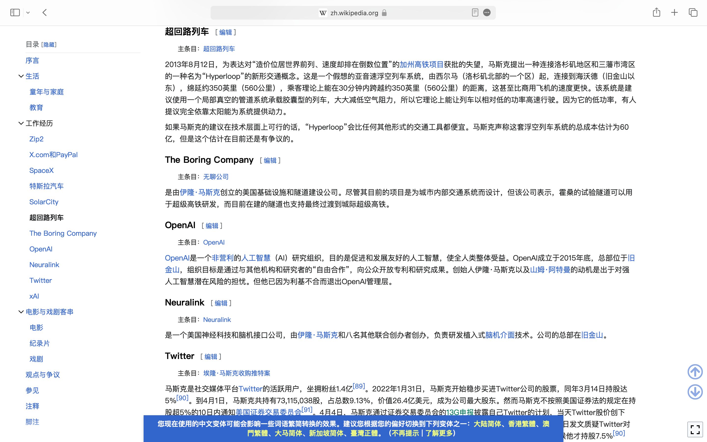

## 网络编程

[TOC]

所谓的网络编程，就是如何在网络上进行数据的传输。在Android开发中，网络编程主要用于实现应用程序与互联网上的服务器进行通信。下面是一些基础的网络编程知识点，我们将从最基础的概念开始。

### 网络基础基本的常识

####  IP地址

每个连接到网络的设备都有一个唯一的IP地址，用于在网络中标识该设备。

##### 公有IP和私有的IP

我们在手机上或者是电脑上看到的 IP地址（192.168.xx.xx） ，是私有的 IP，所谓的 IP 就相当与你电脑在整个互联网的地址，通过这个地址，别人的电脑就能够跟你进行通信。那什么是公有的IP？，公有的IP就是互联网上你的地址，你想象一下，你小区的地址，公有的IP地址就相当于你的小区。那么什么私有的IP地址，私有的IP地址就是，小区分配给你的，你的家庭的地址，那么我们告诉别人自己的家庭住址的时候，我们就会说，我是xxx小区（公有IP）几栋几号（私有地址）,那么公有的IP是分配给谁的呢，你可以简单的理解为，分配给了路由器，也就是你的WIFI，每一个链接到这个路由器的设备都是同一个公有的IP，路由器会给每一个联网的设备分配一个私有的IP，用来区分不同的设备。你的路由器从ISP获得一个公共IP地址，这个地址被路由器上的所有设备共享以访问互联网。路由器为其上的每个设备分配一个独特的私有IP地址，以在局域网内区分各个设备。此外，设备上运行的每个服务或应用都会使用一个端口号，这个端口号附加在私有IP地址后面，以在该设备上区分不同的服务或应用。				

查看私有的IP，在你的网络的详细信息当中就能够看得到，无论是IPv4 还是IPv6都是，你的私有的IP

查看公有的IP，你可以在终端当中，使用指令 `curl ifconfig.me`  		

#### 端口（port）

- 端口是一个16位的数字，用于区分同一台计算机上运行的不同网络服务。其实通过英文的名字更好的能够理解，port，港口，想象你的电脑就是一个海港，一个海港有很多的港口，每一个都外来的，或者自己的船只都和这些港口进行对接，一艘艘船只发送出去，一只只船只进入港口。

#### 协议

- 网络中的设备需要遵循一定的规则来进行通信，这些规则被称为协议。常见的协议有TCP、UDP、HTTP、HTTPS等。

#### HTTP和HTTPS

- HTTP（超文本传输协议）和HTTPS（安全超文本传输协议）是用于传输超文本（例如网页）的协议。
- HTTPS是HTTP的安全版本，它使用SSL/TLS协议来加密数据。

#### URL

URL（Uniform Resource Locator）是互联网上资源的地址。一个URL包含了协议、主机名（或IP地址）、端口号（可选）和路径。例如，`http://www.example.com:80/path`。

##### 案例

```URL
https://www.example.com:8080/path/to/resource?name=value&age=20#section
```

**解析**

**方案（Scheme）或者说传输协议**

- `https`
- 这意味着这个URL使用的是HTTPS协议，这是一种用于安全通信的HTTP。通常，HTTPS协议用于Web浏览器和服务器之间的通信。

**主机（Host）**

- `www.example.com`
- 这是服务器的域名，它指定了资源所在的服务器的位置。也可以用IP地址来代替。

**端口（Port）**

- `8080`
- 这个数字指定了服务器上的端口号。如果未指定，将使用协议的默认端口，例如，HTTPS的默认端口是443

**路径（Path）/ 开头的部分**

- `/path/to/resource`
- 这部分指定了资源在服务器上的具体位置。

**查询字符串（Query String）？ 开头的部分**

- `??name=value&age=20`
- 这部分包含了传递给资源的参数。在这个例子中，有两个参数：`name`的值是`value`，`age`的值是`20`。这个其实就是给服务器传参数比方说，当服务器接收到传进起来的参数是 1 的时候，显示 page1 ，当我接收到的参数是 2 的时候显示，page2 ，就能够实现，一个地址，多个显示页面的目的
- 当我的 ? 开始的时候，后面就是，参数的部分，前面的是 键 ，后面的是 值 ，这里是两组参数，前面的，中间是用 & 进行隔开的

**片段（Fragment）# 开头的的部分**

- `#section`
- 这部分指定了资源中的一个子部分。在Web页面中，这通常用于定位页面中的一个特定区域。这个相当与页面的查找，`#section`就是URL的"fragment"部分。当你访问这个URL时，浏览器会加载`page.html`这个网页，并且自动滚动到ID为`section`的元素的位置。

**举一例子**

[https://zh.wikipedia.org/zh-hans/埃隆·马斯克](https://zh.wikipedia.org/zh-hans/埃隆·马斯克)

这个是埃隆马斯克的中文维基百科的网址


​					

这个里面有一个这个标题  **超回路列车**

当我在原来的链接后面加上 **#超回路列车**

 [https://zh.wikipedia.org/zh-hans/埃隆·马斯克#超回路列车](https://zh.wikipedia.org/zh-hans/埃隆·马斯克#超回路列车)

他就会直接跳转到，所在的小标题的位置，而不是进入默认的网页的最顶端



​					

##### 在Java当中解析 URL

```java
import java.net.URL

public class UrlExample {

    public static void main(String[] args) {
        try {
            URL url = new URL("https://www.example.com:8080/path/to/resource?name=value&age=20#section");
            
            // 获取方案
            String scheme = url.getProtocol(); // 返回 "https"
            
            // 获取主机名
            String host = url.getHost(); // 返回 "www.example.com"
            
            // 获取端口号
            int port = url.getPort(); // 返回 8080
            
            // 获取路径
            String path = url.getPath(); // 返回 "/path/to/resource"
            
            // 获取查询字符串
            String query = url.getQuery(); // 返回 "name=value&age=20"
            
            // 获取片段
            String fragment = url.getRef(); // 返回 "section"
            
            // 打印各部分
            System.out.println("Scheme: " + scheme);
            System.out.println("Host: " + host);
            System.out.println("Port: " + port);
            System.out.println("Path: " + path);
            System.out.println("Query: " + query);
            System.out.println("Fragment: " + fragment);
            
        } catch (Exception e) {
            e.printStackTrace();
        }
    }
}
```

​												

#### HTTP/HTTPS

当你在浏览器中输入一个URL并按回车时，浏览器会向服务器发送一个HTTP请求。服务器接收到请求后，会返回一个HTTP响应。HTTP请求和响应都包含头部和正文。头部包含了关于请求或响应的元数据，而正文包含了实际的内容。

##### HTTP

HTTP（HyperText Transfer Protocol，超文本传输协议）是一种用于传输超文本（如HTML文件）的协议。它是互联网的基础，用于构建WWW（万维网）。HTTP协议通常使用TCP端口80。

HTTP是无状态的，这意味着每个请求都是独立的，服务器不会存储任何有关客户端之前请求的信息。

##### HTTPS

HTTPS（HyperText Transfer Protocol Secure，安全超文本传输协议）是HTTP的安全版本。它使用SSL/TLS协议来加密传输的数据，以保护数据的隐私和完整性。HTTPS通常使用TCP端口443。

​		

#### HTTP 与 HTTPS 的主要区别

1. **安全性：**
   - HTTP 是不安全的，数据以纯文本形式传输，可能会被拦截或者篡改。
   - HTTPS 是安全的，数据会被加密，这使得它更难以被拦截或篡改。
2. **端口号：**
   - HTTP 默认使用80端口。
   - HTTPS 默认使用443端口。
3. **证书：**
   - HTTPS 需要使用SSL证书来建立安全连接。SSL证书需要从证书颁发机构（CA）购买。
4. **性能：**
   - 由于HTTPS需要进行加密和解密操作，所以它的速度可能会稍慢一些，但这个差异通常是可以接受的，并且随着现代硬件和软件优化，这个差异变得越来越小。
5. **URL显示：**
   - 在大多数浏览器的地址栏中，HTTPS 网站会显示一个锁的图标，以表示连接是安全的

​				

### 请求和响应

#### HTTP 请求（Request）

HTTP请求是由客户端（通常是Web浏览器）发送到服务器的，要求服务器采取某种行动。请求包含许多信息，服务器可以根据这些信息生成响应。

##### 请求行（Request Line）

请求行是HTTP请求的第一行，包含以下三部分：

- **HTTP方法**：定义了请求的类型。常见的HTTP方法包括：
  - `GET`：请求指定的页面信息，并返回实体主体。（重要）
  - `POST`：向指定资源提交数据，请求服务器进行处理。数据包含在请求体中。（重要）
  - `PUT`：从客户端向服务器传送的数据取代指定的文档的内容。
  - `DELETE`：请求服务器删除指定的页面。
- **URL**：指定了请求的资源。例如`/index.html`。
- **HTTP版本**：定义了使用的HTTP协议版本，例如HTTP/1.1

​		

##### 请求头（Request Headers）

请求头提供了关于请求、请求主体和客户端的信息。常见的请求头包括：

- `Host`：指定了请求的目标服务器。
- `User-Agent`：描述了发起请求的用户代理（通常是浏览器）的信息。
- `Accept`：告诉服务器客户端能够处理的媒体类型。
- `Content-Type`：当请求中包含主体时，描述了主体的媒体类型。
- `Content-Length`：当请求中包含主体时，描述了主体的长度。

```makefile
Host: www.example.com
User-Agent: Mozilla/5.0
Accept: text/html, application/xhtml+xml, application/xml;q=0.9, */*;q=0.8
```

​			

##### 请求体（Request Body）

请求体包含了发送给服务器的数据。只有某些HTTP方法（如`POST`和`PUT`）才会使用请求体。例如，当你在网页上填写一个表单并提交时，表单的数据会被包含在`POST`请求的请求体中。

请求体的内容取决于`Content-Type`头的值。例如，如果`Content-Type`是`application/x-www-form-urlencoded`，那么请求体中的数据会被编码为键值对，例如：

```makefile
username=user&password=pass
```

​				

#### 一个post请求的案例

```makefile
POST /login HTTP/1.1
Host: www.example.com
User-Agent: Mozilla/5.0 (Windows NT 10.0; Win64; x64; rv:89.0) Gecko/20100101 Firefox/89.0
Accept: text/html,application/xhtml+xml,application/xml;q=0.9,image/webp,*/*;q=0.8
Accept-Language: en-US,en;q=0.5
Accept-Encoding: gzip, deflate, br
Content-Type: application/x-www-form-urlencoded
Content-Length: 29
Connection: keep-alive
Referer: http://www.example.com/login

username=user&password=pass
```

1. **请求行**：指定了HTTP方法（`POST`）、请求的URL（`/login`）和HTTP协议版本（`HTTP/1.1`）。
2. **请求头**：包含了多个头字段，每个字段描述了关于请求的一些信息。
3. **请求体**：包含了实际发送给服务器的数据，例如用户输入的用户名和密码

​					

请求行（Request Line）

```makefile
POST /login HTTP/1.1
```

- `POST`：HTTP方法。
- `/login`：请求的URL。
- `HTTP/1.1`：HTTP协议版本。

​				

请求头（Request Headers）

```makefile
Host: www.example.com
User-Agent: Mozilla/5.0 (Windows NT 10.0; Win64; x64; rv:89.0) Gecko/20100101 Firefox/89.0
Accept: text/html,application/xhtml+xml,application/xml;q=0.9,image/webp,*/*;q=0.8
Accept-Language: en-US,en;q=0.5
Accept-Encoding: gzip, deflate, br
Content-Type: application/x-www-form-urlencoded
Content-Length: 29
Connection: keep-alive
Referer: http://www.example.com/login
```

- `Host`：目标服务器的域名。
- `User-Agent`：发起请求的用户代理（通常是浏览器）的信息。
- `Accept`、`Accept-Language`、`Accept-Encoding`：描述了客户端愿意接收的内容类型、语言和编码。
- `Content-Type`：描述了请求体的媒体类型。
- `Content-Length`：描述了请求体的长度。
- `Connection`：指定了连接管理的指令。
- `Referer`：包含了发起请求的页面的URL。

​				

请求体（Request Body）

```makefile
username=user&password=pass
```


### Android中的网络编程

在Android中，你可以使用`HttpURLConnection`类或第三方库（如OkHttp）来发送HTTP请求和接收HTTP响应。通常，网络请求应该在一个单独的线程中执行，以避免阻塞主线程。

​			

