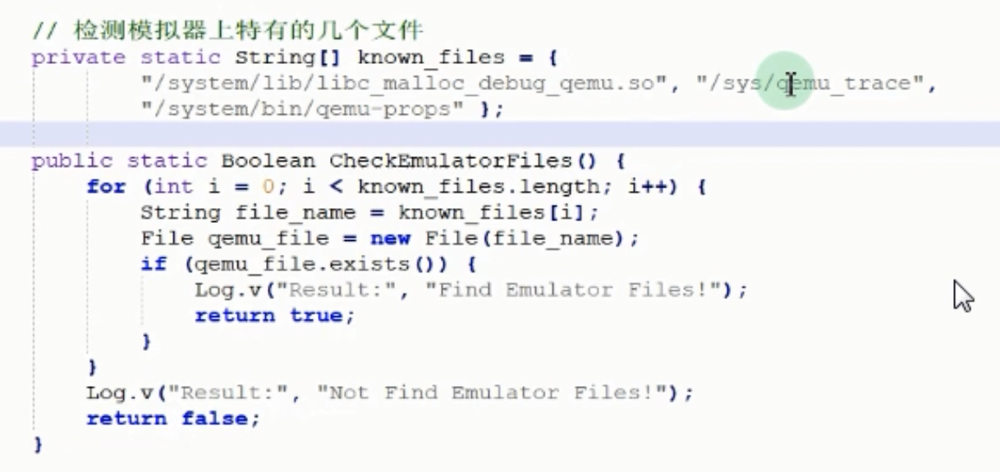
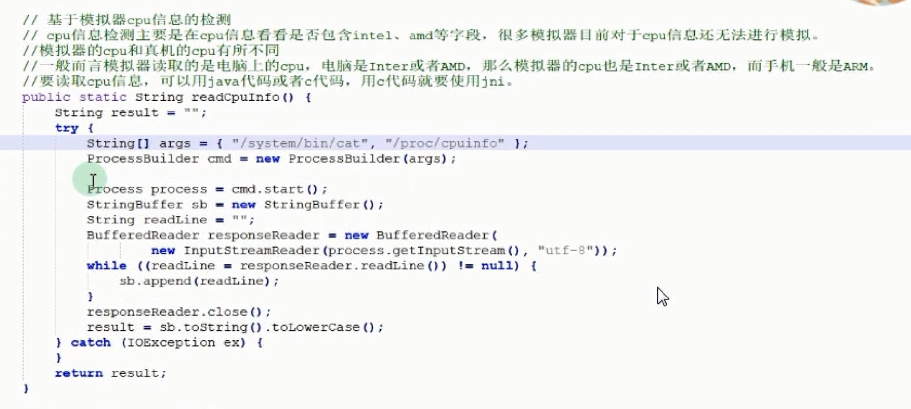
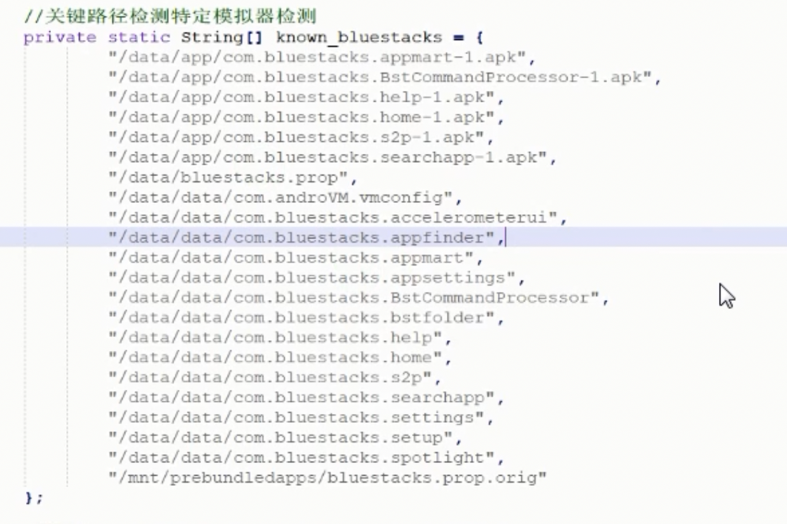

## apk常见的一个保护策略

### 混淆

java层的混淆，ProGuard工具 

资源文件的混淆【MT 针对单个 smali 做修改】

SO 层的混淆 ollvm

签名校验

34

---

#### 模拟器检测Java层，SO很少

---

---

反调试

_start 

__libc_init

main

23946

检测 tracepid（？？？？？）

0 -> 1

​		

进程名称检测（？？？？）

