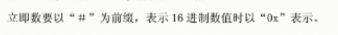

`B`：Branch

**B** 跳转

B 无条件的直接跳转  

BL 带链接的无条件跳转

BX 指令

寄存器和堆栈都是用来存放 数据的，一个是存放的比较大的数据，一个是存放比较小的数据

LDM

STM

PUSH

POP

SWP

MOV

ADD SUB MUL DIV

AND ORR EOR 

LSL

LSR

CMP

SWT

DCB

寻址方式

---

我们来想象一下，你的朋友要给你一本书。这本书可能在各种不同的地方，例如他的书包里，他的书架上，或者他手中。那么他将这本书给你的方式就相当于寻址方式。以下是一些可能的“寻址方式”：

1. **立即寻址**：这就好比你的朋友直接把手中的书给你，就像指令中直接写了要操作的数据。
2. **寄存器寻址**：你的朋友告诉你，书就在他的书包里，你直接从书包里拿。这就像计算机中的寄存器寻址，寄存器就好比书包，直接告诉我们数据在哪。
3. **寄存器间接寻址**：你的朋友给你一张便签，上面写着书在哪里，你根据便签找到书。这就像计算机的寄存器间接寻址，寄存器（便签）上写的是数据（书）的地址。
4. **基址寻址**：你的朋友告诉你书在书架的第三个格子里。这里的书架就像基址，第三个格子就像偏移量。计算机用基址（一个寄存器的值）和偏移量（一个额外的数）来找到数据。

LSR
ASR

ROR

RRX

CPSR 的 寄存器  SUBS 当中的 S 

SWI 指令

ARM 当中的伪指令

nop 

Thumb 指令

三级流水线  

---

IDA 
table 就是 汇编到 伪 C 的代码

蓝色表示常规的指令函数，

黑色表示 节与节之间的间隙

棕色是

暗黄色是IDA 未识别的内容

粉色表示外部导入的函数

HEx  查看指令的十六进制，直接划过去，然后，Hex view 

在View -> View subviews 当中可以看得到， Srings ，这是一个字符串的窗口

切换视图 空格

esc 返回

G跳转地址

重命名

注释 : ；

Ctlr + m 加标签

cltr + L 就是查看标签

CLtr + S 各个段的信息

查看没有反编译之前的数据 U 

 返回到反编译之后的代码 C 

快捷键

a p 类似的

---

小端存储和大端存储

 sp 栈顶指针

BLX 关注 sp PC   标志位 T