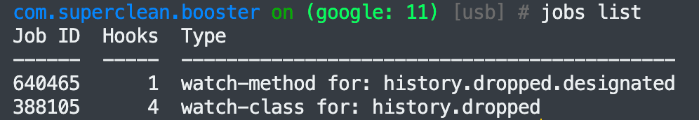

## frida使用


### 通过frida输出Hello I'm here

* 新建 .js 文档

```javascript
setTimeout
(
    function()
    {  
        Java.perform(function()
        {      
            console.log("hello world!");    
        });
    }
);
```

首先我们把一个匿名函数作 为参数传给了setTimeout()函数，在这个匿名函数体中调用了Frida 的API函数Java.perform()，这个API函数本身又接受了一个匿名函数 作为参数，该匿名函数最终调用console.log()函数来打印一个"Hello world!"字符串。这里需要调用setTimeout()方法是因为该方法将函 数注册到JavaScript运行库中，然后在JavaScript运行库中调用 Java.perform()方法将函数注册到App的Java运行库中并在其中执行 该函数(本范例打印输出了一条log)			

* 将手机/虚拟机里面的 frida-server 运行起来

`./fs`  通过这样的方式就能够运行 frida-server ，fs 是我已经对frida-server 改名，这里以你实际的 frida-server 的名字为准			

​			

* 检查是否已经运行了frida-server

`frida-ps -U`  **-U** 表示的是 USB 连接的设备，如果连接成功，就会显示，已经在手机/虚拟机上面运行的，进程，反之就不会显示正在运行的进程

​			

* 通过附加模式注入到指定的进程

`frida -U -l /Users/faker/Documents/hello_world.js "Max cleaner" ` 

**-U** 表示的是 USB 连接的设备			

**-l** 表示的是引入插件

"Max cleaner" 表示的是，想要附加的进程，这里的进程一般来说，是包名，但是主要是以 `firda-ps -U`  显示的结果为主，比方说，max cleaner 这一款软件，的包名是 `com.lpstu.max.junk.clean` 但是在 frida-ps -U 当中显示的是 Max cleaner 那么，注入进程的时候，就写 Max cleaner ，并且注意，这个名字中间有空格，所以两侧要加上双引号，如果，没有空格，那么可以不加			

----

### frida Hook Java层 普通函数

* 新建一个工程，MainActivity.java 如下

```java
package com.example.demo2;

import androidx.appcompat.app.AppCompatActivity;

import android.os.Bundle;
import android.util.Log;

public class MainActivity extends AppCompatActivity {

    @Override
    protected void onCreate(Bundle savedInstanceState) {
        super.onCreate(savedInstanceState);
        setContentView(R.layout.activity_main);
        while(true)
        {
            try{
                Thread.sleep(1000);
            }
            catch (InterruptedException e)
            {
                e.printStackTrace();
            }
            fun(50,30);
        }
    }
    void fun (int x,int y){
        Log.d("demo2.1",String.valueOf(x+y));
    }
}
```


Hook_java.js

```javascript
function main()
{
    console.log("脚本已经加载好...")
    Java.perform(function()
    {
        console.log("注入 Java perform 函数")
        var MainActivity = Java.use("com.example.demo2.MainActivity") //定位类
        console.log("Java.use 执行成功")
        MainActivity.fun.implementation = function(x,y)
        {
            console.log("x=>",x,"y=>",y)
            var ret_value = this.fun(x,y)
            return ret_value
        }
    })
}
setImmediate(main);
```

脚本中使用function关键字定义了一个main()函数，用于存放 Hook脚本，然后调用Frida的API函数Java.perform()将脚本中的内 容注入到Java运行库，这个API的参数是一个匿名函数，函数内容是 监控和修改Java函数逻辑的主体内容			

​			

在Java.perform()函数包裹的匿名函数中，首先调用了Frida的 API函数Java.use()，这个函数的参数是Hook的函数所在类的类名， 参数的类型是一个字符串类型，比如Hook的fun()函数所在类的全名，此处是 `com.example.demo2.MainActivity ` 

​			

这个函数的返回值动态 地为相应Java类获取一个JavaScript Wrapper，可以通俗地理解为 一个JavaScript对象。

在获取到对应的JavaScript对象后，通过“.”符号连接fun这个 对 应 的 函 数 名 ， 然 后 加 上 implementation 关 键 词 表 示 实 现 MainActivity对象的fun()函数		

​			

最后通过“=”这个符号连接一个匿 名函数，参数内容和原Java的内容一致。不同的是，JavaScript是一 个弱类型的语言，不需要指明参数类型。此时一个针对MainActivity 类的fun()函数的Hook框架就完成了。		

​				

这个匿名函数的内容取决于逆向开发和分析人员想修改这个被 Hook的函数的哪些运行逻辑。比如调用console.log()函数把参数内容 打印出来				

通过this.fun()函数再次调用原函数，并把原本的参数传递 给这个fun()函数。简而言之，就是重新执行原函数的内容，最后将这 个函数的返回值直接通过return指令返回。				

在Hook一个函数时，还有一个地方需要注意，那就是最好不要 修改被Hook的函数的返回值类型，否则可能会引起程序崩溃等问 题，比如直接通过调用原函数将原函数的返回值返回（如果不返回，原来的程序，该函数的后续操作就会错乱）			

​				

`setImmediate` (Frida的API函数)函数传递的参数是要被执行 的函数，比如传入main参数，表示当Frida注入App后立即执行 main()函数。				

这个函数和`setTimeout()` 函数类似，都是用于指定要执 行的函数，不同的是`setTimeout` 可以用于指定Frida注入App多长时间后执行函数，往往用于延时注入。				

如果传递的第二个参数为0或者 压根没有第二个参数，就和setImmediate()函数的作用一样

​			

### Hook Java层 重载函数

* 新建一个工程，Mainactivity 的内容如下

```java
package com.example.demo2;

import androidx.appcompat.app.AppCompatActivity;

import android.os.Bundle;
import android.util.Log;

import java.util.Locale;

public class MainActivity extends AppCompatActivity {

    @Override
    protected void onCreate(Bundle savedInstanceState) {
        super.onCreate(savedInstanceState);
        setContentView(R.layout.activity_main);
        while(true)
        {
            try{
                Thread.sleep(1000);
            }
            catch (InterruptedException e)
            {
                e.printStackTrace();
            }
            fun(50,30);
            Log.d("chongzai",fun("重载部分"));
        }
    }
    void fun (int x,int y){
        Log.d("chongzai",String.valueOf(x+y));
    }
    String fun(String x){
        return x.toLowerCase();
    }
}
```

​			

Hook_java.js

```javascript
function main()
{
    console.log("脚本加载成功...")
    Java.perform(function()
    {
        console.log("注入函数成功...")
        var MainActivity = Java.use("com.example.demo2.MainActivity")
        console.log("java.use 执行成功...")
        MainActivity.fun.overload("int","int").implementation = function(x,y)
        {
            console.log("x=>",x,"y=>",y)
            var result_value = this.fun(30,40)
            return result_value
        }
        
    })
}
setTimeout(main)
```

​				

```javascript
function main()
{
    console.log("脚本加载成功...")
    Java.perform(function()
    {
        console.log("注入函数成功...")
        var MainActivity = Java.use("com.example.demo2.MainActivity")
        console.log("java.use 执行成功...")
        MainActivity.fun.overload("java.lang.String").implementation = function(x)
        {
            console.log("x=>",x)
            var result_value = this.fun("hook string")
            return result_value
        }
        
    })
}
setTimeout(main)
```

​				

---

### 主动调用

主动调用就是强制调用一个函数去执行

如果不想分析详细的算法逻辑，可以直接通过主动传递 参数来调用关键算法函数，忽略方法函数的实现过程直接得到密文或 者明文，可以说这是各种算法调用的“克星”

在Java中，类中的函数可分为两种:类函数和实例方法。通俗地 讲，就是静态的方法和动态的方法。				

类函数使用关键字static修饰， 和对应类是绑定的，如果类函数还被public关键词修饰着，在外部就 可以直接通过类去调用			

如果是类函数的主动调用，直接 使用Java.use()函数找到类进行调用即可			

​				

实例方法则没有关键字static修饰，在外部 只能通过创建对应类的实例再通过这个实例去调用。在Frida中主动 调用的类型会根据方法类型区分开

如果是实例方法的主动调 用，则需要在找到对应的实例后对方法进行调用。这里用到了Frida 中非常重要的一个API函数Java.choose()，这个函数可以在Java的堆 中寻找指定类的实例。


* 新建一个工程，Mainactivity如下

```java
package com.example.demo2;

import androidx.appcompat.app.AppCompatActivity;

import android.os.Bundle;
import android.util.Log;

import java.util.Locale;

public class MainActivity extends AppCompatActivity {

    @Override
    protected void onCreate(Bundle savedInstanceState) {
        super.onCreate(savedInstanceState);
        setContentView(R.layout.activity_main);
        while(true)
        {
            try{
                Thread.sleep(1000);
            }
            catch (InterruptedException e)
            {
                e.printStackTrace();
            }
            fun(50,30);
            Log.d("chongzai",fun("重载部分"));
            //secret();
            //staticsecret();z
        }
    }
    void fun (int x,int y){
        Log.d("chongzai",String.valueOf(x+y));
    }
    String fun(String x){
        return x.toLowerCase();
    }
    String secret()
    {
        Log.d("sss","这是一个动态方法");
        return "动态方法被hook";
    }
    static String staticsecret()
    {
        Log.d("sss","这是一个静态方法");
        return "静态方法被hook";
    }
}
```


* 主动调用和被动调用的代码如下

```javascript
function main()
{
    console.log("脚本加载成功...")
    Java.perform(function()
    {
        console.log("注入函数成功...")
        var MainActivity = Java.use("com.example.demo2.MainActivity")
        console.log("java.use 执行成功...")
        MainActivity.fun.overload("java.lang.String").implementation = function(x)
        {
            console.log("x=>11",x)
            var result_value = this.fun("hook string")
            return result_value
        }
        
    })
}

function hook_java()
{
    console.log("脚本记载已经OK。。。")
    Java.perform(function()
    {
        var MainActivity = Java.use("com.example.demo2.MainActivity")
        console.log("脚本已经注入...")
        MainActivity.secret.implementation = function()
        {
            console.log(this.secret())
            return "";
        }
    })
}

function Djava()
{
    console.log("脚本交在成功...")
    Java.perform(function()
    {
        console.log("开始注入脚本...")

        // 主动调用静态函数
        var MainActivity = Java.use("com.example.demo2.MainActivity")
        console.log("脚本注入成功...")
        MainActivity.staticsecret()

        // 主动调用动态函数
        Java.choose(
            "com.example.demo2.MainActivity",
        {
            onMatch:function(instance)
            {
                console.log("instance found",instance)
                instance.secret()
            },
            onComplete:function()
            {
                console.log("调用完成...")
            }
        })
    })
}

 
setTimeout(Djava)
```

调用之后发现，在代码当中没有被调用的两个函数，在 `adb catlog | grep sss` 显示打印的结果

​			

可以发现静态的staticSecret()函数 和Hook时使用的方式大同小异，都是使用Java.use这个API去获取，MainActivity类，在获取对应的类对象后通过“.”连接符连接 staticSecret方法名，最终以和Java中一样的方式直接调用静态方法 staticSecret()函数			

​				

动态方法secret需要先通过Java.choose这个 API从内存中获取相应类的实例对象，然后才能通过这个实例对象去 调用动态的secret()函数，如果需要主动调用动态函数，必须确保存在相应类的对象，否则 无法进入Java.choose这个API的回调onMatch逻辑中，比如 MainActivity类对象。由于App在打开后确实运行在MainActivity界 面上，那么这个对象就一定会存在，这就是所谓的“所见即所得”思想		


#### 主动调用获取context

这是一个主动调用静态函数的办法，其中涉及到 context 的获取，context 是一个上下文，没有办法直接给定，只能够获取


Android 的Java代码

```java
package a.a.a.a.a.a.a.a;

	...


public final class III111II {
    
  	...
    
    public static final void IIIll1Il(Context arg10, String arg11, String arg12, int arg13)
    {
      
      ...
        
    }
```


hook代码

```java
// -----------------------------------主动调用--------------------

function zhudo()
{
    console.log("打开 js 脚本...")
    Java.perform(function()
    {
        console.log("注入 js 脚本...")
        var III111IIclass = Java.use("a.a.a.a.a.a.a.a.III111II")
        console.log("use...")
        var currentApplication = Java.use("android.app.ActivityThread").currentApplication()
        console.log("获取contetx...")
        var context = currentApplication.getApplicationContext()
        console.log("获取到的 context:" , context)
        III111IIclass.IIIll1Il(context,"CLEAN","source_install_app",1)
    })
}

setTimeout(zhudo)
```

​		

这是一个主动调用静态函数的办法，其中涉及到 context 的获取，context 是一个上下文，没有办法直接给定，只能够获取

Android代码

```java
package a.a.a.a.a.a.a.a;

	...
 
public final class lIllI1ll {
    
  ...
  
 	private final void IIIll1Il(Context arg12, int arg13, String arg14)
  {
    
    ...
      
  }

```


hook代码

```javascript
function zhudongDynamic()
{
    console.log("打开 js 脚本...")
    Java.perform(function()
    {
        console.log("注入 js 脚本..")
        var currentApplication = Java.use("android.app.ActivityThread").currentApplication()
        var context = currentApplication.getApplicationContext()
        Java.choose(
            "a.a.a.a.a.a.a.a.lIllI1ll",
        {
            onMatch:function(instance)
            {
                console.log("choose...")
                instance.IIIll1Il(context)
            },
            onComplete:function()
            {
                console.log("调用完成")
            }
        })
    })
}
```

​			

#### 主动调用之CharSequence

CharSequence 数据是数据类型，charSequence是一个接口，表示char值的一个可读序列

在主动调用的时候，输入输出参数，当我们在主动调用的时候，可能会遇到这样的类型的参数

​			

Android 代码

```java
public static boolean IIIllI1I(CharSequence arg0, CharSequence arg1, boolean arg2, int arg3, Object arg4) {  // 定位
        if((arg3 & 2) != 0) {
            arg2 = false;
        }

        return lI1II1lI.IIIllI1I(arg0, arg1, arg2);
    }
```

​				

`var charseqClazz = Java.use('java.lang.CharSequence')`

`var stringClzz = Java.use('java.lang.String')` 

`var strok = stringClzz.$new('unknown ssid')`

`var charseqok = Java.cast(strok, charseqClazz)`

Hook 代码

```javascript
function zhudongtanchuang()
{
    console.log("打开脚本 ... ")
    Java.perform(function()
    {
        console.log("注入脚本 ... ")

        var charseqClazz = Java.use('java.lang.CharSequence')
        var stringClzz = Java.use('java.lang.String')
        var strok = stringClzz.$new('unknown ssid')
        var strunknown_ssid = stringClzz.$new("unknown ssid")
        var charseqok = Java.cast(strok, charseqClazz)
        var charsequnknown_ssid = Java.cast(strunknown_ssid,charseqClazz)

        var historyclass = Java.use("IllI1Ill.lIl11l1l.IlIlI1Il")
        historyclass.IIIllI1I(charseqok,charsequnknown_ssid, false, 2, null)

    })
}
```

有时候，false 和 true 是没有办法直接输入的，因为 js 代码可能会把他解释为，字符串，所以我们可以直接用 0 / 1 进行代替

​		

---

## 自动化之RPC

就是使用Python对JavaScript脚本进行操作

​			

新建demo		

```java
package com.example.demo2;

import androidx.appcompat.app.AppCompatActivity;

import android.os.Bundle;
import android.util.Log;

import java.util.Locale;

public class MainActivity extends AppCompatActivity {

    private String total = "hello";
    @Override
    protected void onCreate(Bundle savedInstanceState) {
        super.onCreate(savedInstanceState);
        setContentView(R.layout.activity_main);
        while(true)
        {
            try{
                Thread.sleep(1000);
            }
            catch (InterruptedException e)
            {
                e.printStackTrace();
            }
            fun(50,30);
            Log.d("chongzai",fun("LoWeRcAsE Me Hello"));
            //secret();
            //staticsecret();z
        }
    }
    void fun (int x,int y){
        Log.d("sum：",String.valueOf(x+y));
    }
    String fun(String x){
        return x.toLowerCase();
    }
    String secret()
    {
        total += " secretFunc";
        return total;
    }
    static void staticsecret()
    {
        Log.d("secret","这是一个静态方法");
    }
}
```

我们的目的是获取total这个实例变量的值			

在主动调用时需要注意的是，Java中的变量也存在是否使用 static修饰的区别。在用Frida对Java中的变量进行处理时也要区分 是否使用static修饰:类变量，使用static修饰，可以直接通过类进行 获取;实例变量，不使用static修饰，和特定的对象绑定在一起				

 			

js 代码

```javascript
function CallSecretFunc()
{
    Java.perform(function()
    {
        Java.choose(
            "com.example.demo2.MainActivity",
            {
                onMatch:function(instance)
                {
                    console.log(instance.secret()) 
                },
                onComplete:function()
                {
                    console.log("frida 执行完成 ... ")
                }
            }
            )
    })
}


function getTotalValue()
{
    console.log("打开脚本 ... ")
    Java.perform(function()
    {
        var MainActivity = Java.use("com.example.demo2.MainActivity")

        Java.choose(
            "com.example.demo2.MainActivity",
        {
            onMatch:function(instance)
            {
                console.log("total value = ",instance.total.value)
            },
            onComplete:function()
            {
                console.log("获取完成")
            }
        })
    })
}

setTimeout(CallSecretFunc)
```

​			

两个代码的实现的功能不一样，确保我们的 js 代码没有问题之后，将这个函数导出				

```javascript
function CallSecretFunc()
{
    Java.perform(function()
    {
        Java.choose(
            "com.example.demo2.MainActivity",
            {
                onMatch:function(instance)
                {
                    console.log(instance.secret()) 
                },
                onComplete:function()
                {
                    console.log("frida 执行完成 ... ")
                }
            }
            )
    })
}


function getTotalValue()
{
    console.log("打开脚本 ... ")
    Java.perform(function()
    {
        var MainActivity = Java.use("com.example.demo2.MainActivity")

        Java.choose(
            "com.example.demo2.MainActivity",
        {
            onMatch:function(instance)
            {
                console.log("total value = ",instance.total.value)
            },
            onComplete:function()
            {
                console.log("获取完成")
            }
        })
    })
}

rpc.exports = {
    callsecretfunc:CallSecretFunc,
    gettotalvalue:getTotalValue
}
```

这 部 分 代 码 实 现 的 功 能 就 是 将 CallSecretFunc() 函 数 和 getTotalValue()函数分别导出为callsecretfunc和gettotalvalue。需 要注意的是，导出名**不可以有大写字母或者下划线**

​			

Python代码				

注意：这个地方获取进程名的时候，应该是frida识别到的进程名称，而不是包名或者是进程列表当中的进程的名称

```python
import frida,sys

def on_messgae(message,data):
    if message["type"] == "send":
        print("[*] {0}".format(message["playload"]))
    else:
        print(message)


device = frida.get_usb_device() # 获取设备的句柄
process = device.attach("demo2") # 注入进程

with open("test.js") as f:
    jscode = f.read()

script = process.create_script(jscode) # 加载了编写的 js 代码

script.on("message",on_messgae) # 注册了消息对应函数
script.load()

command = ""
while 1 == 1:
    command = input("\输入指令：\n1：退出\n2：获取 callsecretfunc 函数\n3：获取 gettotalvalue() 函数")
    if command == "1":
        break
    elif command == "2":
        script.exports.callsecretfunc() # 调用 js 的代码
    elif command == "3":
        script.exports.gettotalvalue()

```

---

### objection的使用

他是一个基于 frida 的一个工具			

Objection可以快速完成诸如内存搜索、类和 模块搜索、方法Hook以及打印参数、返回值、调用栈等常用功能    

objection 的安装的条件：			

1. Python的版本大于3.4
2. Python包管理软件pip的版本大于9.0
3. 注意 objection 的版本要比 frida 的版本小一点，能够避免 objection 需要的功能，frida 还不支持，但是我使用的是 frida 15.1.14，发布于2021年的12月9号，目前的objection 在，2021年4月份就停止更新了。所以可以直接使用 `pip3 install -U objection` 进行下载，（如果不是我这样的情况，可以指定下载的 objection的版本 pip3 insatll objection==你要指定的版本号）
4. 安装好了之后，可以使用 `objection version` 查看是否安装成功，以及，安装的版本

​				

#### objection 的使用

主要通过-g 参数指定注入的进程并通过explore命令进入REPL模式。在进入REPL模式后便可以使用Objection进行Hook的常用命令				

Objection支持通过-N参数来指定网络中 的设备并通过-h参数和-p参数来指定对应设备的IP和端口以进行连 接，从而完成对网络设备的注入与Hook。除此之外还可以通过 patchapk命令将frida-gadget.so打包进App			

​			

以 设置 这个应用为例			

1. 在确认手机使用USB线连接上手机 后
2. 运行相应版本的frida-server
3. 运行“设置”应用以通过frida-ps 找到对应的App及其包名


4. 通过 `objection -g 设 置  explore`  进入到 REPL 模式当中
5. 当不记得完整的命令的时候可以通过，空格来进行提示
6. 当是不知道命令的作用的时候，可以在命令前面加上 help 可以对命令进行释义


#### 常用命令

1. `jobs list` 查看和管理当前所执行 Hook的任务，因为可以同时运行多项Hook作业

2. `jobs kill [task_id]` 关闭任务

   

   **内存漫游相关命令**，Objection可以快速便捷地打印出内存 中的各种类的相关信息，这对App快速定位有着无可比拟的优势			

3. `android hooking list classes` 可以使用以下命令列出内存中的所有类（当然这种方式找到的类很多，所以介绍下面的筛选的方式）

4. `android hooking search classes <key>` 表示搜索包含，比方说包含 display 关键字的类

5. `android hooking search methods <key>` 表示 从内存中搜索所有包含关键词key的方法

6. `android hooking list class_methods <类名>` 表示的是，查看一个类下面的所有的方法，比方说对`com.android.settings.fuelgauge.BatteryInfo` 这个类感兴趣  ->     `android hooking list class_methods com.android.settings.fuelgauge.BatteryInfo` 比方说，有一个类是一个内部类，那么，查看的方式就是 加一个 **$** 表示后面的这个类名是一个内部类比方说这样： `android hooking list class_methods com.super.clean.booster.notification.services.BackupWorker$dating` 

7. `android hooking list activities` 表示的是列出加载到内存当中所有的 activity 

8. `android hooking list receivers`  表示的是列出加载到内存当中所有的 广播接收器

9. `android hooking list providers` 表示的是列出加载到内存当中所有的 内容提供者

   ​				

   **通过 objection 对 app 进行 hook**

10. `android hooking watch class_method com.super.clean.booster.notification.services.BackupWorker$dating.run --dump-backtrace` 这个表示对 run() 这个方法进行 hook ，并且打印 调用堆栈，开启了以后，就去触发这个函数，然后就会自动的生成调用堆栈，并且他的调用顺序是从下向上，还能够看得到，参数信息，以及返回值。


​				

* 可以 hook 除了构造函数之外的所有的函数

  android hooking watch class <类名>

  此时触发这个函数，也会出现调用栈，调用的顺序就是从上到下




​				

* 主动调用

首先要获取句柄，通过 `android heap search instances <类名>` 比方说 `android heap search instances java.io.File `   


这里的，Handle 非常的重要，是识别实例的标志			

​			

**实例方法的调用有两种**

1. 第一种是没有参数的实例方法

   `android heap execute <Handle> <methodname>`

   比方说：可以发现贺 toString() 的结果是一致的

   


2. 第二种是，主动调用执行带参数的函数

`android heap evaluate <Handle>`        

比方说： `android heap evaluate 384824` 

这个时候会进入一个小的编辑器，在这里实现，函数的调用			

```java
console.log("文件是可写的??",clazz.canWrite())
clazz.setWritable(True)
console.log("文件是可写的??",clazz.canWrite())
```

输入完毕之后， esc 返回（这个时候不会有任何的反应）然后点击 enter 执行脚本


1. `memory list modules` 打印内存当中加载的库


