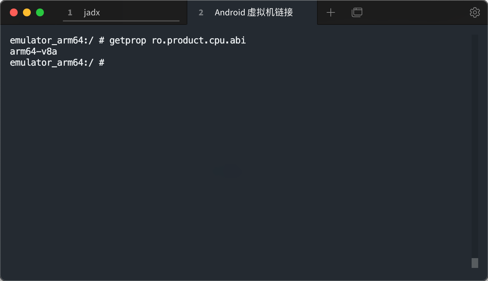
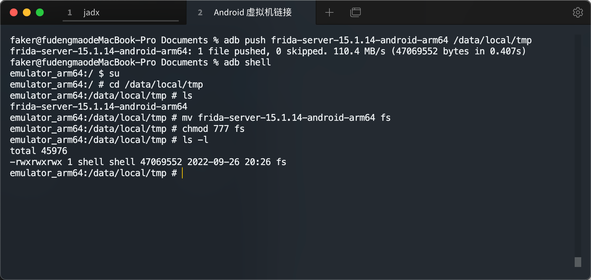

## frida环境的安装

firda 可以插入一些 代码到原生App的内存空间去动态地监视和修改其行为			

* 安装frida-tools 和 firda （整个过程比较的缓慢，可以使用 jnettop 查看下载的进度）

`pip3 install frida-tools ` 			

`pip3 install frida` 				

​		

* 下载 frida-server [下载链接](https://github.com/frida/frida/releases)  		

需要注意的是，这个 firda-server 一定要跟你的 firda 的版本是一样的。并且，注意你的设备的 cpu 是64位的还是32位的，通过 `getprop ro.product.cpu.abi` 这个指令就能够看得到你的设备的位数，		

​							

* 将这个 firda-server 文件解压之后，通过 push 指令，发送到 /data/local/tmp 文件夹下面
* 并且将这个文件的权限通过 chmod 指令设置为最高

### frida 简介

frida 两种操作模式

1. 通过命令行直接将 JavaScript 脚本注入到程序当中，这个称之为 CLI 模式
2. 另一种是通过 python 进行 JavaScript 脚本进行注入，这个称之为 RPC 模式（在需要处理大量数据的时候，这种方式更优秀）

​				

frida 操作 app 的方式主要有两种

1. spwan 模式，这种方式就是通过 frida 启动 app ，如果 app 目前已经启动了，但是通过这样的方式，frida 还是会启动一次 app 。要是用这种模式，需要在，指令当中加上 **-f** 
2. 第二种模式就是，attach 模式，这种模式，就是，在 app 已经启动的其概况之下，通过 ptrace 注入程序，从而执行后续操作，如果在执行指令当中不加任何其他的符号，默认就是这样的操作

### 安装IDE

主要就是安装 vscode node.js npm （主要是为了我们在写 JavaScript 的代码的时候有智能提示）

如果是 mac 并且已经安装了 brew 那么可以直接通过 `brew install node` 安装 node 			

通过 `node -v`  `npm -v`  指令查看是否安装成功			

 			

​			

