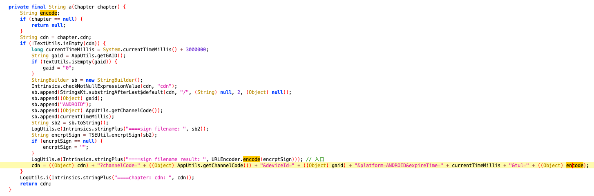
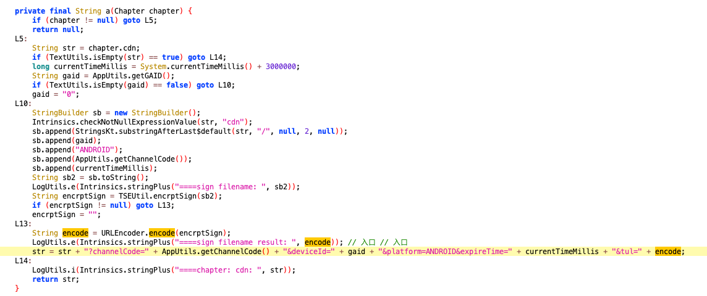

## jadx-gui还原代码错误

### 事情的起因

我正在分析一款 app 的一个函数

在这个函数当中，重要的是 `encode` 的这一个变量				

我们可以发现，这个变量在一开始创建了，然后在打印日志的时候出现过一次，紧接着就是，在赋值了，并且，在 hook 了这个函数之后，我们发现，`encode` 是有内容的，并不是空的，所以判断这个部分的，代码还原遇到了一些问题。

​			

### 解决

看到我们的 jadx-gui 这个软件的下面

将我们的选项从 **代码** 转换到 **Simple**				

我们再来看看这个代码		

这次我们就看到了，明确的 ，`encode` 的内容了。

​				

当然还有一种解决办法，就是不管这些，直接丢进，jEB 当中查看就是了。或者是使用其他的版本的 jadx-gui			

