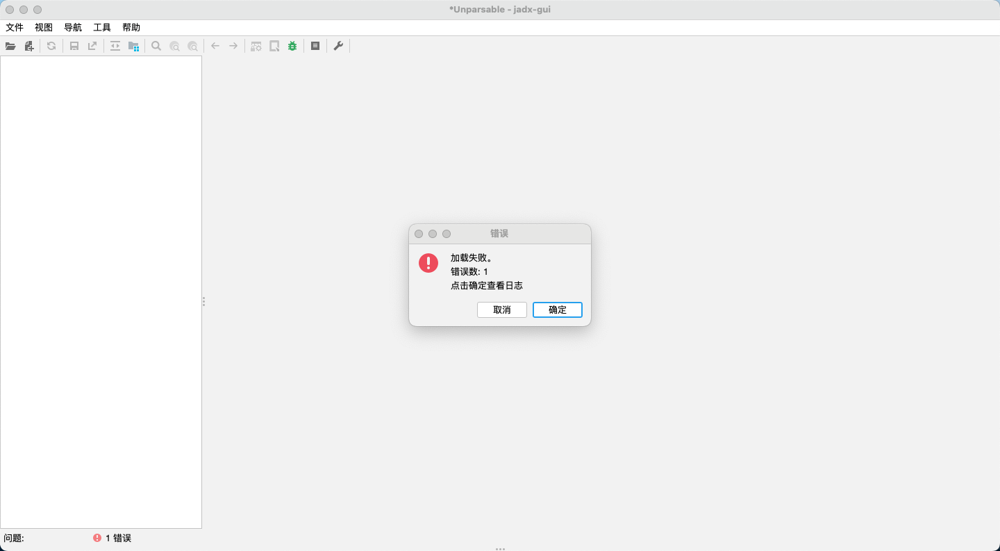
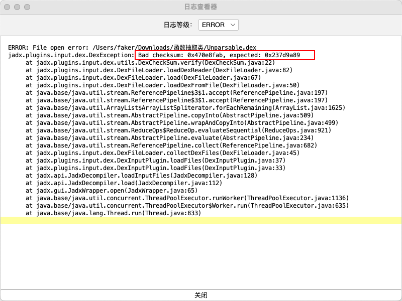

## jadx-gui不能解析dex的文件

**本教程所涉及到的案例的dex文件在 Release 当中的 Unparsable.dex** 

​					

当我们直接将这个 dex 的文件放进，jadx-gui 当中的时候。会看到



​					

我们看一下这个错误的日志



**Bad checksum: 0x470e8fab, expected: 0x237d9a89**						

这意味着接收到的数据的校验和是 `0x470e8fab`，但是期望的校验和是 `0x237d9a89`。这两个值不同，所以系统判定接收到的数据可能是损坏的或者被篡改的。						

​							

这个也就是说，当前的校验值是 0x237d9a89 ，但是正确的应该是 0x470e8fab 

​						

所以我们将这个校验值放进，**010Editor** 的这个软件当中做一些修改

**注意：如果你的 010Editor 没有解析 dex 的模板，你需要先安装一个 dex解析模板** 


然后需要找一个修复 DEX 文件的脚本，比方说如下

```c
int endian = ReadInt(0x28);     // endian_flag
if (endian == 0x12345678) {
    LittleEndian();
}
else {
    BigEndian();
}

uchar sha1[20];
ReadBytes(sha1, 0xc, 20);

Printf("src sha1: ");
uint i = 0;
for (i = 0; i < 20; i++) {
    Printf("%02x", sha1[i]);
}
Printf("\n");

uchar checksum[20];
ChecksumAlgBytes(CHECKSUM_SHA1, checksum, 0x20);

Printf("calced sha1: ");
for (i = 0; i < 20; i++) {
    Printf("%02x", checksum[i]);
}
Printf("\n");

int adler32 = ReadInt(0x8);
if (Memcmp(checksum, sha1, 20) != 0) {
    WriteBytes(checksum, 0xc, 20);
}
else {
    Printf("same sha1\n");
}

int adler32_ = Checksum(CHECKSUM_ADLER32, 0xc);
Printf("src adler32: %x\n", adler32);
Printf("calced adler32:%x\n", adler32_);

if (adler32_ != adler32) {
    WriteInt(0x8, adler32_);
}
else {
    Printf("same adler32\n");
}

Printf("Done.\n");
```

然后添加脚本，运行脚本，保存文件，将保存的文件，重新放进 jadx-gui 当中就可以了