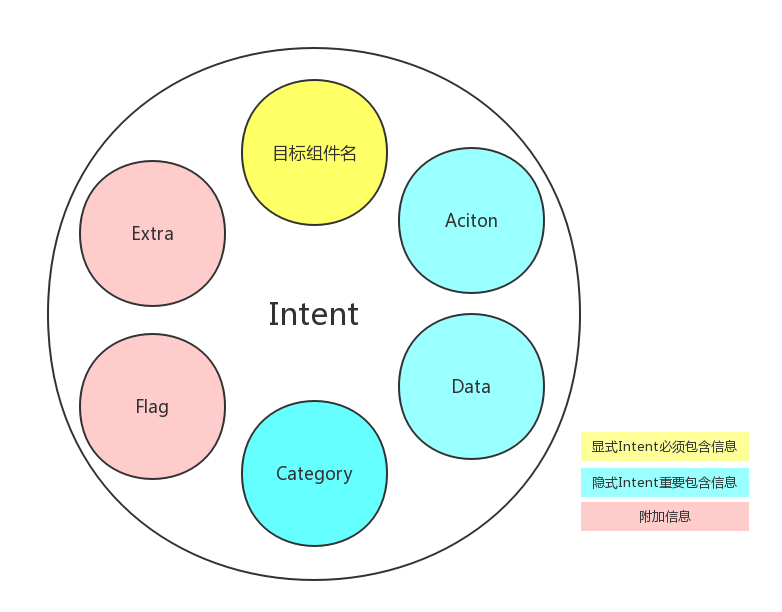

## java代码基础

- [java代码基础](#java代码基础)
  - [static关键字](#static关键字)
    - [static关键字修饰方法](#static关键字修饰方法)
    - [static关键字修饰变量](#static关键字修饰变量)
    - [static静态代码块](#static静态代码块)
  - [构造函数](#构造函数)
  - [方法重写与方法重载](#方法重写与方法重载)
  - [接口](#接口)
  - [startsWith()](#startswith)
  - [TextUtils.isEmpty](#textutilsisempty)
  - [TextUtils.isDigitsOnly](#textutilsisdigitsonly)
  - [Bundle](#bundle)
  - [Context](#context)
  - [synchronized](#synchronized)
  - [volatile](#volatile)
  - [getString()](#getstring)
  - [System.currentTimeMillis()](#systemcurrenttimemillis)
  - [MMKV](#mmkv)
  - [parseInt()](#parseint)
  - [Build. VERSION. SDK_INT](#build-version-sdk_int)
  - [CharSequence](#charsequence)
  - [System.currentTimeMillis()](#systemcurrenttimemillis-1)
  - [ArrayList](#arraylist)
  - [Android中的RemoteViews](#android中的remoteviews)
  - [Intent](#intent)
    - [Action](#action)
    - [Data](#data)
    - [Category](#category)
    - [Extra](#extra)
    - [Flag](#flag)
    - [Intent 构造示例：](#intent-构造示例)
  - [PendingIntent](#pendingintent)
  - [Notification](#notification)
    - [Notification 的基本操作](#notification-的基本操作)
    - [Notification 的必要属性有三项](#notification-的必要属性有三项)
    - [创建Notification](#创建notification)
    - [给 Notification 设置 Action](#给-notification-设置-action)
    - [PendingIntent](#pendingintent-1)
    - [PendingIntent 具有以下几种 flag：](#pendingintent-具有以下几种-flag)
    - [更新 Notification](#更新-notification)
    - [取消 Notification](#取消-notification)
    - [设置 Notification 的通知效果](#设置-notification-的通知效果)

### static关键字

可以修饰 变量 函数    

方便在没有创建对象的情况下来进行调用，并且全局通用，各个对象的关键字变量之间互相影响   

static 可以修饰 类 ，变量 ，方法     

下面介绍后面两种    

​     

#### static关键字修饰方法

```java
public class StaticMethod {
    public static void test() {
        System.out.println("============= 静态方法=============");
    };
    public static void main(String[] args) {
        //方式一：直接通过类名
        StaticMethod.test(); // 直接调用 类.方法 就能够直接使用，是静态方法的特点
        //方式二：
        StaticMethod fdd=new StaticMethod(); // 传统的先实例化对象，再通过实例化的对象调用方法
        fdd.test();
    }
}
```

​    

#### static关键字修饰变量    

被static修饰的成员变量叫做静态变量，也叫做类变量，说明这个变量是属于这个类的，而不是属于是对象，没有被static修饰的成员变量叫做实例变量，说明这个变量是属于某个具体的对象的   

```java
public class StaticVar {
    private static String name="java的架构师技术栈"；
    public static void main(String[] args) {
        //直接通过类名
        StaticVar.name;
    }
}
```

​    

#### static静态代码块

它是**随着类的加载而执行，只执行一次，并优先于主函数**。具体说，**静态代码块是由类调用**的。类调用时，先执行静态代码块，然后才执行主函数的。

**静态代码块其实就是给类初始化的，而构造代码块是给对象初始化的**

```java
public class MainActivity extends Activity implements View.OnClickListener {
    Button P;
    Button S;
    int cnt;
    int flag;
    private final Handler handler;
    int m;
    int n;
    Button r;
    private final Runnable showMessageTask;

    static {
        System.loadLibrary("calc"); // 静态代码块
    }

    public MainActivity() {
        this.cnt = 0;
        this.handler = new Handler();
        this.showMessageTask = new Runnable() {
        };
    }

    public native int calc() {
    }
```

---

### 构造函数

就是初始化实例    

由于构造方法是如此特殊，所以构造方法的名称就是类名。构造方法的参数没有限制，在方法内部，也可以编写任意语句。但是，和普通方法相比，构造方法没有返回值（也没有`void`），调用构造方法，必须用`new`操作符

```java
public class Main {
    public static void main(String[] args) {
        Person p = new Person("Xiao Ming", 15);
        System.out.println(p.getName());
        System.out.println(p.getAge());
    }
}

class Person {
    private String name;
    private int age;

    public Person(String name, int age) {
        this.name = name;
        this.age = age;
    }
    
    public String getName() {
        return this.name;
    }

    public int getAge() {
        return this.age;
    }
}
```

---

### 方法重写与方法重载

@Override	方法重写

重写是子类对父类的允许访问的方法的实现过程进行重新编写, 返回值和形参都不能改变。**即外壳不变，核心重写！**    

重写的好处在于子类可以根据需要，定义特定于自己的行为。 也就是说子类能够根据需要实现父类的方法。

```java
    public MainActivity() {
        this.cnt = 0;
        this.handler = new Handler();
        this.showMessageTask = new Runnable() {
            @Override //方法重载的标志
            public void run() {
                TextView tv3 = (TextView)MainActivity.this.findViewById(0x7F0C0052);  // id:textView3
                if(MainActivity.this.n - MainActivity.this.m == 1) {
                    ++MainActivity.this.cnt;
                    tv3.setText("WIN! +" + String.valueOf(MainActivity.this.cnt));
                }
                else if(MainActivity.this.m - MainActivity.this.n == 1) {
                    MainActivity.this.cnt = 0;
                    tv3.setText("LOSE +0");
                }
                else if(MainActivity.this.m == MainActivity.this.n) {
                    tv3.setText("DRAW +" + String.valueOf(MainActivity.this.cnt));
                }
                else if(MainActivity.this.m < MainActivity.this.n) {
                    MainActivity.this.cnt = 0;
                    tv3.setText("LOSE +0");
                }
                else {
                    ++MainActivity.this.cnt;
                    tv3.setText("WIN! +" + String.valueOf(MainActivity.this.cnt));
                }

                if(1000 == MainActivity.this.cnt) {
                    tv3.setText("SECCON{" + String.valueOf((MainActivity.this.cnt + MainActivity.this.calc()) * 107) + "}");
                }

                MainActivity.this.flag = 0;
            }
        };
    }

    public native int calc() {
    }
```

​		


重载(overloading)		没有关键字

是在一个类里面，方法名字相同，而参数不同。返回类型可以相同也可以不同。		

每个重载的方法（或者构造函数）都必须有一个独一无二的参数类型列表。		

简而言之就是新的方法名字相同但是参数不同，实现的功能也不同		

最常用的地方就是构造器的重载。

```java
public class Overloading {
    public int test(){
        System.out.println("test1");
        return 1;
    }
 
    public void test(int a){
        System.out.println("test2");
    }   
 
    //以下两个参数类型顺序不同
    public String test(int a,String s){
        System.out.println("test3");
        return "returntest3";
    }   
 
    public String test(String s,int a){
        System.out.println("test4");
        return "returntest4";
    }   
 
    public static void main(String[] args){
        Overloading o = new Overloading();
        System.out.println(o.test());
        o.test(1);
        System.out.println(o.test(1,"test3"));
        System.out.println(o.test("test4",1));
    }
}
```

---

### 接口

首先接口通过 inerface 进行定义		

通过 implements 进行实现		

接口之间的继承还是通过 extends 进行实现的		

因为Java当中不支持多继承，但是接口支持多继承		

所以可以多个接口共同实现一个		

可以把它理解成，支持多继承的一个类		

但是接口是不支持直接实现类，它更像是父类的一个补充		

```java
public inerface Runner
{
  int ID = 1;
  void run ();
}
interface Animal extends Runner
{
  void breathe ();
}
class Fish implements Animal
{
  public void run ()
{
   System.out.println("fish is swimming");
}
public void breather()
{
   System.out.println("fish is bubbing");   
}
}
abstract LandAnimal implements Animal
{
  public void breather ()
{
   System.out.println("LandAnimal is breathing");
}
}
class Student extends Person implements Runner
{
   ......
   public void run ()
    {
         System.out.println("the student is running");
    }
   ......
}

interface Flyer
{
  void fly ();
}
class Bird implements Runner , Flyer
{
  public void run ()
   {
       System.out.println("the bird is running");
   }
  public void fly ()
   {
       System.out.println("the bird is flying");
   }
}
class TestFish
{
  public static void main (String args[])
   {
      Fish f = new Fish();
      int j = 0;
      j = Runner.ID;
      j = f.ID;
   }
}
```

----

### startsWith()

startsWith() 方法用于检测字符串是否以指定的前缀开始

---

### TextUtils.isEmpty

用来判断字符串是不是为空

```java

public static boolean isEmpty(CharSequence str) {  
    if (str == null || str.length() == 0)  
        return true;  
    else  
        return false;  
```

在字符串为null或者""的情况下，都是可以用 TextUtils.isEmpty() 来进行判断的，因为当""情况下，str.length()==0，所以同样也会返回true

---

### TextUtils.isDigitsOnly

用来判断字符串是不是全部都是数字

---

### Bundle

这个类似于 Python 当中的字典

Bundle主要用于传递数据；它保存的数据，是以key-value(键值对)的形式存在的。

我们经常使用Bundle在Activity之间传递数据，传递的数据可以是boolean、byte、int、long、float、double、string等基本类型或它们对应的数组，也可以是对象或对象数组。当Bundle传递的是对象或对象数组时，必须实现Serializable 或 Parcelable接口。下面分别介绍Activity之间如何传递基本类型、传递对象

​		

Bundle提供了各种常用类型的putXxx()/getXxx()方法

---

### Context

Context的中文翻译为：语境; 上下文; 背景; 环境，在开发中我们经常说称之为“上下文”，那么这个“上下文”到底是指什么意思呢？在语文中，我们可以理解为语境，在程序中，我们可以理解为当前对象在程序中所处的一个环境，一个与系统交互的过程。比如微信聊天，此时的“环境”是指聊天的界面以及相关的数据请求与传输，Context在加载资源、启动Activity、获取系统服务、创建View等操作都要参与。

​							

那Context到底是什么呢？一个Activity就是一个Context，一个Service也是一个Context。Android程序员把“场景”抽象为Context类，他们认为用户和操作系统的每一次交互都是一个场景，比如打电话、发短信，这些都是一个有界面的场景，还有一些没有界面的场景，比如后台运行的服务（Service）。一个应用程序可以认为是一个工作环境，用户在这个环境中会切换到不同的场景，这就像一个前台秘书，她可能需要接待客人，可能要打印文件，还可能要接听客户电话，而这些就称之为不同的场景，前台秘书可以称之为一个应用程序。

​			

Context一共有三种类型，分别是Application、Activity和Service。这三个类虽然分别各种承担着不同的作用，但它们都属于Context的一种，而它们具体Context的功能则是由ContextImpl类去实现的

​			

就像它的名字(上下文)一样，他是项目当前的状态的一个标识，他可以让新创建出来，新加入进来的对象或组件知道当前项目的进度，处于一个什么状态，这样我们就可以容易理解上下文的意思了把，上文就是自己知道了之前项目已经处于一个什么样的状态，下文就是告诉后来的对象或者组件当前项目处于一个什么状态。
你可以通过getApplication()、getContext()、getBaseContext()或者this(在当前的Activity中时)来获取context上下文。

​			

---

### synchronized

synchronized可以保证方法或者代码块在运行时，同一时刻只有一个方法可以进入到临界区			

一个线程访问一个对象中的synchronized(this)同步代码块时，其它线程试图访问该对象的线程将被阻塞			

---

### volatile

**变量修改对其他线程立即可见**			

就是我在一个线程对一个变量进行了修改，那么其他线程马上就可以知道我修改了他	

---

### getString()

**getString**表示以 Java 编程语言中String的形式获取此 ResultSet 对象的当前行中指定列的值。			

```java
Connection conn = ……  //省略部分代码
String sql = "SELECT username,pwd FROM myTable";
Statement st = conn.createStatement();
ResultSet rs = st.executeQuery(sql);
while(rs.next()){
    System.out.println(rs.getString("username"));  //获取username列的列值
    System.out.println(rs.getString("pwd"));  //获取pwd列的列值
}
```

​							

```java
Connection conn = ……  //省略部分代码
String sql = "SELECT username,pwd FROM myTable";  //定义查询SQL语句
Statement st = conn.createStatement();
ResultSet rs = st.executeQuery(sql);
while(rs.next()){
    System.out.println(rs.getString(1));  //获取数据表中第一列数据值
    System.out.println(rs.getString(2));  //获取数据表中第二列数据值
}
```

---

### System.currentTimeMillis()

生产一个当前的毫秒数，一个从1970年1月1日开始的毫秒数

---

### MMKV

是一种支持多进程的字典

MMKV 是基于 mmap 内存映射的 key-value 组件

MMKV 的使用非常简单，所有变更立马生效，无需调用 sync、apply。

​			

MMKV 提供一个全局的实例，可以直接使用

```java
import com.tencent.mmkv.MMKV;
//……

//1. 获取默认全局实例 (一般就使用这个就行)
MMKV kv = MMKV.defaultMMKV();

//2. 也可以自定义MMKV对象，设置自定ID  (根据业务区分的存取实例)
MMKV kv = MMKV.mmkvWithID("ID");

//3. MMKV默认是支持单进程的，如果业务需要多进程访问，需要在初始化的时候添加多进程模式参数
MMKV kv = MMKV.mmkvWithID("ID", MMKV.MULTI_PROCESS_MODE); //多进程同步支持
```

​				

```java
/** 添加/更新数据 **/
//存boolean类型
kv.encode("bool", true);
//存int类型
kv.encode("int", Integer.MIN_VALUE);
//存string类型
kv.encode("string", "MyiSMMKV");


/** 获取数据 **/
//获取boolean类型数据
boolean bValue = kv.decodeBool("bool");
//获取int类型数据
int iValue = kv.decodeInt("int");
//获取string类型数据
String str = kv.decodeString("string");
//...等类型的获取

// 删除数据
mmkv.removeValueForKey(key);
```


```java
//读写bool类型相关
public boolean encode(String key, boolean value) {
    return this.encodeBool(this.nativeHandle, key, value);
}
public boolean decodeBool(String key) {
    return this.decodeBool(this.nativeHandle, key, false);
}

public boolean decodeBool(String key, boolean defaultValue) {
    return this.decodeBool(this.nativeHandle, key, defaultValue);
}
//读写int 类型
public boolean encode(String key, int value) {
    return this.encodeInt(this.nativeHandle, key, value);
}

public int decodeInt(String key) {
    return this.decodeInt(this.nativeHandle, key, 0);
}

public int decodeInt(String key, int defaultValue) {
    return this.decodeInt(this.nativeHandle, key, defaultValue);
}
//读写long 类型
public boolean encode(String key, long value) {
    return this.encodeLong(this.nativeHandle, key, value);
}

public long decodeLong(String key) {
    return this.decodeLong(this.nativeHandle, key, 0L);
}

public long decodeLong(String key, long defaultValue) {
    return this.decodeLong(this.nativeHandle, key, defaultValue);
}
//读写float类型
public boolean encode(String key, float value) {
    return this.encodeFloat(this.nativeHandle, key, value);
}

public float decodeFloat(String key) {
    return this.decodeFloat(this.nativeHandle, key, 0.0F);
}

public float decodeFloat(String key, float defaultValue) {
    return this.decodeFloat(this.nativeHandle, key, defaultValue);
}
//读写double 类型
public boolean encode(String key, double value) {
    return this.encodeDouble(this.nativeHandle, key, value);
}

public double decodeDouble(String key) {
    return this.decodeDouble(this.nativeHandle, key, 0.0D);
}

public double decodeDouble(String key, double defaultValue) {
    return this.decodeDouble(this.nativeHandle, key, defaultValue);
}
//读写字符串类型
public boolean encode(String key, @Nullable String value) {
    return this.encodeString(this.nativeHandle, key, value);
}

@Nullable
public String decodeString(String key) {
    return this.decodeString(this.nativeHandle, key, (String)null);
}

@Nullable
public String decodeString(String key, @Nullable String defaultValue) {
    return this.decodeString(this.nativeHandle, key, defaultValue);
}
//读写 set<string> 类型
public boolean encode(String key, @Nullable Set<String> value) {
    return this.encodeSet(this.nativeHandle, key, value == null ? null : (String[])value.toArray(new String[0]));
}

@Nullable
public Set<String> decodeStringSet(String key) {
    return this.decodeStringSet(key, (Set)null);
}

@Nullable
public Set<String> decodeStringSet(String key, @Nullable Set<String> defaultValue) {
    return this.decodeStringSet(key, defaultValue, HashSet.class);
}

@Nullable
public Set<String> decodeStringSet(String key, @Nullable Set<String> defaultValue, Class<? extends Set> cls) {
    String[] result = this.decodeStringSet(this.nativeHandle, key);
    if (result == null) {
        return defaultValue;
    } else {
        Set a;
        try {
            a = (Set)cls.newInstance();
        } catch (IllegalAccessException var7) {
            return defaultValue;
        } catch (InstantiationException var8) {
            return defaultValue;
        }

        a.addAll(Arrays.asList(result));
        return a;
    }
}
//读写 byte[]
public boolean encode(String key, @Nullable byte[] value) {
    return this.encodeBytes(this.nativeHandle, key, value);
}

@Nullable
public byte[] decodeBytes(String key) {
    return this.decodeBytes(key, (byte[])null);
}

@Nullable
public byte[] decodeBytes(String key, @Nullable byte[] defaultValue) {
    byte[] ret = this.decodeBytes(this.nativeHandle, key);
    return ret != null ? ret : defaultValue;
}
//读写序列化类型 Parcelable
public boolean encode(String key, @Nullable Parcelable value) {
    if (value == null) {
        return this.encodeBytes(this.nativeHandle, key, (byte[])null);
    } else {
        Parcel source = Parcel.obtain();
        value.writeToParcel(source, value.describeContents());
        byte[] bytes = source.marshall();
        source.recycle();
        return this.encodeBytes(this.nativeHandle, key, bytes);
    }
}

@Nullable
public <T extends Parcelable> T decodeParcelable(String key, Class<T> tClass) {
    return this.decodeParcelable(key, tClass, (Parcelable)null);
}

@Nullable
public <T extends Parcelable> T decodeParcelable(String key, Class<T> tClass, @Nullable T defaultValue) {
    if (tClass == null) {
        return defaultValue;
    } else {
        byte[] bytes = this.decodeBytes(this.nativeHandle, key);
        if (bytes == null) {
            return defaultValue;
        } else {
            Parcel source = Parcel.obtain();
            source.unmarshall(bytes, 0, bytes.length);
            source.setDataPosition(0);

            Parcelable var8;
            try {
                String name = tClass.toString();
                Creator creator;
                synchronized(mCreators) {
                    //先从本地缓存中获取
                    creator = (Creator)mCreators.get(name);
                    if (creator == null) {
                        //获取public 变量  CREATOR，  由于是反射所以会保存到hashmap中 避免耗时
                        Field f = tClass.getField("CREATOR");
                        creator = (Creator)f.get((Object)null);
                        if (creator != null) {
                            mCreators.put(name, creator);
                        }
                    }
                }
                //如果为空 则表明类没有实现Parcelable 序列化
                if (creator == null) {
                    throw new Exception("Parcelable protocol requires a non-null static Parcelable.Creator object called CREATOR on class " + name);
                }

                var8 = (Parcelable)creator.createFromParcel(source);
            } catch (Exception var16) {
                simpleLog(MMKVLogLevel.LevelError, var16.toString());
                return defaultValue;
            } finally {
                source.recycle();
            }

            return var8;
        }
    }
}
```


---

### parseInt()

```java
int I = Integer.parseInt("123456");
```

把字符串转变成整形

---

### Build. VERSION. SDK_INT

代表的操作系统的版本号，谷歌的解释大致翻译如下当前在此硬件上运行的软件的SDK

---

### CharSequence

简单理解成，这就是一个 String 

CharSequence与String都能用于定义字符串，但CharSequence的值是可读可写序列，而String的值是只读序列。

---

### System.currentTimeMillis()

获取一个当前系统时间的时间戳

---

### ArrayList

ArrayList 类是一个可以动态修改的数组，与普通数组的区别就是它是没有固定大小的限制，我们可以添加或删除元素，类似于Python当中的列表

---

### Android中的RemoteViews

RemoteViews翻译过来就是远程视图.顾名思义,RemoteViews不是当前进程的View,是属于SystemServer进程

RemoteViews在Android中的使用场景有两种：通知栏和桌面小部件。

```java
private void showDefaultNotification() {
    NotificationCompat.Builder builder = new NotificationCompat.Builder(this);

    // 设置通知的基本信息：icon、标题、内容
    builder.setSmallIcon(R.mipmap.ic_launcher);
    builder.setContentTitle("My notification");
    builder.setContentText("Hello World!");
    builder.setAutoCancel(true);

    // 设置通知的点击行为：这里启动一个 Activity
    Intent intent = new Intent(this, SecondActivity.class);
    PendingIntent pendingIntent = PendingIntent.getActivity(this, 0, intent, PendingIntent.FLAG_UPDATE_CURRENT);
    builder.setContentIntent(pendingIntent);

    // 发送通知 id 需要在应用内唯一
    NotificationManager notificationManager = (NotificationManager) getSystemService(Context.NOTIFICATION_SERVICE);
    notificationManager.notify(id, builder.build());
}
```


自定义通知

```java
private void showCustomNotification() {

    RemoteViews remoteView;

    // 构建 remoteView
    remoteView = new RemoteViews(getPackageName(), R.layout.layout_notification);
    remoteView.setTextViewText(R.id.tvMsg, "哈shenhuniurou");
    remoteView.setImageViewResource(R.id.ivIcon, R.mipmap.ic_launcher_round);

    NotificationCompat.Builder builder = new NotificationCompat.Builder(this);

    // 设置自定义 RemoteViews
    builder.setContent(remoteView).setSmallIcon(R.mipmap.ic_launcher);

    // 设置通知的优先级(悬浮通知)
    builder.setPriority(NotificationCompat.PRIORITY_MAX);
    Uri alarmSound = RingtoneManager.getDefaultUri(RingtoneManager.TYPE_NOTIFICATION);
    // 设置通知的提示音
    builder.setSound(alarmSound);


    // 设置通知的点击行为：这里启动一个 Activity
    Intent intent = new Intent(this, SecondActivity.class);
    PendingIntent pendingIntent = PendingIntent.getActivity(this, 0, intent, PendingIntent.FLAG_UPDATE_CURRENT);
    builder.setContentIntent(pendingIntent);
    builder.setAutoCancel(true);
    Notification notification = builder.build();

    NotificationManager notificationManager = (NotificationManager) getSystemService(Context.NOTIFICATION_SERVICE);
    notificationManager.notify(1001, notification);
}
```


* setTextViewText(viewId, text) 设置文本
* setTextColor(viewId, color)           设置文本颜色
* setTextViewTextSize(viewId, units, size)     设置文本大小
* setImageViewBitmap(viewId, bitmap)        设置图片
* setImageViewResource(viewId, srcId)       根据图片资源设置图片
* setViewPadding(viewId,left, top,right, bottom) 设置Padding间距
* setOnClickPendingIntent(viewId, pendingIntent)  设置点击事件，表示的是点击 viewId 这标签的按钮，会触发后面的 pendingIntent 

---

### Intent

Intent 是 Android 非常常用的一个用于组件间互相通信的信息对象，常用于启动组件和传递数据

Intent传送数据是以键值对的形式，主要通过`putExtra()`方法，该方法接收两个参数，第一个是数据的键,第二个是数据的值

​		

向目标Activity传递数据：

```java
Intent intent=new Intent(this,Main2Activity.class);
//可传递多种类型的数据
intent.putExtra("name","张三");
intent.putExtra("age",12);
startActivity(intent);
```

​			

在目标Activity中取出数据

```java
Intent intent=getIntent();
//用getXxxExtra()取出对应类型的数据。取出String只需要指定key
String name=intent.getStringExtra("name");
//取出int要指定key，还要设置默认值，当intent中没有该key对应的value时，返回设置的默认值
int age=intent.getIntExtra("age",0);
```

​		

Intent 的包含信息与构造



| 代码                                         | 描述                                                         |
| -------------------------------------------- | ------------------------------------------------------------ |
| Intent()                                     | 构造一个空 Intent                                            |
| Intent(String action)                        | 构造一个指定 action 的 Intent                                |
| Intent(String action，Uri uri)               | 构造一个指定 action 和 uri（相当于同时设定了 data）的 Intent |
| Intent(Context packageContext，Class<?> cls) | 构造一个指定目标组件的 Intent，显式 Intent 的主要构造方法    |

​			

| 代码                                            | 描述                                                        |
| ----------------------------------------------- | ----------------------------------------------------------- |
| setAction(String action)                        | 指定 action                                                 |
| setClass(Context packageContext, Class<?> cls)  | 制定目标组件类名                                            |
| setData(Uri data)                               | 设置 Data 的 uri                                            |
| setType(String type)                            | 设置 Data 的 MIME 类型                                      |
| setDataAndType(Uri data, String type)           | 同时设置 Data 的 uri 与 MIME 类型                           |
| addCategory(String category)                    | 添加一项 Category，Intent 可有多个 Category                 |
| addFlags(int flags)                             | 设置 Flag，决定目标组件的启动方式                           |
| putExtra(String name, 基本类型和序列化类 value) | 放入附加数据，参 2 可以是各种基本类型，及序列化后的自定义类 |
| putExtras(Bundle extras)                        | 把封装了数据信息的 Bundle 对象放入 Intent                   |

​			

#### Action

指 Intent 发向的组件的主要动作，比如：图片应用中主要动作为查看图片的组件、地图应用中主要动作为查看地址的组件。另外，对于广播（Broadcast）组件而言，Intent 的 action 则是指广播具体的值。当 Broadcast Receiver 接收到该值时代表了某事件已经发生。
通常使用的主要是 Android 系统内置 action，这些 action 实际上是保存在 Intent 类中的静态常量，系统的默认组件（如：默认浏览器、图片浏览器、拨号页面等）都可以响应相应的 action。下面给出几个比较常见内置 action。

**ACTION_VIEW**
向用户展示某信息，比如使用浏览器打开网址，用图片应用显示图片等

**ACTION_SEND**
用于发送数据，比如电子邮件应用或者一些社交应用。

**ACTION_DIAL**
显示带拨号盘的页面，让用户可以进行拨号动作。


**自定义action**， 供 Intent 在自己的应用内使用（或者供其他应用在自己的应用中调用组件）。如果定义自己的操作，请确保将应用的软件包名称作为前缀。 例如：

```java
static final String ACTION_TIMETRAVEL = "com.example.action.TIMETRAVEL";
```

​				

​				

#### Data

包含了 URI 对象和 memitype 两个部分，分别是待操作数据的引用 uri，以及待操作数据的数据类型。两部分均为可选，但是要注意同时设置时应该使用 `setDataAndType()`方法，防止互相抵消。
Data 内容一般由 action 决定，比如 action 为 ACTION_VIEW，那么 Data 就可以是一个网址，也可以是图片之类的数据 uri。
同时指定 Uri 和 MIME 类型有助于 Android 系统找到接收 Intent 的最佳组件，例如可以响应 ACTION_VIEW 的组件可能有非常多，浏览器、播放器、图片应用等等。此时设置`mimeType`为`"image/jpeg"`或者`video/mp4`，则系统可以筛选出更合适的响应组件。


#### Category

目标组件的类型信息字符串，一个 Intent 可以添加多个 Category 。以下是比较常见的 Category：

**CATEGORY_BROWSABLE**
目标 Activity 允许本身通过网络浏览器启动，以显示链接引用的数据，如图像或电子邮件。

**CATEGORY_LAUNCHER**
该 Activity 是任务的初始 Activity，在系统的应用启动器中列出。

需要注意的是大部分 Intent 虽然不需要设置 Category，但是在调用使用 Intent 的方法（如`starActivity（）`等）的时候，会默认为该 Intent 添加 CATEGORY_DEFAULT，相应目标组件的Intent过滤器应该添加该类别，具体会在下文 **2、Intent的用法** 中详述。

**以上 4 种（组件类名、Action、Data、Category）是会影响系统对 Intent 的解析从而决定最终启动那个组件的信息，以下两种（Extra、Flag）属于附加的信息，不影响系统解析启动那个组件**

​				

#### Extra

Intent 携带附加数据，也是组件间互相传递信息比较常见的做法。使用各种 `putExtra()`方法添加 extra 数据，每种方法均接受两个参数：键名和值。还可以创建一个包含所有 extra 数据的 Bundle 对象，然后使用 `putExtras()`将 Bundle 插入 Intent 中。
具体用法在下文 **3、数据传送** 中详述。

​					

#### Flag

指示 Android 系统如何启动 Activity，例如，Activity 应属于哪个任务，以及启动之后如何处理（例如，它是否属于最近的 Activity 列表）。

​					

#### Intent 构造示例：

```java
    Intent intent = new Intent(this,TagerActivity.class);//显式 Intent 构造示例

    //隐式Intent构造示例
    Intent intent=new Intent(Intent.ACTION_VIEW);//设定 action 为展示内容
    intent.setData(Uri.parse("http://www.baidu.com"));//设置 data 的 uri 为一个网址
    intent.addCategory(Intent.CATEGORY_LAUNCHER);//目标组件为某个应用的首页面
    intent.setFlags(Intent.FLAG_ACTIVITY_SINGLE_TOP);//目标 Activity 的启动方式为 single top
    intent.putExtra("extra_my","Tom");//附加 String 数据
```


---

### PendingIntent

PendingIntent可以看作是对Intent的一个封装，但它不是立刻执行某个行为，

而是满足某些条件或触发某些事件后才执行指定的行为。

​			

它的核心可以粗略地汇总成四个字——“异步激发”。
很明显，这种异步激发常常是要跨进程执行的。比如说A进程作为发起端，它可以从系统“获取”一个PendingIntent，然后A进程可以将PendingIntent对象通过binder机制“传递”给B进程，再由B进程在未来某个合适时机，“回调”PendingIntent对象的send()动作，完成激发。


PendingIntent 是 Android 提供的一种用于外部程序调起自身程序的能力，生命周期不与主程序相关。外部程序通过 PendingIntent 只能调用起三种组件：

- Activity
- Service
- Broadcast

PendingIntent 的使用场景有三个：

- 使用 AlarmManager 设定闹钟
- 在系统状态栏显示 Notification
- 在桌面显示 Widget


```java
// 获取 Broadcast 关联的 PendingIntent
PendingIntent.getBroadcast(Context context, int requestCode, Intent intent, int flags)

// 获取 Activity 关联的 PendingIntent
PendingIntent.getActivity(Context context, int requestCode, Intent intent, int flags)
PendingIntent.getActivity(Context context, int requestCode, Intent intent, int flags, Bundle options)

// 获取 Service 关联的 PendingIntent
PendingIntent.getService(Context context, int requestCode, Intent intent, int flags)
```

* getActivity()的意思其实是，获取一个PendingIntent对象，而且该对象日后激发时所做的事情是启动一个新activity，会执行类似Context.startActivity()那样的动作
* 相应地，getBroadcast()和getService()所获取的PendingIntent对象在激发时，会分别执行类似Context.sendBroadcast()和Context.startService()这样的动作


#### PendingIntent.getActivities

/参数1:context 上下文对象
//参数2:发送者私有的请求码(Private request code for the sender)
//参数3:intent 意图对象
//参数4:必须为FLAG_ONE_SHOT,FLAG_NO_CREATE,FLAG_CANCEL_CURRENT,FLAG_UPDATE_CURRENT,中的一个

        ```java
        pi = PendingIntent.getActivity(this, count, intent, PendingIntent.FLAG_CANCEL_CURRENT);//用户点击该notification后才启动SecondActivity类
        ```


---

### Notification

Notification，是一种具有全局效果的通知，可以在系统的通知栏中显示。当 APP 向系统发出通知时，它将先以图标的形式显示在通知栏中。用户可以下拉通知栏查看通知的详细信息。通知栏和抽屉式通知栏均是由系统控制


通知主要有以下几个作用：

1. 显示接收到短消息、及时消息等信息（如QQ、微信、新浪、短信）
2. 显示客户端的推送消息，如广告、优惠、版本更新、推荐新闻等；常用的第三方 SDK 有： [JPush](https://www.jiguang.cn/) 、 [个推](http://www.getui.com/) 、 [信鸽](https://www.qcloud.com/product/XGPush.html) 、 [网易云信(偏重 IM )](http://netease.im/) 、 [阿里云推送](https://www.aliyun.com/product/cps/)
3. 显示正在进行的事物，例如：后台运行的程序，如音乐播放进度、下载进度等

​				

#### Notification 的基本操作

Notification 的基本操作主要有创建、更新、取消这三种

​			

#### Notification 的必要属性有三项

1. 小图标，通过 setSmallIcon() 方法设置
2. 标题，通过 setContentTitle() 方法设置
3. 内容，通过 setContentText() 方法设置


还可以给 Notification 设置一个 Action ，这样就可以直接跳转到 App 的某个 Activity 、启动一个 Service 或者发送一个 Broadcast。否则，Notification 仅仅只能起到通知的效果，而不能与用户交互

​				

#### 创建Notification

Notification 的创建主要涉及到 **Notification.Builder** 、 **Notification** 、 **NotificationManager**

​			

获取 NotificationManager 对象：

```java
NotificationManager mNotifyManager = (NotificationManager) getSystemService(Context.NOTIFICATION_SERVICE);
```


创建一个简单的 Notification 。主要有以下三步：

1. 获取 NotificationManager 实例
2. 实例化 NotificationCompat.Builder 并设置相关属性
3. 通过 builder.build() 方法生成 Notification 对象,并发送通知

```java
private void sendNotification() {
   //获取NotificationManager实例
   NotificationManager notifyManager = (NotificationManager) getSystemService(Context.NOTIFICATION_SERVICE);
   //实例化NotificationCompat.Builde并设置相关属性
   NotificationCompat.Builder builder = new NotificationCompat.Builder(this)
           //设置小图标
           .setSmallIcon(R.mipmap.icon_fab_repair)
           //设置通知标题
           .setContentTitle("最简单的Notification")
           //设置通知内容
           .setContentText("只有小图标、标题、内容")
           //设置通知时间，默认为系统发出通知的时间，通常不用设置
           //.setWhen(System.currentTimeMillis());
   //通过builder.build()方法生成Notification对象,并发送通知,id=1
   notifyManager.notify(1, builder.build());
}
```

​				

#### 给 Notification 设置 Action

```java
/**
* 发送一个点击跳转到MainActivity的消息
*/
private void sendSimplestNotificationWithAction() {
   //获取PendingIntent
   Intent mainIntent = new Intent(this, MainActivity.class);
   PendingIntent mainPendingIntent = PendingIntent.getActivity(this, 0, mainIntent, PendingIntent.FLAG_UPDATE_CURRENT);
   //创建 Notification.Builder 对象
   NotificationCompat.Builder builder = new NotificationCompat.Builder(this)
           .setSmallIcon(R.mipmap.ic_launcher)
           //点击通知后自动清除
           .setAutoCancel(true)
           .setContentTitle("我是带Action的Notification")
           .setContentText("点我会打开MainActivity")
           .setContentIntent(mainPendingIntent);
   //发送通知
   mNotifyManager.notify(3, builder.build());
}
```

发送具有 Action 的通知多了创建 Intent 、 PendingIntent 和 setContentIntent() 这几步。
不难看出， PendingIntent 才是重点

​				

#### PendingIntent

PendingIntent 是一种特殊的 Intent ，字面意思可以解释为延迟的 Intent ，用于在某个事件结束后执行特定的 Action 。从上面带 Action 的通知也能验证这一点，当用户点击通知时，才会执行。

​				

PendingIntent 主要可以通过以下三种方式获取：

```cpp
//获取一个用于启动 Activity 的 PendingIntent 对象
public static PendingIntent getActivity(Context context, int requestCode, Intent intent, int flags);

//获取一个用于启动 Service 的 PendingIntent 对象
public static PendingIntent getService(Context context, int requestCode, Intent intent, int flags);

//获取一个用于向 BroadcastReceiver 广播的 PendingIntent 对象
public static PendingIntent getBroadcast(Context context, int requestCode, Intent intent, int flags)
```

​				

#### PendingIntent 具有以下几种 flag：

```java
FLAG_CANCEL_CURRENT:如果当前系统中已经存在一个相同的 PendingIntent 对象，那么就将先将已有的 PendingIntent 取消，然后重新生成一个 PendingIntent 对象。

FLAG_NO_CREATE:如果当前系统中不存在相同的 PendingIntent 对象，系统将不会创建该 PendingIntent 对象而是直接返回 null 。

FLAG_ONE_SHOT:该 PendingIntent 只作用一次。

FLAG_UPDATE_CURRENT:如果系统中已存在该 PendingIntent 对象，那么系统将保留该 PendingIntent 对象，但是会使用新的 Intent 来更新之前 PendingIntent 中的 Intent 对象数据，例如更新 Intent 中的 Extras 。
```


#### 更新 Notification

更新通知很简单，只需要再次发送相同 ID 的通知即可，如果之前的通知还未被取消，则会直接更新该通知相关的属性；如果之前的通知已经被取消，则会重新创建一个新通知

​				

#### 取消 Notification

取消通知有如下 5 种方式：

1. 点击通知栏的清除按钮，会清除所有可清除的通知
2. 设置了 setAutoCancel() 或 FLAG_AUTO_CANCEL 的通知，点击该通知时会清除它
3. 通过 NotificationManager 调用 cancel(int id) 方法清除指定 ID 的通知
4. 通过 NotificationManager 调用 cancel(String tag, int id) 方法清除指定 TAG 和 ID 的通知
5. 通过 NotificationManager 调用 cancelAll() 方法清除所有该应用之前发送的通知


通知的布局

```java
/**
 * 为了方便,大部分通知都没设置对应的Action,即PendingIntent
 * 除了sendFlagAutoCancelNotification()方法
 */
public class SimpleNotificationActivity extends Activity implements View.OnClickListener {

    //Notification.FLAG_FOREGROUND_SERVICE    //表示正在运行的服务
    public static final String NOTIFICATION_TAG = "littlejie";
    public static final int DEFAULT_NOTIFICATION_ID = 1;

    private NotificationManager mNotificationManager;

    @Override
    protected void onCreate(Bundle savedInstanceState) {
        super.onCreate(savedInstanceState);
        setContentView(R.layout.activity_simple_notification);

        findViewById(R.id.btn_remove_all_notification).setOnClickListener(this);
        findViewById(R.id.btn_send_notification).setOnClickListener(this);
        findViewById(R.id.btn_remove_notification).setOnClickListener(this);
        findViewById(R.id.btn_send_notification_with_tag).setOnClickListener(this);
        findViewById(R.id.btn_remove_notification_with_tag).setOnClickListener(this);
        findViewById(R.id.btn_send_ten_notification).setOnClickListener(this);
        findViewById(R.id.btn_send_flag_no_clear_notification).setOnClickListener(this);
        findViewById(R.id.btn_send_flag_ongoing_event_notification).setOnClickListener(this);
        findViewById(R.id.btn_send_flag_auto_cancecl_notification).setOnClickListener(this);

        mNotificationManager = (NotificationManager) this.getSystemService(Context.NOTIFICATION_SERVICE);
    }

    @Override
    public void onClick(View v) {
        switch (v.getId()) {
            case R.id.btn_remove_all_notification:
                //移除当前 Context 下所有 Notification,包括 FLAG_NO_CLEAR 和 FLAG_ONGOING_EVENT
                mNotificationManager.cancelAll();
                break;
            case R.id.btn_send_notification:
                //发送一个 Notification,此处 ID = 1
                sendNotification();
                break;
            case R.id.btn_remove_notification:
                //移除 ID = 1 的 Notification,注意:该方法只针对当前 Context。
                mNotificationManager.cancel(DEFAULT_NOTIFICATION_ID);
                break;
            case R.id.btn_send_notification_with_tag:
                //发送一个 ID = 1 并且 TAG = littlejie 的 Notification
                //注意:此处发送的通知与 sendNotification() 发送的通知并不冲突
                //因为此处的 Notification 带有 TAG
                sendNotificationWithTag();
                break;
            case R.id.btn_remove_notification_with_tag:
                //移除一个 ID = 1 并且 TAG = littlejie 的 Notification
                //注意:此处移除的通知与 NotificationManager.cancel(int id) 移除通知并不冲突
                //因为此处的 Notification 带有 TAG
                mNotificationManager.cancel(NOTIFICATION_TAG, DEFAULT_NOTIFICATION_ID);
                break;
            case R.id.btn_send_ten_notification:
                //连续发十条 Notification
                sendTenNotifications();
                break;
            case R.id.btn_send_flag_no_clear_notification:
                //发送 ID = 1, flag = FLAG_NO_CLEAR 的 Notification
                //下面两个 Notification 的 ID 都为 1,会发现 ID 相等的 Notification 会被最新的替换掉
                sendFlagNoClearNotification();
                break;
            case R.id.btn_send_flag_auto_cancecl_notification:
                sendFlagOngoingEventNotification();
                break;
            case R.id.btn_send_flag_ongoing_event_notification:
                sendFlagAutoCancelNotification();
                break;
        }
    }

    /**
     * 发送最简单的通知,该通知的ID = 1
     */
    private void sendNotification() {
        //这里使用 NotificationCompat 而不是 Notification ,因为 Notification 需要 API 16 才能使用
        //NotificationCompat 存在于 V4 Support Library
        NotificationCompat.Builder builder = new NotificationCompat.Builder(this)
                .setSmallIcon(R.mipmap.ic_launcher)
                .setContentTitle("Send Notification")
                .setContentText("Hi,My id is 1");
        mNotificationManager.notify(DEFAULT_NOTIFICATION_ID, builder.build());
    }

    /**
     * 使用notify(String tag, int id, Notification notification)方法发送通知
     * 移除对应通知需使用 cancel(String tag, int id)
     */
    private void sendNotificationWithTag() {
        NotificationCompat.Builder builder = new NotificationCompat.Builder(this)
                .setSmallIcon(R.mipmap.ic_launcher)
                .setContentTitle("Send Notification With Tag")
                .setContentText("Hi,My id is 1,tag is " + NOTIFICATION_TAG);
        mNotificationManager.notify(NOTIFICATION_TAG, DEFAULT_NOTIFICATION_ID, builder.build());
    }

    /**
     * 循环发送十个通知
     */
    private void sendTenNotifications() {
        for (int i = 0; i < 10; i++) {
            NotificationCompat.Builder builder = new NotificationCompat.Builder(this)
                    .setSmallIcon(R.mipmap.ic_launcher)
                    .setContentTitle("Send Notification Batch")
                    .setContentText("Hi,My id is " + i);
            mNotificationManager.notify(i, builder.build());
        }
    }

    /**
     * 设置FLAG_NO_CLEAR
     * 该 flag 表示该通知不能被状态栏的清除按钮给清除掉,也不能被手动清除,但能通过 cancel() 方法清除
     * Notification.flags属性可以通过 |= 运算叠加效果
     */
    private void sendFlagNoClearNotification() {
        NotificationCompat.Builder builder = new NotificationCompat.Builder(this)
                .setSmallIcon(R.mipmap.ic_launcher)
                .setContentTitle("Send Notification Use FLAG_NO_CLEAR")
                .setContentText("Hi,My id is 1,i can't be clear.");
        Notification notification = builder.build();
        //设置 Notification 的 flags = FLAG_NO_CLEAR
        //FLAG_NO_CLEAR 表示该通知不能被状态栏的清除按钮给清除掉,也不能被手动清除,但能通过 cancel() 方法清除
        //flags 可以通过 |= 运算叠加效果
        notification.flags |= Notification.FLAG_NO_CLEAR;
        mNotificationManager.notify(DEFAULT_NOTIFICATION_ID, notification);
    }

    /**
     * 设置FLAG_AUTO_CANCEL
     * 该 flag 表示用户单击通知后自动消失
     */
    private void sendFlagAutoCancelNotification() {
        //设置一个Intent,不然点击通知不会自动消失
        Intent resultIntent = new Intent(this, MainActivity.class);
        PendingIntent resultPendingIntent = PendingIntent.getActivity(
                this, 0, resultIntent, PendingIntent.FLAG_UPDATE_CURRENT);
        NotificationCompat.Builder builder = new NotificationCompat.Builder(this)
                .setSmallIcon(R.mipmap.ic_launcher)
                .setContentTitle("Send Notification Use FLAG_AUTO_CLEAR")
                .setContentText("Hi,My id is 1,i can be clear.")
                .setContentIntent(resultPendingIntent);
        Notification notification = builder.build();
        //设置 Notification 的 flags = FLAG_NO_CLEAR
        //FLAG_AUTO_CANCEL 表示该通知能被状态栏的清除按钮给清除掉
        //等价于 builder.setAutoCancel(true);
        notification.flags |= Notification.FLAG_AUTO_CANCEL;
        mNotificationManager.notify(DEFAULT_NOTIFICATION_ID, notification);
    }

    /**
     * 设置FLAG_ONGOING_EVENT
     * 该 flag 表示发起正在运行事件（活动中）
     */
    private void sendFlagOngoingEventNotification() {
        NotificationCompat.Builder builder = new NotificationCompat.Builder(this)
                .setSmallIcon(R.mipmap.ic_launcher)
                .setContentTitle("Send Notification Use FLAG_ONGOING_EVENT")
                .setContentText("Hi,My id is 1,i can't be clear.");
        Notification notification = builder.build();
        //设置 Notification 的 flags = FLAG_NO_CLEAR
        //FLAG_ONGOING_EVENT 表示该通知通知放置在正在运行,不能被手动清除,但能通过 cancel() 方法清除
        //等价于 builder.setOngoing(true);
        notification.flags |= Notification.FLAG_ONGOING_EVENT;
        mNotificationManager.notify(DEFAULT_NOTIFICATION_ID, notification);
    }    
}
```

​			

#### 设置 Notification 的通知效果

Notification 有震动、响铃、呼吸灯三种响铃效果，可以通过 setDefaults(int defualts) 方法来设置。 Defa

```java
//设置系统默认提醒效果，一旦设置默认提醒效果，则自定义的提醒效果会全部失效。具体可看源码
//添加默认震动效果,需要申请震动权限
//<uses-permission android:name="android.permission.VIBRATE" />
Notification.DEFAULT_VIBRATE

//添加系统默认声音效果，设置此值后，调用setSound()设置自定义声音无效
Notification.DEFAULT_SOUND

//添加默认呼吸灯效果，使用时须与 Notification.FLAG_SHOW_LIGHTS 结合使用，否则无效
Notification.DEFAULT_LIGHTS

//添加上述三种默认提醒效果
Notification.DEFAULT_ALL
```

​			

除了以上几种设置 Notification 默认通知效果，还可以通过以下几种 FLAG 设置通知效果

```java
//提醒效果常用 Flag
//三色灯提醒，在使用三色灯提醒时候必须加该标志符
Notification.FLAG_SHOW_LIGHTS

//发起正在运行事件（活动中）
Notification.FLAG_ONGOING_EVENT

//让声音、振动无限循环，直到用户响应 （取消或者打开）
Notification.FLAG_INSISTENT

//发起Notification后，铃声和震动均只执行一次
Notification.FLAG_ONLY_ALERT_ONCE

//用户单击通知后自动消失
Notification.FLAG_AUTO_CANCEL

//只有调用NotificationManager.cancel()时才会清除
Notification.FLAG_NO_CLEAR

//表示正在运行的服务
Notification.FLAG_FOREGROUND_SERVICE
```

​				

notification 通知效果的设置方式

```java
/**
* 最普通的通知效果
*/
private void showNotifyOnlyText() {
   NotificationCompat.Builder builder = new NotificationCompat.Builder(this)
           .setSmallIcon(R.mipmap.ic_launcher)
           .setLargeIcon(mLargeIcon)
           .setContentTitle("我是只有文字效果的通知")
           .setContentText("我没有铃声、震动、呼吸灯,但我就是一个通知");
   mManager.notify(1, builder.build());
}

/**
* 展示有自定义铃声效果的通知
* 补充:使用系统自带的铃声效果:Uri.withAppendedPath(Audio.Media.INTERNAL_CONTENT_URI, "6");
*/
private void showNotifyWithRing() {
   NotificationCompat.Builder builder = new NotificationCompat.Builder(this)
           .setSmallIcon(R.mipmap.ic_launcher)
           .setContentTitle("我是伴有铃声效果的通知")
           .setContentText("美妙么?安静听~")
           //调用系统默认响铃,设置此属性后setSound()会无效
           //.setDefaults(Notification.DEFAULT_SOUND)
           //调用系统多媒体裤内的铃声
           //.setSound(Uri.withAppendedPath(MediaStore.Audio.Media.INTERNAL_CONTENT_URI,"2"));
           //调用自己提供的铃声，位于 /res/values/raw 目录下
           .setSound(Uri.parse("android.resource://com.littlejie.notification/" + R.raw.sound));
   //另一种设置铃声的方法
   //Notification notify = builder.build();
   //调用系统默认铃声
   //notify.defaults = Notification.DEFAULT_SOUND;
   //调用自己提供的铃声
   //notify.sound = Uri.parse("android.resource://com.littlejie.notification/"+R.raw.sound);
   //调用系统自带的铃声
   //notify.sound = Uri.withAppendedPath(MediaStore.Audio.Media.INTERNAL_CONTENT_URI,"2");
   //mManager.notify(2,notify);
   mManager.notify(2, builder.build());
}

/**
* 展示有震动效果的通知,需要在AndroidManifest.xml中申请震动权限
* <uses-permission android:name="android.permission.VIBRATE" />
* 补充:测试震动的时候,手机的模式一定要调成铃声+震动模式,否则你是感受不到震动的
*/
private void showNotifyWithVibrate() {
   //震动也有两种设置方法,与设置铃声一样,在此不再赘述
   long[] vibrate = new long[]{0, 500, 1000, 1500};
   NotificationCompat.Builder builder = new NotificationCompat.Builder(this)
           .setSmallIcon(R.mipmap.ic_launcher)
           .setContentTitle("我是伴有震动效果的通知")
           .setContentText("颤抖吧,凡人~")
           //使用系统默认的震动参数,会与自定义的冲突
           //.setDefaults(Notification.DEFAULT_VIBRATE)
           //自定义震动效果
           .setVibrate(vibrate);
   //另一种设置震动的方法
   //Notification notify = builder.build();
   //调用系统默认震动
   //notify.defaults = Notification.DEFAULT_VIBRATE;
   //调用自己设置的震动
   //notify.vibrate = vibrate;
   //mManager.notify(3,notify);
   mManager.notify(3, builder.build());
}

/**
* 显示带有呼吸灯效果的通知,但是不知道为什么,自己这里测试没成功
*/
private void showNotifyWithLights() {
   final NotificationCompat.Builder builder = new NotificationCompat.Builder(this)
           .setSmallIcon(R.mipmap.ic_launcher)
           .setContentTitle("我是带有呼吸灯效果的通知")
           .setContentText("一闪一闪亮晶晶~")
           //ledARGB 表示灯光颜色、 ledOnMS 亮持续时间、ledOffMS 暗的时间
           .setLights(0xFF0000, 3000, 3000);
   Notification notify = builder.build();
   //只有在设置了标志符Flags为Notification.FLAG_SHOW_LIGHTS的时候，才支持呼吸灯提醒。
   notify.flags = Notification.FLAG_SHOW_LIGHTS;
   //设置lights参数的另一种方式
   //notify.ledARGB = 0xFF0000;
   //notify.ledOnMS = 500;
   //notify.ledOffMS = 5000;
   //使用handler延迟发送通知,因为连接usb时,呼吸灯一直会亮着
   Handler handler = new Handler();
   handler.postDelayed(new Runnable() {
       @Override
       public void run() {
           mManager.notify(4, builder.build());
       }
   }, 10000);
}

/**
* 显示带有默认铃声、震动、呼吸灯效果的通知
* 如需实现自定义效果,请参考前面三个例子
*/
private void showNotifyWithMixed() {
   NotificationCompat.Builder builder = new NotificationCompat.Builder(this)
           .setSmallIcon(R.mipmap.ic_launcher)
           .setContentTitle("我是有铃声+震动+呼吸灯效果的通知")
           .setContentText("我是最棒的~")
           //等价于setDefaults(Notification.DEFAULT_SOUND | Notification.DEFAULT_LIGHTS | Notification.DEFAULT_VIBRATE);
           .setDefaults(Notification.DEFAULT_ALL);
   mManager.notify(5, builder.build());
}

/**
* 通知无限循环,直到用户取消或者打开通知栏(其实触摸就可以了),效果与FLAG_ONLY_ALERT_ONCE相反
* 注:这里没有给Notification设置PendingIntent,也就是说该通知无法响应,所以只能手动取消
*/
private void showInsistentNotify() {
   NotificationCompat.Builder builder = new NotificationCompat.Builder(this)
           .setSmallIcon(R.mipmap.ic_launcher)
           .setContentTitle("我是一个死循环,除非你取消或者响应")
           .setContentText("啦啦啦~")
           .setDefaults(Notification.DEFAULT_ALL);
   Notification notify = builder.build();
   notify.flags |= Notification.FLAG_INSISTENT;
   mManager.notify(6, notify);
}

/**
* 通知只执行一次,与默认的效果一样
*/
private void showAlertOnceNotify() {
   NotificationCompat.Builder builder = new NotificationCompat.Builder(this)
           .setSmallIcon(R.mipmap.ic_launcher)
           .setContentTitle("仔细看,我就执行一遍")
           .setContentText("好了,已经一遍了~")
           .setDefaults(Notification.DEFAULT_ALL);
   Notification notify = builder.build();
   notify.flags |= Notification.FLAG_ONLY_ALERT_ONCE;
   mManager.notify(7, notify);
}

/**
* 清除所有通知
*/
private void clearNotify() {
   mManager.cancelAll();
}
```


#### Notification的基本使用流程

**Notification**：通知信息类，它里面对应了通知栏的各个属性

**NotificationManager**：是状态栏通知的管理类，负责发通知、清除通知等操作。

使用的基本流程：

- **Step 1.** 获得NotificationManager对象： NotificationManager mNManager = (NotificationManager) getSystemService(NOTIFICATION_SERVICE);
- **Step 2.** 创建一个通知栏的Builder构造类： Notification.Builder mBuilder = new Notification.Builder(this);
- **Step 3.** 对Builder进行相关的设置，比如标题，内容，图标，动作等！
- **Step 4.**调用Builder的build()方法为notification赋值
- **Step 5**.调用NotificationManager的notify()方法发送通知！
- **PS:**另外我们还可以调用NotificationManager的cancel()方法取消通知


#### NotificationManager 和 NotificationManagerCompat 之间有什么区别

我能够创建通知

```
NotificationManager notificationManager = (NotificationManager) getSystemService(Context.NOTIFICATION_SERVICE);
 if (notificationManager != null) {
     notificationManager.notify(NOTIFICATION_ID, notification);
 }
```

​				

所以

```java
NotificationManagerCompat notificationManagerCompat = NotificationManagerCompat.from(MainActivity.this);
 notificationManagerCompat.notify(NOTIFICATION_ID, notification);
```

那么，这些方式有什么区别呢？

​				

`NotificationManagerCompat`是一个兼容库，`NotificationManager`用于旧平台的回退。

​				

#### NotificationManagerCompat的使用

```java
    Intent snoozeIntent = new Intent(this, MyBroadcastReceiver.class);
    snoozeIntent.setAction(ACTION_SNOOZE);
    snoozeIntent.putExtra(EXTRA_NOTIFICATION_ID, 0);
    PendingIntent snoozePendingIntent =
            PendingIntent.getBroadcast(this, 0, snoozeIntent, 0);

    NotificationCompat.Builder builder = new NotificationCompat.Builder(this, CHANNEL_ID)
            .setSmallIcon(R.drawable.notification_icon)
            .setContentTitle("My notification")
            .setContentText("Hello World!")
            .setPriority(NotificationCompat.PRIORITY_DEFAULT)
            .setContentIntent(pendingIntent)
            .addAction(R.drawable.ic_snooze, getString(R.string.snooze),
                    snoozePendingIntent);
    
```


### 完整的通过NotificationManagerCompat新建通知的流程

本页面上的代码使用了 Android 支持库中的 `NotificationCompat` API。这些 API 允许您添加仅在较新版本 Android 上可用的功能，同时仍向后兼容 Android 4.0（API 级别 14）

在本部分中，您将了解如何创建用户点击后可启动应用中的 Activity 的通知。


##### 设置通知内容

首先，您需要使用 `NotificationCompat.Builder` 对象设置通知内容和渠道。以下示例显示了如何创建包含下列内容的通知：

- 小图标，通过 `setSmallIcon()` 设置。这是所必需的唯一用户可见内容。
- 标题，通过 `setContentTitle()` 设置。
- 正文文本，通过 `setContentText()` 设置。
- 通知优先级，通过 `setPriority()` 设置。优先级确定通知在 Android 7.1 和更低版本上的干扰程度。（对于 Android 8.0 和更高版本，必须设置渠道重要性，如下一节中所示。）

```java
NotificationCompat.Builder builder = new NotificationCompat.Builder(this, CHANNEL_ID)
            .setSmallIcon(R.drawable.notification_icon)
            .setContentTitle(textTitle)
            .setContentText(textContent)
            .setPriority(NotificationCompat.PRIORITY_DEFAULT);
```

​			

请注意，`NotificationCompat.Builder` 构造函数要求您提供渠道 ID。这是兼容 Android 8.0（API 级别 26）及更高版本所必需的，但会被较旧版本忽略。

默认情况下，通知的文本内容会被截断以放在一行。如果您想要更长的通知，可以使用 `setStyle()` 添加样式模板来启用可展开的通知。例如，以下代码会创建更大的文本区域：

```java
    NotificationCompat.Builder builder = new NotificationCompat.Builder(this, CHANNEL_ID)
            .setSmallIcon(R.drawable.notification_icon)
            .setContentTitle("My notification")
            .setContentText("Much longer text that cannot fit one line...")
            .setStyle(new NotificationCompat.BigTextStyle()
                    .bigText("Much longer text that cannot fit one line..."))
            .setPriority(NotificationCompat.PRIORITY_DEFAULT);
    
```

​			

##### 创建渠道并设置重要性

必须先通过向 `createNotificationChannel()` 传递 `NotificationChannel` 的实例在系统中注册应用的通知渠道，然后才能在 Android 8.0 及更高版本上提供通知。因此以下代码会被 `SDK_INT` 版本上的条件阻止：


---

#### equalsIgnoreCase() 

equalsIgnoreCase() 方法用于将字符串与指定的对象比较，不考虑大小写。 (推荐：java视频教程)语法public boolean. 返回值：如果给定对象与字符串相等，则返回true；否则返回false

​				

boolean equals(Object str)

这里str是一个用来与调用字符串（String）对象做比较的字符串（String）对象。如果两个字符串具有相同的字符和长度，它返回true，否则返回false。这种比较是区分大小写的。

---

### setCategory()

设置通知的类别

**CATEGORY_ALARM：** 警报或计时器通知。

**CATEGORY_REMINDER：** 上次通知用户决定稍后提醒的通知。
**CATEGORY_EVENT：** 日历事件的通知。
**CATEGORY_CALL：** 来电等类似的通知。

---

### 广播发出来的广播

Intent.ACTION_TIME_TICK 含义：系统每分钟会发出该广播 
Intent.ACTION_TIME_CHANGED); // 时间改变,例如手动修改设置里的时间 
Intent.ACTION_TIMEZONE_CHANGED); // 时区变化,例如手动修改设置里的时区


---

### Random().nextInt()

在方法调用返回介于0(含)和n(不含)伪随机

---

### ActivityManager.getSystemService("activity").getRunningAppProcesses()

这个是获取当前正在运行的进程

​			

#### ActivityManager.RunningAppProcessInfo.importance

这个是获取当前进程的等级

​				

IMPORTANCE_FOREGROUND	100	进程正在运行前台ui，可直接与用户发生交互。
IMPORTANCE_FOREGROUND_SERVICE	125	进程正在运行前台服务。例如播放音乐
IMPORTANCE_VISIBLE	200	进程正在运行一些内容，内容不与用户交互，但是对用户可见。
IMPORTANCE_PERCEPTIBLE	230	用户无法直接感知到的进程，但是从某种程度上，用户可以感知到。
IMPORTANCE_PERCEPTIBLE_PRE_26	130	sdk 26版本以前，这个值代表IMPORTANCE_PERCEPTIBLE
IMPORTANCE_SERVICE	300	进程包含运行的服务。这些服务是各种程序启动的服务，但是对用户无感知。系统尽可能保持服务运行，但是有可能杀死。
IMPORTANCE_TOP_SLEEPING	325	进程正在运行前台ui，但是设备处于休眠状态，对用户不可见。系统努力防止其被杀死，但是可以认为这是一个缓存进程，被限制了网络访问、运行后台服务等能力。
IMPORTANCE_TOP_SLEEPING_PRE_28	150	sdk 28以前，这个值代表IMPORTANCE_TOP_SLEEPING
IMPORTANCE_CANT_SAVE_STATE	350	进程正在运行无法保存其状态的应用程序，因此无法再后台被杀死。应用于Application标签中设置了cantSaveState属性的程序。
IMPORTANCE_CANT_SAVE_STATE_PRE_26	170	sdk 26以前，这个值代表IMPORTANCE_CANT_SAVE_STATE
IMPORTANCE_CACHED	400	进程包含缓存的代码，不会主动运行任何app组件
IMPORTANCE_EMPTY	500	进程为空，没有运行任何代码。已废弃，使用IMPORTANCE_CACHED代替
IMPORTANCE_GONE	1000	进程不存在

----

