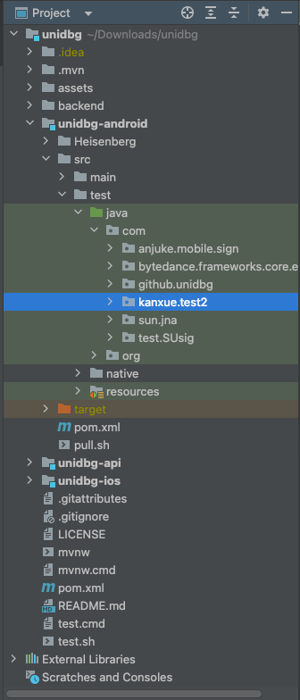
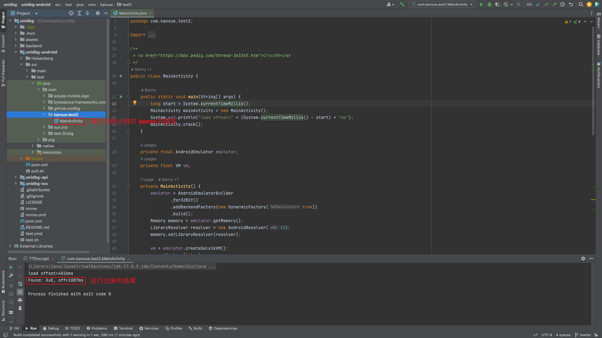

## unidbg 使用教程

- [unidbg](https://github.com/zhkl0228/unidbg) github 链接

根据 GitHub 的介绍，我们可以知道				

unidbg是一个基于unicorn的逆向工具，可黑盒调用移动app中的so文件，运行时不需要模拟器或真机。有时用真机调so文件难以过反调试，而unidbg可以弥补这块缺陷			

​			

### 补环境

首先要将java、maven、IDEA配置好

---

Unidbg 是一个基于 unicorn 的逆向工具，可以黑盒调用安卓和iOS中的so文件。这使得逆向人员可以在无需了解so内部算法原理的情况下，主动调用so中的函数，让其中的算法“为我所用”，只需要传入所需的参数、补全运行所需的环境，即可运行出所需要的结果。及由此衍生的辅助分析、算法还原、 SO 调试与逆向等等功能。

​		

#### 分析 demo [kanxue.test2]

首先我们看到原始的 unidbg 的项目，直接看看这个项目，发现了很多的 demo ，那我么我现在直接开始直接手撕 demo，学习 unidbg 



现在我们看到 kanxue.test2




kanxue.test2代码

```java
package com.kanxue.test2;

import com.github.unidbg.AndroidEmulator;
import com.github.unidbg.LibraryResolver;
import com.github.unidbg.arm.backend.DynarmicFactory;
import com.github.unidbg.linux.android.AndroidEmulatorBuilder;
import com.github.unidbg.linux.android.AndroidResolver;
import com.github.unidbg.linux.android.dvm.DalvikModule;
import com.github.unidbg.linux.android.dvm.DvmObject;
import com.github.unidbg.linux.android.dvm.VM;
import com.github.unidbg.linux.android.dvm.jni.ProxyDvmObject;
import com.github.unidbg.memory.Memory;

import java.io.File;

/**
 * <a href="https://bbs.pediy.com/thread-263345.htm">CrackMe</a>
 */
public class MainActivity {

    public static void main(String[] args) {
        long start = System.currentTimeMillis();
        MainActivity mainActivity = new MainActivity();
        System.out.println("load offset=" + (System.currentTimeMillis() - start) + "ms");
        mainActivity.crack();
    }

    private final AndroidEmulator emulator;
    private final VM vm;

    private MainActivity() {
        emulator = AndroidEmulatorBuilder
                .for32Bit()
                .addBackendFactory(new DynarmicFactory(true))
                .build();
        Memory memory = emulator.getMemory();
        LibraryResolver resolver = new AndroidResolver(23);
        memory.setLibraryResolver(resolver);

        vm = emulator.createDalvikVM();
        vm.setVerbose(false);
        DalvikModule dm = vm.loadLibrary(new File("unidbg-android/src/test/resources/example_binaries/armeabi-v7a/libnative-lib.so"), false);
        dm.callJNI_OnLoad(emulator);
    }

    private static final char[] LETTERS = {
            'A', 'B', 'C', 'D', 'E', 'F', 'G', 'H', 'I', 'J', 'K', 'L', 'M',
            'N', 'O', 'P', 'Q', 'R', 'S', 'T', 'U', 'V', 'W', 'X', 'Y', 'Z',
            'a', 'b', 'c', 'd', 'e', 'f', 'g', 'h', 'i', 'j', 'k', 'l', 'm',
            'n', 'o', 'p', 'q', 'r', 's', 't', 'u', 'v', 'w', 'x', 'y', 'z'
    };

    private void crack() {
        DvmObject<?> obj = ProxyDvmObject.createObject(vm, this);
        long start = System.currentTimeMillis();
        for (char a : LETTERS) {
            for (char b : LETTERS) {
                for (char c : LETTERS) {
                    String str = "" + a + b + c;
                    boolean success = obj.callJniMethodBoolean(emulator, "jnitest(Ljava/lang/String;)Z", str);
                    if (success) {
                        System.out.println("Found: " + str + ", off=" + (System.currentTimeMillis() - start) + "ms");
                        return;
                    }
                }
            }
        }
    }
}
```


  现在开始逐行逐句的进行解读

我们知道，这个 Java 的函数就是 MainActivity 这个类的 main 函数作为入口的，所以我们先看看入口函数

```java
    public static void main(String[] args) {
        long start = System.currentTimeMillis(); // 获取了一个开始的时间
        MainActivity mainActivity = new MainActivity(); // 申请这个 mainActivity 的对象  
        System.out.println("load offset=" + (System.currentTimeMillis() - start) + "ms");// 打印整个项目的耗时
        mainActivity.crack(); // 执行 mainActivity.crack(); 的函数
    }
```

我们可以发现，这个入口函数的主要就是 `mainActivity.crack();` 说明主要的功能在这个位置 ，但是在这个执行这个类方法之前，肯定会先执行我们的构造函数。我们现在看看构造函数


```java
    private MainActivity() {
        emulator = AndroidEmulatorBuilder
                .for32Bit()
                .addBackendFactory(new DynarmicFactory(true))
                .build();
        Memory memory = emulator.getMemory();
        LibraryResolver resolver = new AndroidResolver(23);
        memory.setLibraryResolver(resolver);

        vm = emulator.createDalvikVM();
        vm.setVerbose(false);
        DalvikModule dm = vm.loadLibrary(new File("unidbg-android/src/test/resources/example_binaries/armeabi-v7a/libnative-lib.so"), false);
        dm.callJNI_OnLoad(emulator);
    }
```


**这个初试化的构造函数干了几件事情**

1. 构建 android 虚拟机

```java
        emulator = AndroidEmulatorBuilder
                .for32Bit()
                .addBackendFactory(new DynarmicFactory(true))
                .build();
```

这个代码的作用是构建一个模拟器			

这个模拟器是 32 位的，如果你的 SO 文件是 64 位的，那么就需要  `for64Bit`  

`addBackendFactory(new DynarmicFactory(true))` 这个代码的作用是，选择我们的后端工厂的引擎，因为我们的电脑的芯片（x86 指令集）是没有办法直接处理 android 程序的代码的 ARM 指令的，所以需要一个翻译机，将 android 程序的ARM 指令转换成，电脑能够直接运行的指令。而，“翻译器”，也有不同的种类，DynarmicFactory 这一款翻译器，更加适合，浮点运算，如果你要模拟执行的 SO 文件，有大量的浮点运行，那么这一款的 “翻译器” 能够处理的更快。

你可以直接将这一行代码删掉 `addBackendFactory(new DynarmicFactory(true)` ，就会发现这个代码 demo 执行的速度被大大的降低，跟原来的代码相比，直接慢了十倍（当我们删掉了以后，就会直接使用默认的 Unicorn 引擎）

最后的 `build()` 就是构建

​					

2. 设置模拟器的库解析器

```java
        Memory memory = emulator.getMemory(); // 模拟器中获取了一个表示模拟内存的对象,用于访问和操作 android 模拟器的内存 
        LibraryResolver resolver = new AndroidResolver(23); // 行代码创建了一个新的库解析器，这个解析器用于解析 Android 平台的库。这里的 23 是 Android 的 API 等级
        memory.setLibraryResolver(resolver); // 将库解析器加载到 android 模拟器的内存 
```

意思就是加载，android 的运行环境，到底是在 android 23 上面运行还是在 android 19 上面，目前，截止2023年，unidbg 仅支持这两个环境

​			

3. 加载并初始化一个 Android 库

```java
				vm = emulator.createDalvikVM();
        vm.setVerbose(false);
        DalvikModule dm = vm.loadLibrary(new File("unidbg-android/src/test/resources/example_binaries/armeabi-v7a/libnative-lib.so"), false);
        dm.callJNI_OnLoad(emulator);
```

1. `vm = emulator.createDalvikVM();`：这行代码创建了一个 Dalvik 虚拟机实例。就相当于一个 android 系统
2. `vm.setVerbose(false);`：这行代码设置了虚拟机的详细输出模式。设置为 `false` 意味着虚拟机在运行时将不会输出详细的信息。如果你想看到更多的信息（比如函数调用的详情），你可以将这个设置为 `true`。
3. `DalvikModule dm = vm.loadLibrary(new File("unidbg-android/src/test/resources/example_binaries/armeabi-v7a/libnative-lib.so"), false);`：这行代码加载了一个库到虚拟机中。这个库的路径是 "unidbg-android/src/test/resources/example_binaries/armeabi-v7a/libnative-lib.so"。加载后的库被封装为一个 `DalvikModule` 实例，并存储在 `dm` 变量中。后面的参数的作用是：这就是 `forceCallInit` 参数的作用。当这个参数为 `true` 时，`loadLibrary` 方法会在加载完库后立即调用 `JNI_OnLoad` 函数。当这个参数为 `false` 时，`loadLibrary` 方法只加载库，不调用 `JNI_OnLoad` 函数。如果你希望在稍后的某个时间点调用 `JNI_OnLoad` 函数，你需要手动调用 `callJNI_OnLoad` 方法
4. `dm.callJNI_OnLoad(emulator);`：当 Android 加载一个库时，它会首先调用这个库中的 `JNI_OnLoad` 函数（如果存在的话）。这个函数通常用于进行一些初始化的工作。这行代码就是调用了这个函数。


因为这个代码的作用其实是，判断输入进来的字符串，XuE ,如果是就返回true ，如果不是，就返回 false ，所以建立一个列表，用来暴力破解用的

```java
    private static final char[] LETTERS = {
            'A', 'B', 'C', 'D', 'E', 'F', 'G', 'H', 'I', 'J', 'K', 'L', 'M',
            'N', 'O', 'P', 'Q', 'R', 'S', 'T', 'U', 'V', 'W', 'X', 'Y', 'Z',
            'a', 'b', 'c', 'd', 'e', 'f', 'g', 'h', 'i', 'j', 'k', 'l', 'm',
            'n', 'o', 'p', 'q', 'r', 's', 't', 'u', 'v', 'w', 'x', 'y', 'z'
    };
```

​				

**调用 android 项目的函数**

```java
    private void crack() {
        DvmObject<?> obj = ProxyDvmObject.createObject(vm, this);
        long start = System.currentTimeMillis();
        for (char a : LETTERS) {
            for (char b : LETTERS) {
                for (char c : LETTERS) {
                    String str = "" + a + b + c;
                    boolean success = obj.callJniMethodBoolean(emulator, "jnitest(Ljava/lang/String;)Z", str);
                    if (success) {
                        System.out.println("Found: " + str + ", off=" + (System.currentTimeMillis() - start) + "ms");
                        return;
                    }
                }
            }
        }
    }
```

`DvmObject<?> obj = ProxyDvmObject.createObject(vm, this)` 

这个代码的作用是找到，这个类，并且创建一个 Java 的对象，存储在 obj 当中。			

**vm** 就是他的 Dalvik 虚拟机

**this** 这个很有意思，他就是你所在的文件的路径，看看前面的文件所在的路径  `com.kanxue.test2.MainActivity` ，那么他就会去找这个类，并且从内存当中抓一个当前正在运行的，最新鲜的对象。

​			

和这个功能类似的，还有一个

`DvmObject<?> dvmObject = vm.resolveClass("com/libok/libsino/SU").newObject(null);` 

这个就不会从内存当中抓一个对象，而是自己创建一个对象，构造函数的参数写在 newObject 的参数当中，如果是无参函数就传一个 null。如果有参数，就 			

`DvmObject<?> dvmObject = vm.resolveClass("com/libok/libsino/SU").newObject(123,"ok?");` 

 

`boolean success = obj.callJniMethodBoolean(emulator, "jnitest(Ljava/lang/String;)Z", str);` 

这个函数的作用就是调用，对应的函数了，**obj.callJniMethodBoolean** 这是一个神奇的函数，根据名字我们知道，他是要去调用一个 jni 的函数，并且返回的是一个 bool 类型的数据。

1. 第一个参数是 android虚拟机
2. 第二个参数是函数的签名，可以通过 jadx-gui 进行反编译查看
3. 第三个参数是一个不定长度的参数，是我们想要调用的函数的，参数

---


