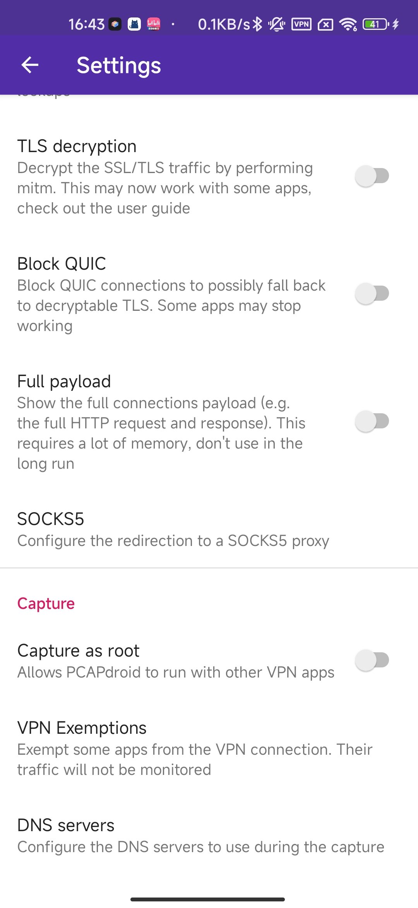

## 不用设置路由器翻墙的抓包外网APP的方法

- [不用设置路由器翻墙的抓包外网APP的方法](#不用设置路由器翻墙的抓包外网app的方法)
  - [设置 PCAPdroid APP](#设置-pcapdroid-app)
  - [现在我们的视野转到电脑端的 Charles](#现在我们的视野转到电脑端的-charles)
    - [首先设置 Charles 的端口](#首先设置-charles-的端口)
    - [使用外部代理](#使用外部代理)
  - [查看 Clash 的端口](#查看-clash-的端口)
  - [Charles 的一些其他的设置](#charles-的一些其他的设置)
    - [如果你只关心手机的流量](#如果你只关心手机的流量)
    - [应对防火墙的DNS污染](#应对防火墙的dns污染)
  - [开始工作](#开始工作)
  - [原理](#原理)

前情提要：				

我现在的抓包的顺序是，直接打开，装在手机上的小黄鸟（httpcanary）进行抓包			

如果是国内的软件那就还好，装上证书就能够直接的抓包，但是如果这个软件需要翻墙才能够使用，就会比较的麻烦，我之前的做法是，将自己的路由器进行翻墙，然后手机连上翻好墙之后的 WiFi ，紧接着，我再打开我的小黄鸟进行抓包。			

如果不设置一个翻墙的路由器，就会出现这样的情况，就是在你的手机上，打开了 VPN ，这个 APP 才能够使用，但是打开了紧接着打开抓包软件，就会发现，之前的 Clash 翻墙的软件就被关闭了。因为翻墙被关闭了，现在软件也没有办法使用，也没有办法抓包了。		

但是最近遇到一个问题，国庆的时候，我有幸也在放假的行列当中，国庆之前的内容想留到国庆的时候在家做一点，我的电脑是通过 Clash 进行翻墙了的，但是，我家的路由器没有翻墙，我也不想设置我的路由器翻墙。为了完成我的工作，就有这一篇文章		

​					

我们需要一个软件		

[PCAPdroid](https://github.com/emanuele-f/PCAPdroid/)

[下载地址](https://github.com/emanuele-f/PCAPdroid/releases)

### 设置 PCAPdroid APP

安装好我们的软件之后，在设置当中找到 socket5【Configure the redirection to a SOCKS5 proxy】	

这一个选项

​						

并且设置他的 host 和 代理，这里的 host 的地址就是你的手机，电脑所在的同一个，WiFi 的 IP 地址，端口是，就是你想要转发到的端口，我们这里就是 Charles 的端口，因为这样 Charles 就能够直接看到这些包数据了

​			

### 现在我们的视野转到电脑端的 Charles 

#### 首先设置 Charles 的端口

这样手机上的流量就会被转发到 Charles 

​						

​				

#### 使用外部代理

也就是说将这个部分的流量转发到翻墙的软件，让 Clash 软件帮我们翻墙，注意这里的 **127.0.0.1**这个是我们的本机的地址，如果你想填，所在的 WiFi 的地址也是可以的，**7890** ，是我们的 Clash 的端口，如果你的 Clash 的端口变了，这里的端口记得变一下

​						

​				

### 查看 Clash 的端口

​			

### Charles 的一些其他的设置

#### 如果你只关心手机的流量

可以关闭，抓电脑端的包，防止 Charles 和 Clash 重复的设置代理。造成不能翻墙的错误

​				

#### 应对防火墙的DNS污染

​					

### 开始工作

点击这里的 ready 就可以了

​	

### 原理

其实原理非常的简单，就是 APP 的请求，会通过这个软件的包转发到 Charles 的这个软件上，Charles 分析了这个包之后，又将这个包，转发到 Clash 上，Clash 将这个包通过翻墙的方式发出去，然后，再获取响应。