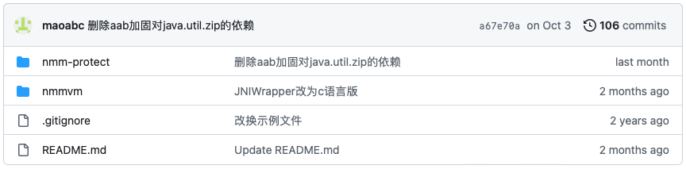

## 学习nmmp

### 项目地址

[nmmp GitHub 地址](https://github.com/maoabc/nmmp/tree/master)			

​			

​			

这里我们看到两个项目。			

根据 readme 的介绍，这里有两个 Java 的项目			

[nmm-protect](https://github.com/maoabc/nmmp/tree/master/nmm-protect)： 这个项目是，做加密的，也就是我们主要关心的部分

[nmmvm](https://github.com/maoabc/nmmp/tree/master/nmmvm)：这个项目是，用来做测试的	

​							

我们直接下载这个项目，并且通过 IDEA 打开这个 nmmp-project ，通过简单的配置一些，SDK，NDK，CMAKE。之后就可以使用			

​			

