# 工具脱壳

- [工具脱壳](#工具脱壳)
    - [首先需要判断是否需要脱壳](#首先需要判断是否需要脱壳)
    - [准备工具](#准备工具)
    - [开始脱壳](#开始脱壳)

***此教程当中所使用的工具在 release 当中 的 unpacking.zip 压缩包当中***

### 首先需要判断是否需要脱壳

1. S检查壳的工具 ApkScan-PKID.jar （release仓库当中）直接双击就能够运行

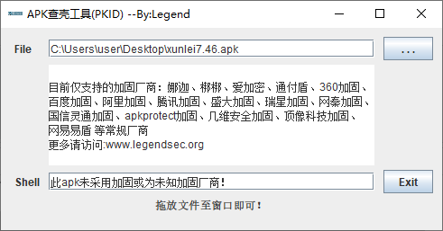

或者是将软件拖进 jadx-gui 当中查看，出现了这样的东西就说明是加壳了

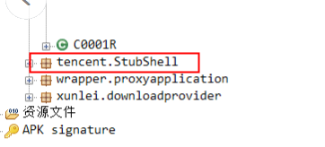

2. 如果需要脱壳准备脱壳工具 frida_dexdump（release仓库当中）此工具是一个 python 程序，需要你拥有 python 的环境已经相关的依赖

3. 然后检查你的手机 cpu   `adb shell getprop ro.product.cpu.abi` 

### 准备工具  
4. 安装 **frida** `pip install frida==15.1.14` （注意版本最好一致）

5. 安装 **frida-tools**  `pip install frida-tools==10.4.1` （两个工具的安装过程比较的缓慢需要等待）

   

6. 下载 Android_server **frida-server-15.1.14-android-arm64.xz** （release仓库当中）[原下载链接](https://github.com/frida/frida/releases/tag/15.1.14) 

7. 将这个文件解压之后，push 到 /data/local/tmp 当中 `adb push frida-server-15.1.14-android-arm64 /data/local/tmp`

8. 给这个 frida-server 文件一个 777 的最高权限

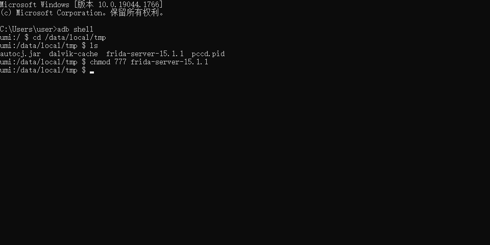

9. 对它进行重命名成 **fs15114 ** 

10. 打开 root 权限 `su` 

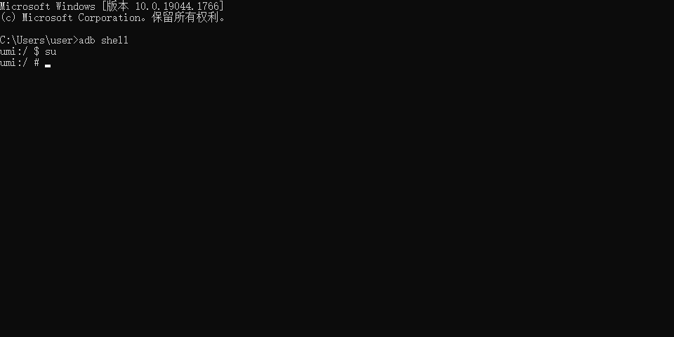

### 开始脱壳  
11. `./fs15114` 去运行这个软件

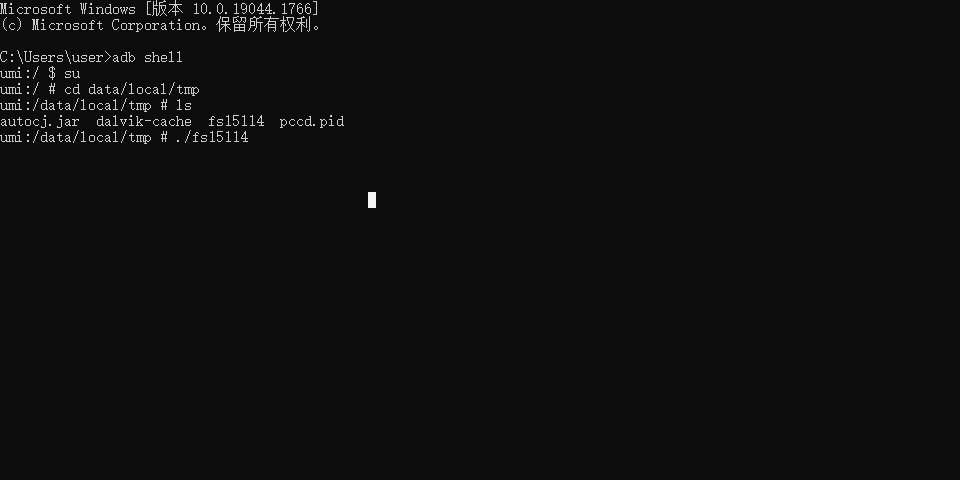

12. 端口转换 `adb forward tcp:27042 tcp:27042` 这里的 27042 是 frida 默认的一个端口

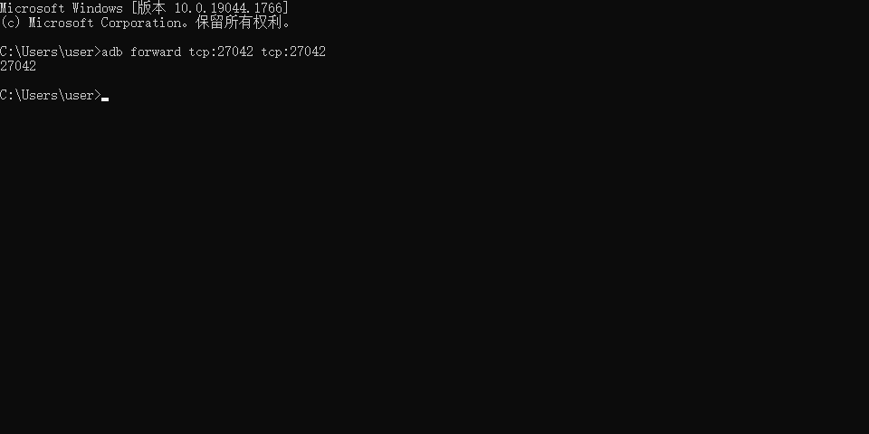

13. 将要脱壳的app安装在手机当中，并且运行起来，通过 `frida-ps -U ` 查看手机当中的进程

14. 通过 `python main.py` 运行 frida_dexdump 当中的 main.py 

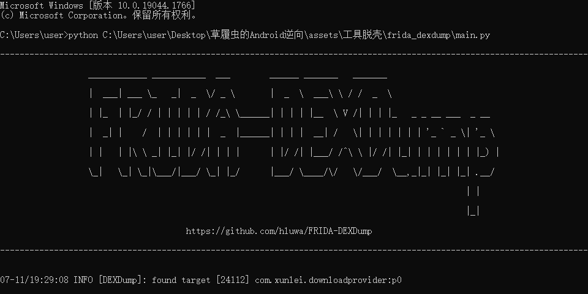

15. 他会自己生成 .dex 文件，根据这些文件的路径找到这些文件（注意：在dump脱壳文件的时候，需要将后台清理掉，仅保留要脱壳的程序）

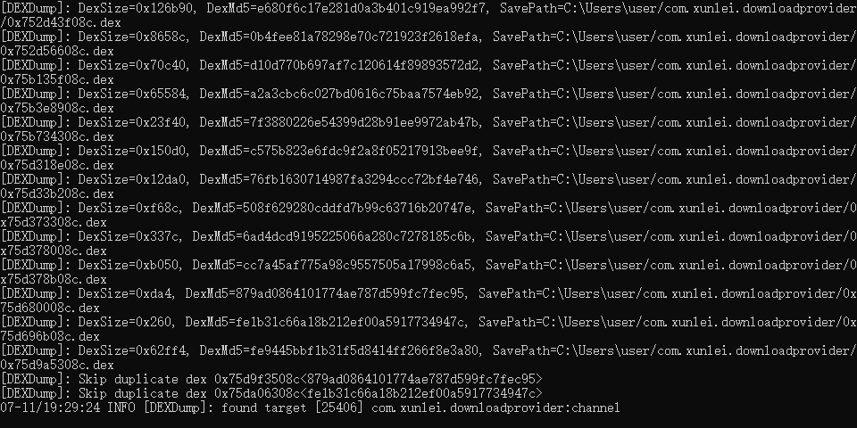

16. 将得到的文件改名成 classes.dex 的形式（文件名随意顺序），将这些改名的文件放在apk的文件夹当中，重新压缩，更名 apk ，放进编译软件当中就能够查看当中的代码

    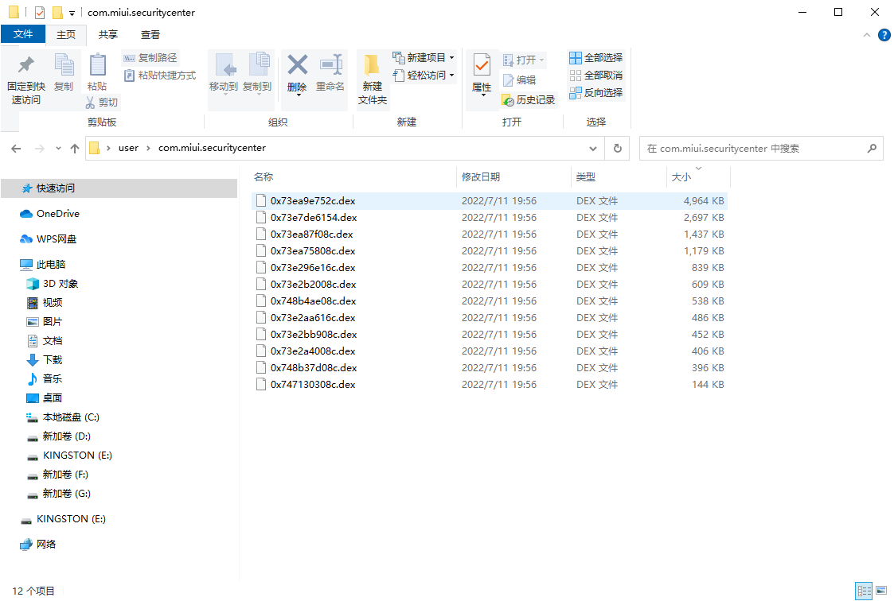

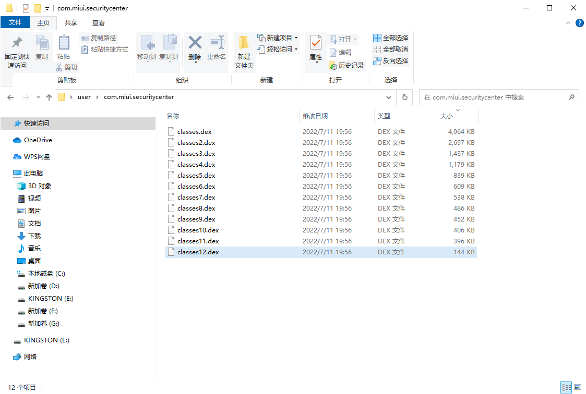

将打包好的apk文件放进 jadx-gui 当中直到能够，如下显示就算是成功了！

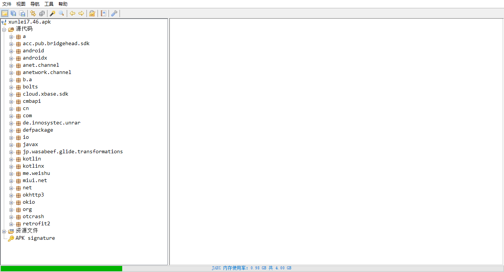