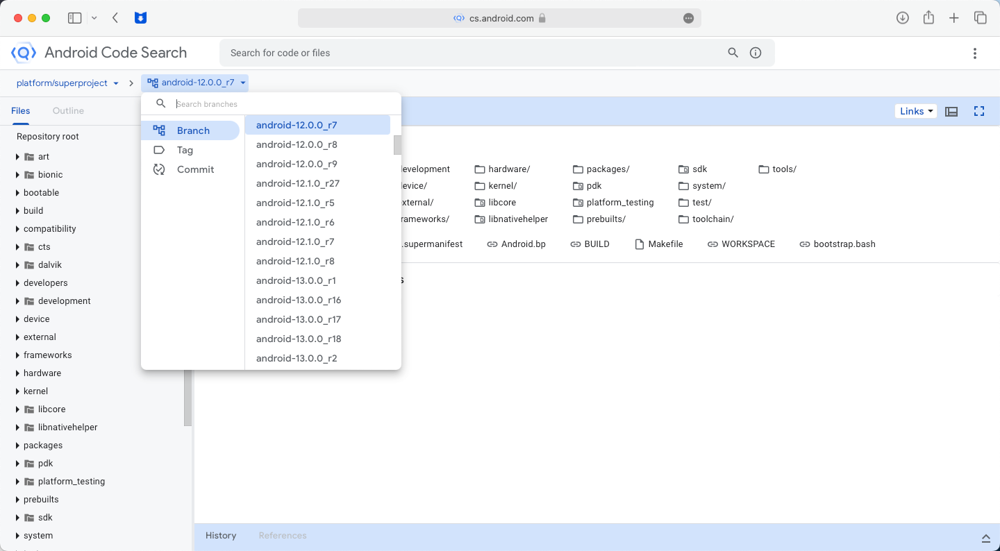
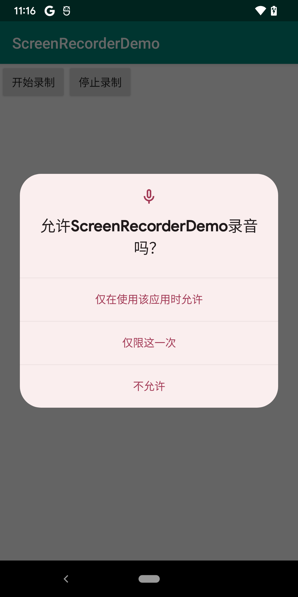
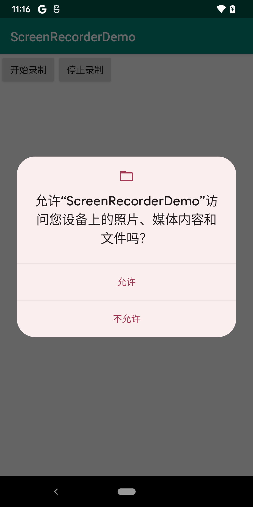
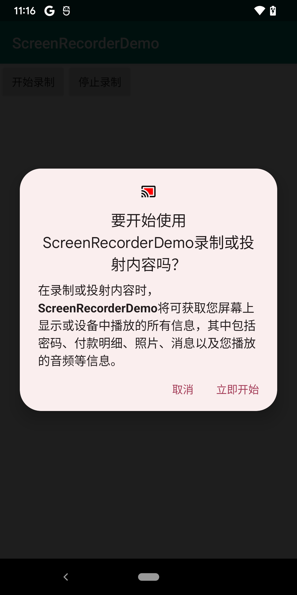
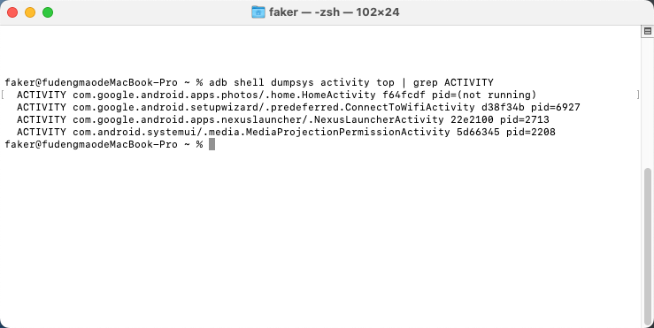
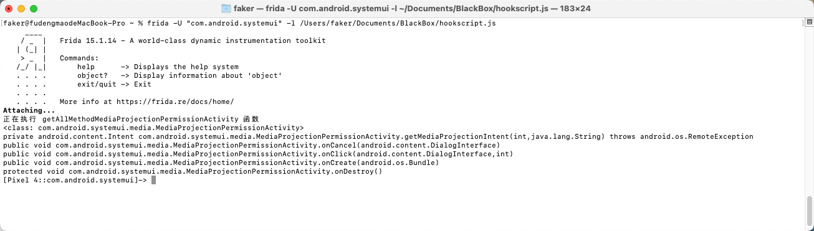
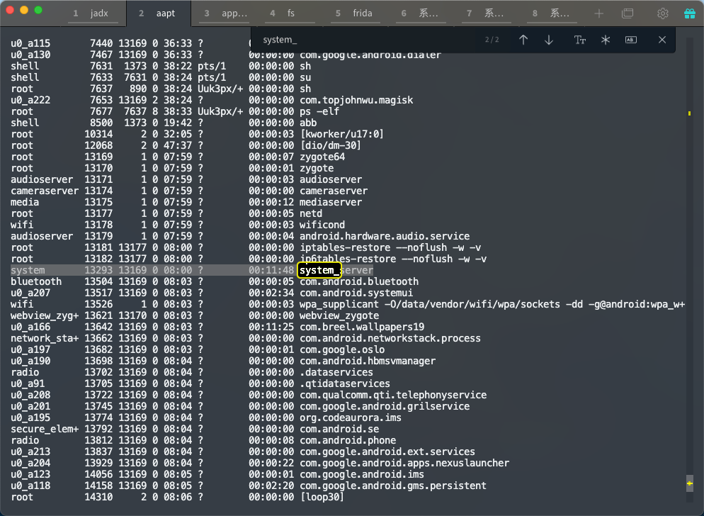
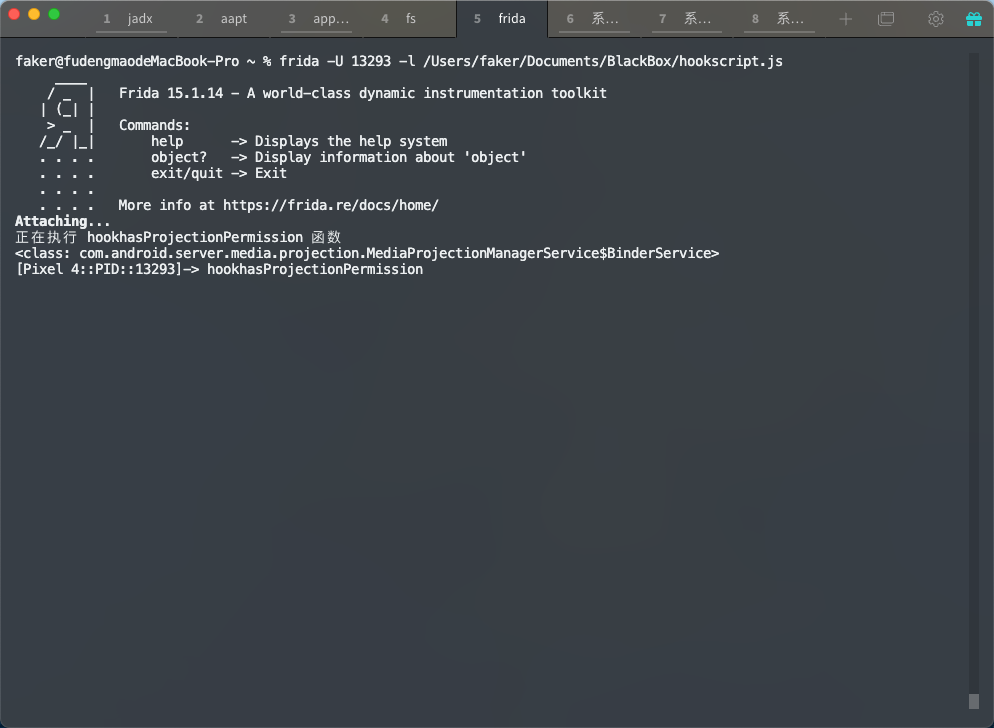

1. 现在针对的是已经 root 的，谷歌原生系统的手机（Android12，不同的系统的代码可能是不一样的，这个要阅读源码来确认）
2. 源码的地址 [android源码地址](https://cs.android.com/android/platform/superproject/+/android-12.0.0_r7:)
3. 在这个地方，切换，Android的版本
4. 
5. 目前的状态是，Android 现在仅支持动态的获取权限，比方说文件存储权限，录屏权限，录音权限，等等







想要达到的效果是，这些权限在安装 app 的时候就已经自动的获取，并且不需要用户手动进行获取


[参考链接](https://blog.csdn.net/qq_18273521/article/details/106575185)


在这个教程当中主要是

### 步骤一

在frameworks/base/packages/systemui/src/com/android/systemui/media/mediaprojectionspermissionactivity的onCreate方法当中 mDialog.show();屏蔽掉dialog显示 


setResult(RESULT_OK, getMediaProjectionIntent(mUid, mPackageName,false /*permanentGrant*/));

将这个 false 改为 true


系统的app是默认开启权限了的，第三方app还要在

frameworks/base/services/core/java/com/android/server/pm/PackageManagerService.java 的 grantPermissionsLpw

将 changedInstallPermission 的值添加在代码当中

```java
int permsSize = pkg.requestedPermissions.size();
          for (int i=0; i<permsSize; i++) {
              final String name = pkg.requestedPermissions.get(i);
              final BasePermission bp = mSettings.mPermissions.get(name);
              if(null != bp && permissionsState.grantInstallPermission(bp) !=                 
                  PermissionsState.PERMISSION_OPERATION_FAILURE) {
                  Slog.d(TAG, "zrx--- grant permission " + name + " to package " + 
                      pkg.packageName);
                  changedInstallPermission = true; //here
              }
          }
```


但是上面的教程比较老，有些函数已经改变，有些代码已经不存在，所以，想要在 Android12 上面实现这个功能，就需要根据这个教程，再自适应调整


并且小米的系统不是开源的，分析的思路还要进行探索


### 解决录屏权限的弹窗

思路

在这个弹窗弹出来的时候，获取当前的 activity （adb shell dumpsys activity top | grep ACTIVITY）




```terminal
ACTIVITY com.google.android.apps.photos/.home.HomeActivity f64fcdf pid=(not running)
  ACTIVITY com.google.android.setupwizard/.predeferred.ConnectToWifiActivity d38f34b pid=6927
  ACTIVITY com.google.android.apps.nexuslauncher/.NexusLauncherActivity 22e2100 pid=2713
  ACTIVITY com.android.systemui/.media.MediaProjectionPermissionActivity 5d66345 pid=2208
```


可以发现弹窗是一个 ACTIVITY ，路径是 com.android.systemui.media.MediaProjectionPermissionActivity 

并且所属的包是 com.android.systemui 

可以查看这个类下面的所有的函数（在其中的一次 hook 的过程当中，发现，无论怎么hook 都在说，找不到进程，要不然就是说，该进程拒绝 frid-agent，解决办法就是，将frida-server 退出，然后重启就好了）




然后在chatGPT上面找到了 com.android.systemui.media.MediaProjectionPermissionActivity这个类在，源码当中的这个位置frameworks/base/packages/SystemUI/src/com/android/systemui/media/MediaProjectionPermissionActivity.java

Android源码在线看在上面


分析一下这个源码，先看完整的源码

```java
public void onCreate(Bundle icicle) {
        super.onCreate(icicle);

        mFeatureFlags = Dependency.get(FeatureFlags.class);
        mPackageName = getCallingPackage();
        IBinder b = ServiceManager.getService(MEDIA_PROJECTION_SERVICE);
        mService = IMediaProjectionManager.Stub.asInterface(b);

        if (mPackageName == null) {
            finish();
            return;
        }

        PackageManager packageManager = getPackageManager();
        ApplicationInfo aInfo;
        try {
            aInfo = packageManager.getApplicationInfo(mPackageName, 0);
            mUid = aInfo.uid;
        } catch (PackageManager.NameNotFoundException e) {
            Log.e(TAG, "unable to look up package name", e);
            finish();
            return;
        }

        try {
            if (mService.hasProjectionPermission(mUid, mPackageName)) {
                setResult(RESULT_OK, getMediaProjectionIntent(mUid, mPackageName));
                finish();
                return;
            }
        } catch (RemoteException e) {
            Log.e(TAG, "Error checking projection permissions", e);
            finish();
            return;
        }

        TextPaint paint = new TextPaint();
        paint.setTextSize(42);

        CharSequence dialogText = null;
        CharSequence dialogTitle = null;
        if (Utils.isHeadlessRemoteDisplayProvider(packageManager, mPackageName)) {
            dialogText = getString(R.string.media_projection_dialog_service_text);
            dialogTitle = getString(R.string.media_projection_dialog_service_title);
        } else {
            String label = aInfo.loadLabel(packageManager).toString();

            // If the label contains new line characters it may push the security
            // message below the fold of the dialog. Labels shouldn't have new line
            // characters anyways, so just truncate the message the first time one
            // is seen.
            final int labelLength = label.length();
            int offset = 0;
            while (offset < labelLength) {
                final int codePoint = label.codePointAt(offset);
                final int type = Character.getType(codePoint);
                if (type == Character.LINE_SEPARATOR
                        || type == Character.CONTROL
                        || type == Character.PARAGRAPH_SEPARATOR) {
                    label = label.substring(0, offset) + ELLIPSIS;
                    break;
                }
                offset += Character.charCount(codePoint);
            }

            if (label.isEmpty()) {
                label = mPackageName;
            }

            String unsanitizedAppName = TextUtils.ellipsize(label,
                    paint, MAX_APP_NAME_SIZE_PX, TextUtils.TruncateAt.END).toString();
            String appName = BidiFormatter.getInstance().unicodeWrap(unsanitizedAppName);

            String actionText = getString(R.string.media_projection_dialog_text, appName);
            SpannableString message = new SpannableString(actionText);

            int appNameIndex = actionText.indexOf(appName);
            if (appNameIndex >= 0) {
                message.setSpan(new StyleSpan(Typeface.BOLD),
                        appNameIndex, appNameIndex + appName.length(), 0);
            }
            dialogText = message;
            dialogTitle = getString(R.string.media_projection_dialog_title, appName);
        }

        AlertDialog.Builder dialogBuilder = new AlertDialog.Builder(this,
                R.style.Theme_SystemUI_Dialog)
                .setTitle(dialogTitle)
                .setIcon(R.drawable.ic_media_projection_permission)
                .setMessage(dialogText)
                .setPositiveButton(R.string.media_projection_action_text, this)
                .setNeutralButton(android.R.string.cancel, this)
                .setOnCancelListener(this);

        if (isPartialScreenSharingEnabled()) {
            // This is a temporary entry point before we have a new permission dialog
            // TODO(b/233183090): this activity should be redesigned to have a dropdown selector
            dialogBuilder.setNegativeButton("App", this);
        }

        mDialog = dialogBuilder.create();

        SystemUIDialog.registerDismissListener(mDialog);
        SystemUIDialog.applyFlags(mDialog);
        SystemUIDialog.setDialogSize(mDialog);

        mDialog.create();
        mDialog.getButton(DialogInterface.BUTTON_POSITIVE).setFilterTouchesWhenObscured(true);

        final Window w = mDialog.getWindow();
        w.addSystemFlags(SYSTEM_FLAG_HIDE_NON_SYSTEM_OVERLAY_WINDOWS);

        mDialog.show();
    }
```


将上面的源码逐段分析

```java
mFeatureFlags = Dependency.get(FeatureFlags.class);
mPackageName = getCallingPackage();
IBinder b = ServiceManager.getService(MEDIA_PROJECTION_SERVICE);
mService = IMediaProjectionManager.Stub.asInterface(b);

if (mPackageName == null) {
    finish();
    return;
}
```

`mPackageName = getCallingPackage();` 获取当前调用的包的名称

`ServiceManager.getService(MEDIA_PROJECTION_SERVICE)`获取到一个Binder对象b，其代表了媒体投影服务的实例

通过`IMediaProjectionManager.Stub.asInterface(b)`将Binder对象b转换成IMediaProjectionManager接口，并将其保存在mService变量中

`IMediaProjectionManager`接口提供了访问和控制媒体投影功能


```java
PackageManager packageManager = getPackageManager();
ApplicationInfo aInfo;
try {
    aInfo = packageManager.getApplicationInfo(mPackageName, 0);
    mUid = aInfo.uid;
} catch (PackageManager.NameNotFoundException e) {
    Log.e(TAG, "unable to look up package name", e);
    finish();
    return;
}

try {
    if (mService.hasProjectionPermission(mUid, mPackageName)) {
        setResult(RESULT_OK, getMediaProjectionIntent(mUid, mPackageName));
        finish();
        return;
    }
} catch (RemoteException e) {
    Log.e(TAG, "Error checking projection permissions", e);
    finish();
    return;
}
```

使用`getPackageManager()`方法获取PackageManager对象，这个对象主要是用于获取当前应用程序包的信息

使用`packageManager.getApplicationInfo(mPackageName, 0)`方法获取应用程序的信息，并将结果存储在`ApplicationInfo`变量中。`mPackageName`是调用的包名

`mUid = aInfo.uid` 获取该应用程序的用户ID

通过调用`mService.hasProjectionPermission(mUid, mPackageName)`方法来检查当前应用程序是否具有投影权限。这个方法调用了IMediaProjectionManager接口中的`hasProjectionPermission`方法。如果该应用程序具有投影权限，则设置结果为`RESULT_OK`，并结束该Activity


```java
    TextPaint paint = new TextPaint();
    paint.setTextSize(42);

    CharSequence dialogText = null;
    CharSequence dialogTitle = null;
    if (Utils.isHeadlessRemoteDisplayProvider(packageManager, mPackageName)) {
        dialogText = getString(R.string.media_projection_dialog_service_text);
        dialogTitle = getString(R.string.media_projection_dialog_service_title);
    } else {
        String label = aInfo.loadLabel(packageManager).toString();

        // If the label contains new line characters it may push the security
        // message below the fold of the dialog. Labels shouldn't have new line
        // characters anyways, so just truncate the message the first time one
        // is seen.
        final int labelLength = label.length();
        int offset = 0;
        while (offset < labelLength) {
            final int codePoint = label.codePointAt(offset);
            final int type = Character.getType(codePoint);
            if (type == Character.LINE_SEPARATOR
                    || type == Character.CONTROL
                    || type == Character.PARAGRAPH_SEPARATOR) {
                label = label.substring(0, offset) + ELLIPSIS;
                break;
            }
            offset += Character.charCount(codePoint);
        }
```

使用`Utils.isHeadlessRemoteDisplayProvider`方法判断mPackageName对应的应用是否是一个无头的远程显示提供者

如果是的话，获取两个字符串内容


R.string.media_projection_dialog_service_text
这个字符串资源在 frameworks/base/packages/SystemUI/res/values/strings.xml 这个路径下（我在在线看Android源码的网址当中，搜索的 media_projection_dialog_service_text ）

显示内容是 

> The service providing this function will have access to all of the information that is visible on your screen or played from your device while recording or casting. This includes information such as passwords, payment details, photos, messages, and audio that you play

> 此功能提供的服务将拥有访问您屏幕上或在录制或投放时播放的所有信息的权限。这包括密码、支付详情、照片、消息和您播放的音频等信息。

R.string.media_projection_dialog_service_title

也是在一样的路径下面

显示的内容是

> Start recording or casting?

> 开始录制或播放？


`String label = aInfo.loadLabel(packageManager).toString();` 这个是在获取标签

根据下面的的注释

> 如果标签包含换行符，它可能会将安全消 息推到对话框下面。 标签本身不应该有换行符，因此在第一次看到换行符时只需截断消息即可。


```java
            String unsanitizedAppName = TextUtils.ellipsize(label,
                    paint, MAX_APP_NAME_SIZE_PX, TextUtils.TruncateAt.END).toString();
            String appName = BidiFormatter.getInstance().unicodeWrap(unsanitizedAppName);

            String actionText = getString(R.string.media_projection_dialog_text, appName);
            SpannableString message = new SpannableString(actionText);

            int appNameIndex = actionText.indexOf(appName);
            if (appNameIndex >= 0) {
                message.setSpan(new StyleSpan(Typeface.BOLD),
                        appNameIndex, appNameIndex + appName.length(), 0);
            }
            dialogText = message;
            dialogTitle = getString(R.string.media_projection_dialog_title, appName);
```


` String unsanitizedAppName = TextUtils.ellipsize(label,paint,MAX_APP_NAME_SIZE_PX,TextUtils.TruncateAt.END).toString();`

这句代码，是在设置一个字符串的格式，paint 是 `TextPaint paint = new TextPaint();
    paint.setTextSize(42);` 设置的字体的大小。
设置的是 label 这个标签，

`MAX_APP_NAME_SIZE_PX` 来对字符串进行处理，使其不超过指定的像素大小。如果字符串的长度超过了指定的像素大小，则使用 `TextUtils.TruncateAt.END` 指定的方式对字符串进行截断，并在末尾加上省略号(...)

最后，经过处理的字符串被转换为字符串类型并赋值给 `unsanitizedAppName` 变量

**unsanitizedAppName**，本身的意思就是，未净化的APPName


`String appName = BidiFormatter.getInstance().unicodeWrap(unsanitizedAppName)` 

方法对应用程序名称进行 Unicode 编码格式的处理，通过这样的方式获取，APPName

然后通过 `String actionText = getString(R.string.media_projection_dialog_text, appName)` 将文本进行拼接，

并且将它存在放在可执行对象当中 `SpannableString message = new SpannableString(actionText)` 

并且，将这个 message 检查是不是安全，和设置为黑体


```java
dialogText = message;
dialogTitle = getString(R.string.media_projection_dialog_title, appName);
```

装填，弹窗内容的标题和内容


```java
AlertDialog.Builder dialogBuilder = new AlertDialog.Builder(this,
                R.style.Theme_SystemUI_Dialog)
                .setTitle(dialogTitle)
                .setIcon(R.drawable.ic_media_projection_permission)
                .setMessage(dialogText)
                .setPositiveButton(R.string.media_projection_action_text, this)
                .setNeutralButton(android.R.string.cancel, this)
                .setOnCancelListener(this);
```

对话框对象的建立

指定风格，标题，内容，图标，确认按钮，取消按钮，取消监听器


```java
        if (isPartialScreenSharingEnabled()) {
            // This is a temporary entry point before we have a new permission dialog
            // TODO(b/233183090): this activity should be redesigned to have a dropdown selector
            dialogBuilder.setNegativeButton("App", this);
        }
```

用于检查是否启用了部分屏幕共享功能。如果是，则在对话框中添加一个“App”按钮，否则不添加


```java
        SystemUIDialog.registerDismissListener(mDialog); //注册一个取消监听器
        SystemUIDialog.applyFlags(mDialog); //根据屏幕大小设置对话框的大小和位置。
        SystemUIDialog.setDialogSize(mDialog);//将一些系统标志应用到对话框中，例如 FLAG_LAYOUT_INSET_DECOR 和 FLAG_LAYOUT_IN_SCREEN
```


```java
        mDialog.create(); // 创建对话框窗口
        mDialog.getButton(DialogInterface.BUTTON_POSITIVE).setFilterTouchesWhenObscured(true);// 对话框中的确认按钮，用于在确认按钮被按下时触发相应操作。

        final Window w = mDialog.getWindow();//获取对话框的窗口对象，以便对其进行更多配置。
        w.addSystemFlags(SYSTEM_FLAG_HIDE_NON_SYSTEM_OVERLAY_WINDOWS); //将一个系统标志应用到对话框窗口，即 SYSTEM_FLAG_HIDE_NON_SYSTEM_OVERLAY_WINDOWS。

        mDialog.show(); // 将对话框显示在屏幕上
```


```java
public void onClick(DialogInterface dialog, int which) {
        try {
            if (which == AlertDialog.BUTTON_POSITIVE) {
                setResult(RESULT_OK, getMediaProjectionIntent(mUid, mPackageName));
            }

            if (isPartialScreenSharingEnabled() && which == AlertDialog.BUTTON_NEGATIVE) {
                IMediaProjection projection = createProjection(mUid, mPackageName);
                final Intent intent = new Intent(this, MediaProjectionAppSelectorActivity.class);
                intent.putExtra(MediaProjectionManager.EXTRA_MEDIA_PROJECTION,
                        projection.asBinder());
                intent.setFlags(Intent.FLAG_ACTIVITY_FORWARD_RESULT);
                startActivity(intent);
            }
        } catch (RemoteException e) {
            Log.e(TAG, "Error granting projection permission", e);
            setResult(RESULT_CANCELED);
        } finally {
            if (mDialog != null) {
                mDialog.dismiss();
            }
            finish();
        }
    }
```

按键检测

如果点击的是对话框的确定按钮，它将设置结果为“RESULT_OK”并使用“getMediaProjectionIntent”方法获取一个MediaProjection意图

如果使用了部分屏幕共享功能，并且点击的是对话框的否定按钮，它将创建一个MediaProjection，并将它传递到MediaProjectionAppSelectorActivity中启动一个新的Activity

如果有异常，它会记录日志，并将结果设置为“RESULT_CANCELED”。不论如何，最后，它都将关闭对话框并结束Activity。

---

可以看得出来，弹窗的显示就是，`mDialog.show();` 并且设置窗口，是在

```java
final Window w = mDialog.getWindow();
w.addSystemFlags(SYSTEM_FLAG_HIDE_NON_SYSTEM_OVERLAY_WINDOWS);
```

按照原理来说，hook show 函数，和 GetWindow，addsystemflags 这两个函数，并且将这两个函数，变成空函数，不做任何的功能，就能够达到效果，抹掉弹窗，并且 hook `setResult(RESULT_OK, getMediaProjectionIntent(mUid, mPackageName))` 这个函数就能够，达到直接赋权的效果，RESULT_OK 的值是-1，


但是在分析的时候，这一段代码吸引我的注意力，他是用来，检测重复赋权的代码，如果我们的程序已经给了权限，那么直接设置权限，那么如果我将 `hasProjectionPermission(mUid, mPackageName)` 的结果返回为 true ，那么就会在任何时候都直接赋权，并且 finish() 和 return 掉，所以后面的故事也不会发生，什么获取文本，获取弹窗标题，还有创建弹窗对象什么的

```java
try {
            if (mService.hasProjectionPermission(mUid, mPackageName)) {
                setResult(RESULT_OK, getMediaProjectionIntent(mUid, mPackageName));
                finish();
                return;
            }
        } catch (RemoteException e) {
            Log.e(TAG, "Error checking projection permissions", e);
            finish();
            return;
        }
```


hook代码

```javascript
// 编写 hookhasProjectionPermission 的函数，hook com.android.server.media.projection.MediaProjectionManagerService 的 内部类 BinderService 的  hasProjectionPermission 函数
function hookhasProjectionPermission() {
    console.log("正在执行 hookhasProjectionPermission 函数")
    Java.perform(function ()
    {
        var BinderService = Java.use("com.android.server.media.projection.MediaProjectionManagerService$BinderService")
        console.log(BinderService)
        BinderService.hasProjectionPermission.implementation = function (arg1,arg2) {
            console.log("hookhasProjectionPermission")
            return true
        }
    })
}

setTimeout(hookhasProjectionPermission)
```


这个代码肯定执行在 system_service 的进程当中



​		




弹窗消失，并且能够直接录制视频。这里就不展示了

------


[mRequestedPermissions](https://cs.android.com/android/platform/superproject/+/master:packages/modules/Permission/PermissionController/src/com/android/permissioncontroller/permission/ui/GrantPermissionsActivity.java;drc=d4903a630ce6d55578f00a5fae1f6e5afb0edee4;bpv=0;bpt=1;l=130) = [getIntent](https://cs.android.com/android/platform/superproject/+/master:frameworks/base/core/java/android/app/Activity.java;drc=d4903a630ce6d55578f00a5fae1f6e5afb0edee4;bpv=0;bpt=1;l=1053)()

​                .[getStringArrayExtra](https://cs.android.com/android/platform/superproject/+/master:frameworks/base/core/java/android/content/Intent.java;drc=d4903a630ce6d55578f00a5fae1f6e5afb0edee4;bpv=0;bpt=1;l=9213)([PackageManager](https://cs.android.com/android/platform/superproject/+/master:out/soong/.intermediates/frameworks/base/android-non-updatable.stubs.system/android_common/xref/srcjars.xref/android/content/pm/PackageManager.java;drc=9b25969d7bf3e31c5b7fec5b34c37a304b6a7fa7;bpv=0;bpt=1;l=21).[EXTRA_REQUEST_PERMISSIONS_NAMES](https://cs.android.com/android/platform/superproject/+/master:frameworks/base/core/java/android/content/pm/PackageManager.java;drc=d4903a630ce6d55578f00a5fae1f6e5afb0edee4;bpv=0;bpt=1;l=4427));

android.permission.RECORD_AUDIO,android.permission.READ_PHONE_STATE,android.permission.READ_EXTERNAL_STORAGE,android.permission.WRITE_EXTERNAL_STORAGE


[onPermissionGrantResult](https://cs.android.com/android/platform/superproject/+/master:packages/modules/Permission/PermissionController/src/com/android/permissioncontroller/permission/ui/GrantPermissionsActivity.java;drc=9b25969d7bf3e31c5b7fec5b34c37a304b6a7fa7;bpv=1;bpt=1;l=541?gsn=onPermissionGrantResult&gs=kythe%3A%2F%2Fandroid.googlesource.com%2Fplatform%2Fsuperproject%3Flang%3Djava%3Fpath%3Dcom.android.permissioncontroller.permission.ui.GrantPermissionsActivity%236770c98e6ae4a307ad2083f0734a70d1d36d571655486513ef3df2db8a0d5e43)

android.permission-group.MICROPHONE

android.permission-group.STORAGE


